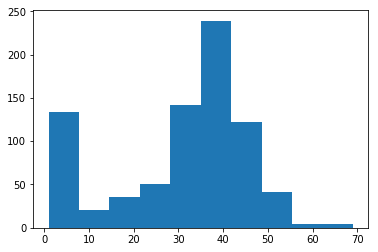

<h1>Korte analyse van de data in 'mijn-kwik.experiments.json'.</h1>

Dit bestand bevat sdmt testresultaten in een Mongo-format. Ik heb dit bestand geïmporteerd in de collection 'experiments' in de 'test'database.


```python
import numpy as np
```


```python
import matplotlib.pyplot as plt
```


```python
%matplotlib inline
```


```python
import pymongo
conn = pymongo.MongoClient()
conn
```


    MongoClient(host=['localhost:27017'], document_class=dict, tz_aware=False, connect=True)


```python
db = conn['test']
experiments = db.experiments
data1 = experiments.find_one()
```

Om een beeld te krijgen van de data bekijk ik een willekeurig document in de collectie:


```python
data1
```


    {'_id': 'yvkJgxA8HouG8KLvA',
     'experiment': 'sdmt',
     'timestamp': datetime.datetime(2017, 1, 23, 11, 59, 17, 787000),
     'userId': 'gGSWzh5PnqgFdCpq4',
     'value': {'accelerometer': [{'timestamp': 1485172642679.0,
        'x': -9.829193115234375,
        'y': 0.309417724609375,
        'z': 1.3274688720703125},
       {'timestamp': 1485172667319.0,
        'x': -0.7554931640625,
        'y': 5.0199127197265625,
        'z': 8.365936279296875},
       {'timestamp': 1485172667454.0,
        'x': -0.6473541259765625,
        'y': 4.9647216796875,
        'z': 8.183837890625},
       {'timestamp': 1485172667521.0,
        'x': -0.5659637451171875,
        'y': 4.9311065673828125,
        'z': 8.337112426757812},
       {'timestamp': 1485172667655.0,
        'x': -0.7792816162109375,
        'y': 5.1253204345703125,
        'z': 8.154769897460938},
       {'timestamp': 1485172667722.0,
        'x': -0.7962493896484375,
        'y': 5.194793701171875,
        'z': 8.126205444335938},
       {'timestamp': 1485172667857.0,
        'x': -0.8582000732421875,
        'y': 5.206573486328125,
        'z': 8.198471069335938},
       {'timestamp': 1485172667923.0,
        'x': -0.915924072265625,
        'y': 5.199554443359375,
        'z': 8.1788330078125},
       {'timestamp': 1485172668058.0,
        'x': -0.9493560791015625,
        'y': 5.264190673828125,
        'z': 7.9945220947265625},
       {'timestamp': 1485172668125.0,
        'x': -0.956512451171875,
        'y': 5.2809295654296875,
        'z': 8.047256469726562},
       {'timestamp': 1485172668259.0,
        'x': -0.7864990234375,
        'y': 5.2210693359375,
        'z': 8.119155883789062},
       {'timestamp': 1485172668327.0,
        'x': -0.74822998046875,
        'y': 5.1804351806640625,
        'z': 8.061843872070312},
       {'timestamp': 1485172668461.0,
        'x': -0.9343719482421875,
        'y': 5.1898956298828125,
        'z': 7.5448150634765625},
       {'timestamp': 1485172668528.0,
        'x': -1.0428466796875,
        'y': 4.92938232421875,
        'z': 8.495407104492188},
       {'timestamp': 1485172668662.0,
        'x': -0.87506103515625,
        'y': 4.7061309814453125,
        'z': 8.49267578125},
       {'timestamp': 1485172668729.0,
        'x': -0.6091461181640625,
        'y': 4.5264434814453125,
        'z': 8.56939697265625},
       {'timestamp': 1485172668864.0,
        'x': -1.169769287109375,
        'y': 4.7516937255859375,
        'z': 8.296279907226562},
       {'timestamp': 1485172668931.0,
        'x': -1.3444976806640625,
        'y': 4.6462860107421875,
        'z': 8.646224975585938},
       {'timestamp': 1485172668998.0,
        'x': -1.425994873046875,
        'y': 4.56732177734375,
        'z': 8.928314208984375},
       {'timestamp': 1485172669132.0,
        'x': -1.3137359619140625,
        'y': 4.65374755859375,
        'z': 8.341079711914062},
       {'timestamp': 1485172669267.0,
        'x': -1.179412841796875,
        'y': 4.5554046630859375,
        'z': 8.752960205078125},
       {'timestamp': 1485172669334.0,
        'x': -1.4716949462890625,
        'y': 4.8690338134765625,
        'z': 7.8138580322265625},
       {'timestamp': 1485172669468.0,
        'x': -1.170074462890625,
        'y': 4.6247711181640625,
        'z': 8.848968505859375},
       {'timestamp': 1485172669535.0,
        'x': -1.016326904296875,
        'y': 4.7059326171875,
        'z': 8.291366577148438},
       {'timestamp': 1485172669602.0,
        'x': -0.999786376953125,
        'y': 4.744537353515625,
        'z': 8.552658081054688},
       {'timestamp': 1485172669737.0,
        'x': -0.8823699951171875,
        'y': 4.931182861328125,
        'z': 8.423110961914062},
       {'timestamp': 1485172669807.0,
        'x': -0.8706817626953125,
        'y': 5.067840576171875,
        'z': 8.06658935546875},
       {'timestamp': 1485172669938.0,
        'x': -0.9038543701171875,
        'y': 5.2354736328125,
        'z': 8.011367797851562},
       {'timestamp': 1485172670005.0,
        'x': -0.94683837890625,
        'y': 5.32147216796875,
        'z': 7.9875030517578125},
       {'timestamp': 1485172670140.0,
        'x': -0.8415985107421875,
        'y': 5.3120574951171875,
        'z': 8.061691284179688},
       {'timestamp': 1485172670206.0,
        'x': -0.7462310791015625,
        'y': 5.30743408203125,
        'z': 7.9775238037109375},
       {'timestamp': 1485172670342.0,
        'x': -0.7218017578125,
        'y': 5.2593841552734375,
        'z': 8.004165649414062},
       {'timestamp': 1485172670475.0,
        'x': -0.671630859375,
        'y': 5.1469879150390625,
        'z': 8.054092407226562},
       {'timestamp': 1485172670542.0,
        'x': -0.774444580078125,
        'y': 5.0413970947265625,
        'z': 8.128890991210938},
       {'timestamp': 1485172670609.0,
        'x': -0.56304931640625,
        'y': 4.7919769287109375,
        'z': 8.75677490234375},
       {'timestamp': 1485172670743.0,
        'x': -0.343475341796875,
        'y': 4.7110595703125,
        'z': 8.334365844726562},
       {'timestamp': 1485172670811.0,
        'x': -0.6566314697265625,
        'y': 4.8208770751953125,
        'z': 8.550018310546875},
       {'timestamp': 1485172671012.0,
        'x': -0.3721771240234375,
        'y': 4.8907928466796875,
        'z': 7.200897216796875},
       {'timestamp': 1485172671214.0,
        'x': -1.1160125732421875,
        'y': 5.3657684326171875,
        'z': 7.8697662353515625},
       {'timestamp': 1485172671214.0,
        'x': -1.1160125732421875,
        'y': 5.3657684326171875,
        'z': 7.8697662353515625},
       {'timestamp': 1485172671348.0,
        'x': -0.8583984375,
        'y': 5.2138824462890625,
        'z': 8.337142944335938},
       {'timestamp': 1485172671415.0,
        'x': -0.810333251953125,
        'y': 5.2425537109375,
        'z': 8.049652099609375},
       {'timestamp': 1485172671549.0,
        'x': -0.9325714111328125,
        'y': 5.355224609375,
        'z': 8.125900268554688},
       {'timestamp': 1485172671617.0,
        'x': -0.7749481201171875,
        'y': 5.3433685302734375,
        'z': 7.9373321533203125},
       {'timestamp': 1485172671751.0,
        'x': -1.088104248046875,
        'y': 5.5321197509765625,
        'z': 7.7335205078125},
       {'timestamp': 1485172671818.0,
        'x': -0.8853607177734375,
        'y': 5.398712158203125,
        'z': 8.14508056640625},
       {'timestamp': 1485172671952.0,
        'x': -0.7696685791015625,
        'y': 5.352752685546875,
        'z': 7.7626495361328125},
       {'timestamp': 1485172672019.0,
        'x': -0.7839813232421875,
        'y': 5.3813934326171875,
        'z': 7.8795318603515625},
       {'timestamp': 1485172672153.0,
        'x': -0.80084228515625,
        'y': 5.3144378662109375,
        'z': 8.210784912109375},
       {'timestamp': 1485172672221.0,
        'x': -0.868011474609375,
        'y': 5.3217315673828125,
        'z': 7.968231201171875},
       {'timestamp': 1485172672356.0,
        'x': -1.0019073486328125,
        'y': 5.30255126953125,
        'z': 8.233505249023438},
       {'timestamp': 1485172672424.0,
        'x': -1.1051177978515625,
        'y': 5.3193206787109375,
        'z': 8.24383544921875},
       {'timestamp': 1485172672557.0,
        'x': -0.8179168701171875,
        'y': 5.2738800048828125,
        'z': 8.01611328125},
       {'timestamp': 1485172672624.0,
        'x': -0.707672119140625,
        'y': 5.168701171875,
        'z': 8.025360107421875},
       {'timestamp': 1485172672758.0,
        'x': -0.949737548828125,
        'y': 5.2906646728515625,
        'z': 8.317825317382812},
       {'timestamp': 1485172672825.0,
        'x': -1.0256500244140625,
        'y': 5.4477996826171875,
        'z': 7.436767578125},
       {'timestamp': 1485172672959.0,
        'x': -0.781524658203125,
        'y': 5.266571044921875,
        'z': 8.430740356445312},
       {'timestamp': 1485172673160.0,
        'x': -0.9493865966796875,
        'y': 5.42706298828125,
        'z': 8.123641967773438},
       {'timestamp': 1485172673227.0,
        'x': -0.793975830078125,
        'y': 5.396026611328125,
        'z': 8.01580810546875},
       {'timestamp': 1485172673361.0,
        'x': -0.7625732421875,
        'y': 5.4342193603515625,
        'z': 7.7432098388671875},
       {'timestamp': 1485172673429.0,
        'x': -0.896484375,
        'y': 5.4580841064453125,
        'z': 8.003982543945312},
       {'timestamp': 1485172673564.0,
        'x': -0.894439697265625,
        'y': 5.4846343994140625,
        'z': 7.9279937744140625},
       {'timestamp': 1485172673631.0,
        'x': -0.8154296875,
        'y': 5.4892730712890625,
        'z': 7.7552642822265625},
       {'timestamp': 1485172673764.0,
        'x': -0.841461181640625,
        'y': 5.5035552978515625,
        'z': 7.832000732421875},
       {'timestamp': 1485172673835.0,
        'x': -0.832122802734375,
        'y': 5.4510955810546875,
        'z': 7.965576171875},
       {'timestamp': 1485172673966.0,
        'x': -0.9182281494140625,
        'y': 5.352874755859375,
        'z': 7.989288330078125},
       {'timestamp': 1485172674034.0,
        'x': -1.102783203125,
        'y': 5.3696136474609375,
        'z': 8.090530395507812},
       {'timestamp': 1485172674101.0,
        'x': -1.0665740966796875,
        'y': 5.369384765625,
        'z': 7.7776336669921875},
       {'timestamp': 1485172674235.0,
        'x': -1.2150421142578125,
        'y': 5.383758544921875,
        'z': 8.239273071289062},
       {'timestamp': 1485172674302.0,
        'x': -1.081207275390625,
        'y': 5.2954559326171875,
        'z': 7.9347076416015625},
       {'timestamp': 1485172674436.0,
        'x': -1.3497467041015625,
        'y': 5.523162841796875,
        'z': 7.5424957275390625},
       {'timestamp': 1485172674638.0,
        'x': -0.958648681640625,
        'y': 5.3525543212890625,
        'z': 8.030426025390625},
       {'timestamp': 1485172674638.0,
        'x': -0.958648681640625,
        'y': 5.3525543212890625,
        'z': 8.030426025390625},
       {'timestamp': 1485172674706.0,
        'x': -1.01165771484375,
        'y': 5.3624267578125,
        'z': 8.05914306640625},
       {'timestamp': 1485172674840.0,
        'x': -0.9327850341796875,
        'y': 5.379180908203125,
        'z': 8.05450439453125},
       {'timestamp': 1485172674906.0,
        'x': -0.8296661376953125,
        'y': 5.38623046875,
        'z': 7.8297882080078125},
       {'timestamp': 1485172675040.0,
        'x': -0.920501708984375,
        'y': 5.5155792236328125,
        'z': 7.8414154052734375},
       {'timestamp': 1485172675107.0,
        'x': -0.846466064453125,
        'y': 5.4869384765625,
        'z': 7.8604278564453125},
       {'timestamp': 1485172675242.0,
        'x': -0.72186279296875,
        'y': 5.4629058837890625,
        'z': 7.88214111328125},
       {'timestamp': 1485172675309.0,
        'x': -0.779388427734375,
        'y': 5.494110107421875,
        'z': 7.85797119140625},
       {'timestamp': 1485172675443.0,
        'x': -0.7864837646484375,
        'y': 5.424530029296875,
        'z': 8.035446166992188},
       {'timestamp': 1485172675511.0,
        'x': -0.84625244140625,
        'y': 5.39593505859375,
        'z': 8.132843017578125},
       {'timestamp': 1485172675645.0,
        'x': -0.74127197265625,
        'y': 5.4535980224609375,
        'z': 7.6927947998046875},
       {'timestamp': 1485172675712.0,
        'x': -0.547149658203125,
        'y': 5.3408355712890625,
        'z': 8.06622314453125},
       {'timestamp': 1485172675846.0,
        'x': -0.678466796875,
        'y': 5.4053802490234375,
        'z': 8.022796630859375},
       {'timestamp': 1485172675981.0,
        'x': -0.7348480224609375,
        'y': 5.5639190673828125,
        'z': 7.0158538818359375},
       {'timestamp': 1485172676182.0,
        'x': -0.53955078125,
        'y': 5.4004669189453125,
        'z': 7.839019775390625},
       {'timestamp': 1485172676249.0,
        'x': -0.786041259765625,
        'y': 5.4915618896484375,
        'z': 8.013214111328125},
       {'timestamp': 1485172676316.0,
        'x': -0.788848876953125,
        'y': 5.5347747802734375,
        'z': 7.8962860107421875},
       {'timestamp': 1485172676451.0,
        'x': -0.7530364990234375,
        'y': 5.515655517578125,
        'z': 8.045135498046875},
       {'timestamp': 1485172676517.0,
        'x': -0.8704071044921875,
        'y': 5.5611724853515625,
        'z': 8.087783813476562},
       {'timestamp': 1485172676652.0,
        'x': -0.82000732421875,
        'y': 5.635345458984375,
        'z': 7.7120208740234375},
       {'timestamp': 1485172676719.0,
        'x': -0.84881591796875,
        'y': 5.6521453857421875,
        'z': 7.795806884765625},
       {'timestamp': 1485172676853.0,
        'x': -0.7025604248046875,
        'y': 5.625701904296875,
        'z': 7.6209869384765625},
       {'timestamp': 1485172676921.0,
        'x': -0.618804931640625,
        'y': 5.59228515625,
        'z': 7.62542724609375},
       {'timestamp': 1485172677057.0,
        'x': -0.681121826171875,
        'y': 5.5539398193359375,
        'z': 7.8963775634765625},
       {'timestamp': 1485172677122.0,
        'x': -0.7864837646484375,
        'y': 5.5994415283203125,
        'z': 7.8387908935546875},
       {'timestamp': 1485172677256.0,
        'x': -0.8701324462890625,
        'y': 5.532470703125,
        'z': 7.8152313232421875},
       {'timestamp': 1485172677323.0,
        'x': -0.7473297119140625,
        'y': 5.374114990234375,
        'z': 8.373825073242188},
       {'timestamp': 1485172677457.0,
        'x': -0.8173065185546875,
        'y': 5.5368194580078125,
        'z': 7.6838531494140625},
       {'timestamp': 1485172677525.0,
        'x': -0.769805908203125,
        'y': 5.470306396484375,
        'z': 7.8458251953125},
       {'timestamp': 1485172677660.0,
        'x': -0.9062042236328125,
        'y': 5.4653167724609375,
        'z': 8.140655517578125},
       {'timestamp': 1485172677726.0,
        'x': -0.822906494140625,
        'y': 5.4892730712890625,
        'z': 7.9639739990234375},
       {'timestamp': 1485172677928.0,
        'x': -0.7975921630859375,
        'y': 5.4785614013671875,
        'z': 7.7747650146484375},
       {'timestamp': 1485172678062.0,
        'x': -0.903533935546875,
        'y': 5.58441162109375,
        'z': 7.3817291259765625},
       {'timestamp': 1485172678129.0,
        'x': -0.7939605712890625,
        'y': 5.5231170654296875,
        'z': 7.7707366943359375},
       {'timestamp': 1485172678263.0,
        'x': -0.889739990234375,
        'y': 5.5995635986328125,
        'z': 7.7407989501953125},
       {'timestamp': 1485172678330.0,
        'x': -0.73150634765625,
        'y': 5.508453369140625,
        'z': 7.9920654296875},
       {'timestamp': 1485172678398.0,
        'x': -0.8462982177734375,
        'y': 5.623260498046875,
        'z': 7.8031463623046875},
       {'timestamp': 1485172678531.0,
        'x': -0.982757568359375,
        'y': 5.7717742919921875,
        'z': 7.7907257080078125},
       {'timestamp': 1485172678665.0,
        'x': -0.85595703125,
        'y': 5.700042724609375,
        'z': 7.8077850341796875},
       {'timestamp': 1485172678733.0,
        'x': -0.91827392578125,
        'y': 5.7239990234375,
        'z': 7.64483642578125},
       {'timestamp': 1485172678804.0,
        'x': -0.9517974853515625,
        'y': 5.7503509521484375,
        'z': 7.7045745849609375},
       {'timestamp': 1485172678937.0,
        'x': -0.8297271728515625,
        'y': 5.7120361328125,
        'z': 7.6521759033203125},
       {'timestamp': 1485172679005.0,
        'x': -0.7362213134765625,
        'y': 5.66888427734375,
        'z': 7.7645721435546875},
       {'timestamp': 1485172679136.0,
        'x': -0.6691741943359375,
        'y': 5.5897979736328125,
        'z': 7.7576446533203125},
       {'timestamp': 1485172679206.0,
        'x': -0.7265472412109375,
        'y': 5.6639862060546875,
        'z': 7.7334747314453125},
       {'timestamp': 1485172679338.0,
        'x': -0.7075958251953125,
        'y': 5.6234283447265625,
        'z': 7.84588623046875},
       {'timestamp': 1485172679404.0,
        'x': -0.79345703125,
        'y': 5.6305389404296875,
        'z': 7.798492431640625},
       {'timestamp': 1485172679539.0,
        'x': -0.8269805908203125,
        'y': 5.7788238525390625,
        'z': 6.901123046875},
       {'timestamp': 1485172679808.0,
        'x': -0.60992431640625,
        'y': 5.52825927734375,
        'z': 8.046310424804688},
       {'timestamp': 1485172679808.0,
        'x': -0.60992431640625,
        'y': 5.52825927734375,
        'z': 8.046310424804688},
       {'timestamp': 1485172679942.0,
        'x': -0.764923095703125,
        'y': 5.6329803466796875,
        'z': 7.826629638671875},
       {'timestamp': 1485172680009.0,
        'x': -0.7528839111328125,
        'y': 5.6519012451171875,
        'z': 7.844207763671875},
       {'timestamp': 1485172680143.0,
        'x': -0.6956024169921875,
        'y': 5.6713104248046875,
        'z': 7.819061279296875},
       {'timestamp': 1485172680210.0,
        'x': -0.724334716796875,
        'y': 5.678466796875,
        'z': 7.8890533447265625},
       {'timestamp': 1485172680344.0,
        'x': -0.686065673828125,
        'y': 5.731201171875,
        'z': 7.671234130859375},
       {'timestamp': 1485172680415.0,
        'x': -0.68353271484375,
        'y': 5.695281982421875,
        'z': 7.7234954833984375},
       {'timestamp': 1485172680546.0,
        'x': -0.6977691650390625,
        'y': 5.7023468017578125,
        'z': 7.690460205078125},
       {'timestamp': 1485172680613.0,
        'x': -0.7984619140625,
        'y': 5.755096435546875,
        'z': 7.8314666748046875},
       {'timestamp': 1485172680747.0,
        'x': -0.6309356689453125,
        'y': 5.668975830078125,
        'z': 7.747467041015625},
       {'timestamp': 1485172680815.0,
        'x': -0.757659912109375,
        'y': 5.7191314697265625,
        'z': 7.915496826171875},
       {'timestamp': 1485172680949.0,
        'x': -0.6595306396484375,
        'y': 5.6927490234375,
        'z': 7.7813262939453125},
       {'timestamp': 1485172681016.0,
        'x': -0.6595916748046875,
        'y': 5.6761322021484375,
        'z': 7.752777099609375},
       {'timestamp': 1485172681150.0,
        'x': -0.6762847900390625,
        'y': 5.6808929443359375,
        'z': 7.7286529541015625},
       {'timestamp': 1485172681217.0,
        'x': -0.4919891357421875,
        'y': 5.568267822265625,
        'z': 7.8894805908203125},
       {'timestamp': 1485172681351.0,
        'x': -0.7025909423828125,
        'y': 5.66168212890625,
        'z': 7.755157470703125},
       {'timestamp': 1485172681419.0,
        'x': -0.8131103515625,
        'y': 5.6475372314453125,
        'z': 8.041763305664062},
       {'timestamp': 1485172681552.0,
        'x': -0.6261444091796875,
        'y': 5.6114501953125,
        'z': 7.7262725830078125},
       {'timestamp': 1485172681620.0,
        'x': -0.5015869140625,
        'y': 5.5132598876953125,
        'z': 7.5180206298828125},
       {'timestamp': 1485172681755.0,
        'x': -0.843963623046875,
        'y': 5.5779266357421875,
        'z': 7.9370269775390625},
       {'timestamp': 1485172681822.0,
        'x': -0.7336883544921875,
        'y': 5.48681640625,
        'z': 7.937347412109375},
       {'timestamp': 1485172681955.0,
        'x': -0.764801025390625,
        'y': 5.4581146240234375,
        'z': 7.9470062255859375},
       {'timestamp': 1485172682023.0,
        'x': -0.9062652587890625,
        'y': 5.5611114501953125,
        'z': 7.83880615234375},
       {'timestamp': 1485172682358.0,
        'x': -0.8822784423828125,
        'y': 5.649749755859375,
        'z': 7.2808837890625},
       {'timestamp': 1485172682426.0,
        'x': -0.652618408203125,
        'y': 5.491943359375,
        'z': 7.8833770751953125},
       {'timestamp': 1485172682560.0,
        'x': -0.740966796875,
        'y': 5.5610809326171875,
        'z': 7.7675323486328125},
       {'timestamp': 1485172682627.0,
        'x': -0.8200836181640625,
        'y': 5.6161956787109375,
        'z': 7.728668212890625},
       {'timestamp': 1485172682761.0,
        'x': -0.664459228515625,
        'y': 5.5587615966796875,
        'z': 8.056854248046875},
       {'timestamp': 1485172682828.0,
        'x': -0.7481689453125,
        'y': 5.678436279296875,
        'z': 7.7216949462890625},
       {'timestamp': 1485172682963.0,
        'x': -0.71710205078125,
        'y': 5.690460205078125,
        'z': 7.671234130859375},
       {'timestamp': 1485172683030.0,
        'x': -0.6717681884765625,
        'y': 5.633087158203125,
        'z': 7.7093963623046875},
       {'timestamp': 1485172683097.0,
        'x': -0.7026214599609375,
        'y': 5.63775634765625,
        'z': 7.9105987548828125},
       {'timestamp': 1485172683232.0,
        'x': -0.647613525390625,
        'y': 5.6066131591796875,
        'z': 7.8006134033203125},
       {'timestamp': 1485172683298.0,
        'x': -0.73626708984375,
        'y': 5.652130126953125,
        'z': 7.6929168701171875},
       {'timestamp': 1485172683433.0,
        'x': -0.702728271484375,
        'y': 5.5420074462890625,
        'z': 8.128631591796875},
       {'timestamp': 1485172683567.0,
        'x': -0.74102783203125,
        'y': 5.6162261962890625,
        'z': 7.7693939208984375},
       {'timestamp': 1485172683634.0,
        'x': -0.7769622802734375,
        'y': 5.61383056640625,
        'z': 8.056808471679688},
       {'timestamp': 1485172683702.0,
        'x': -0.80810546875,
        'y': 5.6281890869140625,
        'z': 7.910675048828125},
       {'timestamp': 1485172684038.0,
        'x': -0.712432861328125,
        'y': 5.647430419921875,
        'z': 7.728271484375},
       {'timestamp': 1485172684171.0,
        'x': -0.7863922119140625,
        'y': 5.697509765625,
        'z': 7.72705078125},
       {'timestamp': 1485172684238.0,
        'x': -0.68115234375,
        'y': 5.6521453857421875,
        'z': 7.747833251953125},
       {'timestamp': 1485172684373.0,
        'x': -0.6834259033203125,
        'y': 5.7119598388671875,
        'z': 7.6640625},
       {'timestamp': 1485172684440.0,
        'x': -0.6884613037109375,
        'y': 5.7073516845703125,
        'z': 7.7473602294921875},
       {'timestamp': 1485172684507.0,
        'x': -0.71697998046875,
        'y': 5.71435546875,
        'z': 7.8051605224609375},
       {'timestamp': 1485172684641.0,
        'x': -0.6620025634765625,
        'y': 5.7263336181640625,
        'z': 7.59259033203125},
       {'timestamp': 1485172684710.0,
        'x': -0.674041748046875,
        'y': 5.6977996826171875,
        'z': 7.7711334228515625},
       {'timestamp': 1485172684843.0,
        'x': -0.6089630126953125,
        'y': 5.6735076904296875,
        'z': 7.6720123291015625},
       {'timestamp': 1485172684911.0,
        'x': -0.5949554443359375,
        'y': 5.6306915283203125,
        'z': 7.83819580078125},
       {'timestamp': 1485172685044.0,
        'x': -0.6142120361328125,
        'y': 5.6329345703125,
        'z': 7.7412872314453125},
       {'timestamp': 1485172685112.0,
        'x': -0.5566558837890625,
        'y': 5.609161376953125,
        'z': 7.718597412109375},
       {'timestamp': 1485172685245.0,
        'x': -0.7815399169921875,
        'y': 5.61846923828125,
        'z': 7.80804443359375},
       {'timestamp': 1485172685313.0,
        'x': -0.8130035400390625,
        'y': 5.5971221923828125,
        'z': 7.95123291015625},
       {'timestamp': 1485172685447.0,
        'x': -0.6141510009765625,
        'y': 5.5348052978515625,
        'z': 7.7599029541015625},
       {'timestamp': 1485172685514.0,
        'x': -0.6404876708984375,
        'y': 5.48687744140625,
        'z': 8.040313720703125},
       {'timestamp': 1485172685649.0,
        'x': -0.784423828125,
        'y': 5.56365966796875,
        'z': 7.9773712158203125},
       {'timestamp': 1485172685716.0,
        'x': -0.72906494140625,
        'y': 5.551483154296875,
        'z': 7.940093994140625},
       {'timestamp': 1485172685917.0,
        'x': -0.6811676025390625,
        'y': 5.4940338134765625,
        'z': 8.4451904296875},
       {'timestamp': 1485172686118.0,
        'x': -0.645233154296875,
        'y': 5.539581298828125,
        'z': 7.98480224609375},
       {'timestamp': 1485172686253.0,
        'x': -0.666748046875,
        'y': 5.616241455078125,
        'z': 7.860076904296875},
       {'timestamp': 1485172686320.0,
        'x': -0.62860107421875,
        'y': 5.6090850830078125,
        'z': 7.891448974609375},
       {'timestamp': 1485172686455.0,
        'x': -0.738616943359375,
        'y': 5.7263641357421875,
        'z': 7.6831207275390625},
       {'timestamp': 1485172686522.0,
        'x': -0.6667633056640625,
        'y': 5.6664886474609375,
        'z': 7.7623748779296875},
       {'timestamp': 1485172686657.0,
        'x': -0.7889251708984375,
        'y': 5.7359619140625,
        'z': 7.6975860595703125},
       {'timestamp': 1485172686723.0,
        'x': -0.637908935546875,
        'y': 5.6663970947265625,
        'z': 7.7002410888671875},
       {'timestamp': 1485172686857.0,
        'x': -0.839111328125,
        'y': 5.728790283203125,
        'z': 7.829254150390625},
       {'timestamp': 1485172686924.0,
        'x': -0.7361907958984375,
        'y': 5.6880645751953125,
        'z': 7.9800872802734375},
       {'timestamp': 1485172687058.0,
        'x': -0.499176025390625,
        'y': 5.6282196044921875,
        'z': 7.6544952392578125},
       {'timestamp': 1485172687125.0,
        'x': -0.7098541259765625,
        'y': 5.728759765625,
        'z': 7.72869873046875},
       {'timestamp': 1485172687259.0,
        'x': -0.50140380859375,
        'y': 5.532318115234375,
        'z': 8.066452026367188},
       {'timestamp': 1485172687327.0,
        'x': -0.55914306640625,
        'y': 5.59478759765625,
        'z': 7.7426605224609375},
       {'timestamp': 1485172687462.0,
        'x': -0.7050628662109375,
        'y': 5.6305694580078125,
        'z': 7.829376220703125},
       {'timestamp': 1485172687528.0,
        'x': -0.664459228515625,
        'y': 5.58514404296875,
        'z': 7.8961639404296875},
       {'timestamp': 1485172687663.0,
        'x': -0.8489227294921875,
        'y': 5.608978271484375,
        'z': 7.87774658203125},
       {'timestamp': 1485172687730.0,
        'x': -0.860748291015625,
        'y': 5.58990478515625,
        'z': 7.8745574951171875},
       {'timestamp': 1485172687864.0,
        'x': -0.7052764892578125,
        'y': 5.55169677734375,
        'z': 7.7669677734375},
       {'timestamp': 1485172687998.0,
        'x': -1.0084991455078125,
        'y': 5.773101806640625,
        'z': 6.958343505859375},
       {'timestamp': 1485172688200.0,
        'x': -0.587646484375,
        'y': 5.5396881103515625,
        'z': 8.029190063476562},
       {'timestamp': 1485172688334.0,
        'x': -0.803131103515625,
        'y': 5.6903076171875,
        'z': 7.7460784912109375},
       {'timestamp': 1485172688401.0,
        'x': -0.726654052734375,
        'y': 5.728759765625,
        'z': 7.7382965087890625},
       {'timestamp': 1485172688535.0,
        'x': -0.662078857421875,
        'y': 5.7647705078125,
        'z': 7.704620361328125},
       {'timestamp': 1485172688602.0,
        'x': -0.6740264892578125,
        'y': 5.7934417724609375,
        'z': 7.7646331787109375},
       {'timestamp': 1485172688736.0,
        'x': -1.0284423828125,
        'y': 5.9299468994140625,
        'z': 7.6042022705078125},
       {'timestamp': 1485172688871.0,
        'x': -0.36273193359375,
        'y': 5.76715087890625,
        'z': 7.2021026611328125},
       {'timestamp': 1485172688939.0,
        'x': -0.10443115234375,
        'y': 5.566253662109375,
        'z': 7.2278594970703125},
       {'timestamp': 1485172689006.0,
        'x': -0.3140411376953125,
        'y': 5.608673095703125,
        'z': 7.522216796875},
       {'timestamp': 1485172689140.0,
        'x': -0.5927886962890625,
        'y': 5.7910003662109375,
        'z': 8.404037475585938},
       {'timestamp': 1485172689207.0,
        'x': -0.441802978515625,
        'y': 5.8057098388671875,
        'z': 8.597137451171875},
       {'timestamp': 1485172689341.0,
        'x': -0.704376220703125,
        'y': 5.104034423828125,
        'z': 7.68719482421875},
       {'timestamp': 1485172689408.0,
        'x': -1.502777099609375,
        'y': 5.4334716796875,
        'z': 6.7181854248046875},
       {'timestamp': 1485172689542.0,
        'x': -2.4302215576171875,
        'y': 5.583831787109375,
        'z': 7.7477264404296875},
       {'timestamp': 1485172689744.0,
        'x': -2.5849609375,
        'y': 5.2497711181640625,
        'z': 8.085281372070312},
       {'timestamp': 1485172689811.0,
        'x': -2.347320556640625,
        'y': 5.1970672607421875,
        'z': 7.5770111083984375},
       {'timestamp': 1485172689947.0,
        'x': -2.144012451171875,
        'y': 5.4104156494140625,
        'z': 7.6928558349609375},
       {'timestamp': 1485172690013.0,
        'x': -2.154205322265625,
        'y': 4.9562225341796875,
        'z': 8.722946166992188},
       {'timestamp': 1485172690147.0,
        'x': -2.7372283935546875,
        'y': 5.206573486328125,
        'z': 7.08880615234375},
       {'timestamp': 1485172690216.0,
        'x': -3.35809326171875,
        'y': 5.089752197265625,
        'z': 8.263092041015625},
       {'timestamp': 1485172690348.0,
        'x': -3.0013275146484375,
        'y': 4.614532470703125,
        'z': 7.9934234619140625},
       {'timestamp': 1485172690416.0,
        'x': -3.570556640625,
        'y': 5.1820068359375,
        'z': 7.1551361083984375},
       {'timestamp': 1485172690550.0,
        'x': -3.3600311279296875,
        'y': 5.0484619140625,
        'z': 7.6347198486328125},
       {'timestamp': 1485172690619.0,
        'x': -3.1656646728515625,
        'y': 5.00537109375,
        'z': 7.4290924072265625},
       {'timestamp': 1485172690751.0,
        'x': -2.906707763671875,
        'y': 4.692535400390625,
        'z': 8.331512451171875},
       {'timestamp': 1485172690818.0,
        'x': -2.996795654296875,
        'y': 5.041473388671875,
        'z': 7.1725006103515625},
       {'timestamp': 1485172690952.0,
        'x': -3.24383544921875,
        'y': 5.0273284912109375,
        'z': 7.7503204345703125},
       {'timestamp': 1485172691020.0,
        'x': -3.2406463623046875,
        'y': 4.982421875,
        'z': 7.4748077392578125},
       {'timestamp': 1485172691154.0,
        'x': -2.9417572021484375,
        'y': 4.9818878173828125,
        'z': 7.939239501953125},
       {'timestamp': 1485172691221.0,
        'x': -3.284027099609375,
        'y': 5.094268798828125,
        'z': 7.8123779296875},
       {'timestamp': 1485172691355.0,
        'x': -3.408905029296875,
        'y': 5.0223388671875,
        'z': 7.652069091796875},
       {'timestamp': 1485172691422.0,
        'x': -3.4925537109375,
        'y': 5.036590576171875,
        'z': 7.5755157470703125},
       {'timestamp': 1485172691556.0,
        'x': -3.4681243896484375,
        'y': 5.0077667236328125,
        'z': 7.813629150390625},
       {'timestamp': 1485172691624.0,
        'x': -3.70819091796875,
        'y': 5.1060333251953125,
        'z': 7.6461334228515625},
       {'timestamp': 1485172691758.0,
        'x': -3.1526031494140625,
        'y': 4.8257293701171875,
        'z': 7.7610321044921875},
       {'timestamp': 1485172691826.0,
        'x': -2.9154052734375,
        'y': 4.80914306640625,
        'z': 7.5443267822265625},
       {'timestamp': 1485172691959.0,
        'x': -3.404266357421875,
        'y': 4.84375,
        'z': 8.573944091796875},
       {'timestamp': 1485172692027.0,
        'x': -3.67669677734375,
        'y': 4.96453857421875,
        'z': 7.87347412109375},
       {'timestamp': 1485172692161.0,
        'x': -3.0518035888671875,
        'y': 4.8402557373046875,
        'z': 7.9038848876953125},
       {'timestamp': 1485172692229.0,
        'x': -2.673675537109375,
        'y': 4.9598236083984375,
        'z': 7.748687744140625},
       {'timestamp': 1485172692362.0,
        'x': -2.606597900390625,
        'y': 4.96002197265625,
        'z': 8.12164306640625},
       {'timestamp': 1485172692430.0,
        'x': -2.6066436767578125,
        'y': 5.069976806640625,
        'z': 7.8637847900390625},
       {'timestamp': 1485172692564.0,
        'x': -2.3191986083984375,
        'y': 5.144439697265625,
        'z': 7.5968170166015625},
       {'timestamp': 1485172692631.0,
        'x': -1.9442138671875,
        'y': 4.955780029296875,
        'z': 8.55780029296875},
       {'timestamp': 1485172692765.0,
        'x': -1.9993896484375,
        'y': 5.2140045166015625,
        'z': 7.530975341796875},
       {'timestamp': 1485172692834.0,
        'x': -1.9439849853515625,
        'y': 5.302459716796875,
        'z': 7.2714385986328125},
       {'timestamp': 1485172692966.0,
        'x': -1.548187255859375,
        'y': 5.2043609619140625,
        'z': 8.162521362304688},
       {'timestamp': 1485172693034.0,
        'x': -1.44232177734375,
        'y': 5.232879638671875,
        'z': 7.81036376953125},
       {'timestamp': 1485172693101.0,
        'x': -2.024139404296875,
        'y': 5.422027587890625,
        'z': 7.905792236328125},
       {'timestamp': 1485172693235.0,
        'x': -1.7342071533203125,
        'y': 5.40997314453125,
        'z': 7.922576904296875},
       {'timestamp': 1485172693302.0,
        'x': -1.8427276611328125,
        'y': 5.38397216796875,
        'z': 8.071426391601562},
       {'timestamp': 1485172693436.0,
        'x': -2.002838134765625,
        'y': 5.6087493896484375,
        'z': 6.9154815673828125},
       {'timestamp': 1485172693639.0,
        'x': -1.7659912109375,
        'y': 5.474945068359375,
        'z': 7.90142822265625},
       {'timestamp': 1485172693705.0,
        'x': -1.5342559814453125,
        'y': 5.4007568359375,
        'z': 7.842254638671875},
       {'timestamp': 1485172693840.0,
        'x': -1.2324981689453125,
        'y': 5.644989013671875,
        'z': 7.790557861328125},
       {'timestamp': 1485172693908.0,
        'x': -1.2680206298828125,
        'y': 5.867523193359375,
        'z': 7.5324249267578125},
       {'timestamp': 1485172694041.0,
        'x': -1.15283203125,
        'y': 5.929656982421875,
        'z': 7.9112701416015625},
       {'timestamp': 1485172694108.0,
        'x': -0.7706146240234375,
        'y': 5.731536865234375,
        'z': 8.090072631835938},
       {'timestamp': 1485172694242.0,
        'x': -0.934906005859375,
        'y': 6.0095062255859375,
        'z': 7.5106048583984375},
       {'timestamp': 1485172694311.0,
        'x': -0.9232177734375,
        'y': 5.9273529052734375,
        'z': 7.8203582763671875},
       {'timestamp': 1485172694444.0,
        'x': -0.5309906005859375,
        'y': 5.8915557861328125,
        'z': 7.7259063720703125},
       {'timestamp': 1485172694511.0,
        'x': -0.5255279541015625,
        'y': 5.9449615478515625,
        'z': 7.6698760986328125},
       {'timestamp': 1485172694645.0,
        'x': -0.4676513671875,
        'y': 5.70953369140625,
        'z': 7.2069091796875},
       {'timestamp': 1485172694713.0,
        'x': -0.518310546875,
        'y': 5.46038818359375,
        'z': 7.9091033935546875},
       {'timestamp': 1485172694850.0,
        'x': -1.129241943359375,
        'y': 5.539459228515625,
        'z': 7.8874664306640625},
       {'timestamp': 1485172694915.0,
        'x': -1.0737152099609375,
        'y': 5.3886871337890625,
        'z': 8.109329223632812},
       {'timestamp': 1485172695049.0,
        'x': -1.1497039794921875,
        'y': 5.42657470703125,
        'z': 8.062301635742188},
       {'timestamp': 1485172695115.0,
        'x': -1.2106475830078125,
        'y': 5.5394744873046875,
        'z': 7.8941802978515625},
       {'timestamp': 1485172695251.0,
        'x': -0.2047882080078125,
        'y': 5.079803466796875,
        'z': 8.160186767578125},
       {'timestamp': 1485172695317.0,
        'x': -0.56793212890625,
        'y': 5.2997894287109375,
        'z': 7.76025390625},
       {'timestamp': 1485172695518.0,
        'x': -0.759796142578125,
        'y': 5.5033416748046875,
        'z': 6.7506866455078125},
       {'timestamp': 1485172695655.0,
        'x': -0.5635528564453125,
        'y': 5.2973480224609375,
        'z': 7.97674560546875},
       {'timestamp': 1485172695719.0,
        'x': -0.7266693115234375,
        'y': 5.4270477294921875,
        'z': 7.9035797119140625},
       {'timestamp': 1485172695853.0,
        'x': -0.7625885009765625,
        'y': 5.489288330078125,
        'z': 7.822113037109375},
       {'timestamp': 1485172695921.0,
        'x': -0.853607177734375,
        'y': 5.6401214599609375,
        'z': 7.6971435546875},
       {'timestamp': 1485172696056.0,
        'x': -0.8940582275390625,
        'y': 5.7214202880859375,
        'z': 7.7719268798828125},
       {'timestamp': 1485172696123.0,
        'x': -0.9111785888671875,
        'y': 5.805389404296875,
        'z': 7.6352081298828125},
       {'timestamp': 1485172696256.0,
        'x': -0.9065704345703125,
        'y': 5.822235107421875,
        'z': 7.7264556884765625},
       {'timestamp': 1485172696323.0,
        'x': -0.906341552734375,
        'y': 5.8054351806640625,
        'z': 7.7670745849609375},
       {'timestamp': 1485172696460.0,
        'x': -0.8441925048828125,
        'y': 5.7719573974609375,
        'z': 7.738128662109375},
       {'timestamp': 1485172696525.0,
        'x': -0.793670654296875,
        'y': 5.764678955078125,
        'z': 7.6425018310546875},
       {'timestamp': 1485172696659.0,
        'x': -0.971038818359375,
        'y': 5.7505340576171875,
        'z': 7.5321044921875},
       {'timestamp': 1485172696727.0,
        'x': -0.956695556640625,
        'y': 5.513885498046875,
        'z': 8.248565673828125},
       {'timestamp': 1485172696861.0,
        'x': -0.6691741943359375,
        'y': 5.5157012939453125,
        'z': 7.6667633056640625},
       {'timestamp': 1485172696928.0,
        'x': -1.029541015625,
        'y': 5.6707305908203125,
        'z': 7.56109619140625},
       {'timestamp': 1485172696928.0,
        'x': -1.029541015625,
        'y': 5.6707305908203125,
        'z': 7.56109619140625},
       {'timestamp': 1485172697129.0,
        'x': -1.260650634765625,
        'y': 5.46533203125,
        'z': 8.068817138671875},
       {'timestamp': 1485172697196.0,
        'x': -1.37103271484375,
        'y': 5.558837890625,
        'z': 7.754791259765625},
       {'timestamp': 1485172697331.0,
        'x': -1.452239990234375,
        'y': 5.6641693115234375,
        'z': 7.27093505859375},
       {'timestamp': 1485172697532.0,
        'x': -1.01397705078125,
        'y': 5.534759521484375,
        'z': 7.6400146484375},
       {'timestamp': 1485172697666.0,
        'x': -1.059814453125,
        'y': 5.671356201171875,
        'z': 7.99969482421875},
       {'timestamp': 1485172697733.0,
        'x': -0.8968658447265625,
        'y': 5.6904449462890625,
        'z': 7.5805206298828125},
       {'timestamp': 1485172697800.0,
        'x': -0.939971923828125,
        'y': 5.8173065185546875,
        'z': 8.062820434570312},
       {'timestamp': 1485172697935.0,
        'x': -0.7597198486328125,
        'y': 6.0755615234375,
        'z': 7.0056915283203125},
       {'timestamp': 1485172698002.0,
        'x': -0.8035430908203125,
        'y': 6.12408447265625,
        'z': 7.224365234375},
       {'timestamp': 1485172698136.0,
        'x': -0.7742156982421875,
        'y': 6.075836181640625,
        'z': 7.353912353515625},
       {'timestamp': 1485172698203.0,
        'x': -0.822540283203125,
        'y': 6.064178466796875,
        'z': 7.2158050537109375},
       {'timestamp': 1485172698338.0,
        'x': -0.8294525146484375,
        'y': 5.8773193359375,
        'z': 7.9268951416015625},
       {'timestamp': 1485172698406.0,
        'x': -1.0638580322265625,
        'y': 5.9225616455078125,
        'z': 7.7416229248046875},
       {'timestamp': 1485172698539.0,
        'x': -0.7424163818359375,
        'y': 5.6838836669921875,
        'z': 7.969970703125},
       {'timestamp': 1485172698607.0,
        'x': -0.4534149169921875,
        'y': 5.59222412109375,
        'z': 7.80572509765625},
       {'timestamp': 1485172698741.0,
        'x': -0.855987548828125,
        'y': 5.7815093994140625,
        'z': 7.8340606689453125},
       {'timestamp': 1485172698808.0,
        'x': -0.6383819580078125,
        'y': 5.6403350830078125,
        'z': 7.79107666015625},
       {'timestamp': 1485172699009.0,
        'x': -0.829803466796875,
        'y': 5.7935028076171875,
        'z': 7.5280609130859375},
       {'timestamp': 1485172699210.0,
        'x': -0.7509307861328125,
        'y': 5.7839508056640625,
        'z': 7.512481689453125},
       {'timestamp': 1485172699210.0,
        'x': -0.7509307861328125,
        'y': 5.7839508056640625,
        'z': 7.512481689453125},
       {'timestamp': 1485172699345.0,
        'x': -0.9514007568359375,
        'y': 5.783538818359375,
        'z': 7.995086669921875},
       {'timestamp': 1485172699411.0,
        'x': -0.9732666015625,
        'y': 5.855682373046875,
        'z': 7.6136932373046875},
       {'timestamp': 1485172699546.0,
        'x': -0.7986907958984375,
        'y': 5.7815093994140625,
        'z': 7.8749847412109375},
       {'timestamp': 1485172699613.0,
        'x': -0.9874725341796875,
        'y': 5.9345550537109375,
        'z': 7.6308135986328125},
       {'timestamp': 1485172699747.0,
        'x': -0.8751678466796875,
        'y': 5.91314697265625,
        'z': 7.48699951171875},
       {'timestamp': 1485172699816.0,
        'x': -0.94940185546875,
        'y': 5.9587249755859375,
        'z': 7.5108489990234375},
       {'timestamp': 1485172699949.0,
        'x': -0.9828338623046875,
        'y': 5.9466705322265625,
        'z': 7.649261474609375},
       {'timestamp': 1485172700016.0,
        'x': -0.782073974609375,
        'y': 5.8677825927734375,
        'z': 7.5710601806640625},
       {'timestamp': 1485172700151.0,
        'x': -0.9241180419921875,
        'y': 5.8335723876953125,
        'z': 7.8412933349609375},
       {'timestamp': 1485172700217.0,
        'x': -1.038238525390625,
        'y': 5.853485107421875,
        'z': 7.7671356201171875},
       {'timestamp': 1485172700352.0,
        'x': -0.7134246826171875,
        'y': 5.7484893798828125,
        'z': 7.79058837890625},
       {'timestamp': 1485172700419.0,
        'x': -0.5562896728515625,
        'y': 5.664031982421875,
        'z': 7.6520843505859375},
       {'timestamp': 1485172700559.0,
        'x': -0.9924468994140625,
        'y': 5.8796234130859375,
        'z': 7.3364715576171875},
       {'timestamp': 1485172700620.0,
        'x': -0.9901885986328125,
        'y': 5.81048583984375,
        'z': 7.4405517578125},
       {'timestamp': 1485172700755.0,
        'x': -1.059356689453125,
        'y': 5.6759033203125,
        'z': 7.968963623046875},
       {'timestamp': 1485172700822.0,
        'x': -1.042633056640625,
        'y': 5.8361968994140625,
        'z': 7.638397216796875},
       {'timestamp': 1485172700957.0,
        'x': -1.112640380859375,
        'y': 5.951507568359375,
        'z': 6.9361724853515625},
       {'timestamp': 1485172701157.0,
        'x': -0.879791259765625,
        'y': 5.7933197021484375,
        'z': 7.437286376953125},
       {'timestamp': 1485172701224.0,
        'x': -0.8248443603515625,
        'y': 5.671173095703125,
        'z': 7.8965606689453125},
       {'timestamp': 1485172701359.0,
        'x': -0.81524658203125,
        'y': 5.740753173828125,
        'z': 7.771881103515625},
       {'timestamp': 1485172701426.0,
        'x': -0.8367462158203125,
        'y': 5.8005523681640625,
        'z': 7.8964691162109375},
       {'timestamp': 1485172701560.0,
        'x': -0.9710235595703125,
        'y': 5.9705810546875,
        'z': 7.5613250732421875},
       {'timestamp': 1485172701627.0,
        'x': -0.958831787109375,
        'y': 5.9921875,
        'z': 7.3507080078125},
       {'timestamp': 1485172701763.0,
        'x': -0.9110260009765625,
        'y': 5.93231201171875,
        'z': 7.6428375244140625},
       {'timestamp': 1485172701829.0,
        'x': -0.9875335693359375,
        'y': 5.975341796875,
        'z': 7.3793182373046875},
       {'timestamp': 1485172701963.0,
        'x': -0.8321075439453125,
        'y': 5.8868408203125,
        'z': 7.623443603515625},
       {'timestamp': 1485172702030.0,
        'x': -0.93011474609375,
        'y': 5.9036102294921875,
        'z': 7.5251617431640625},
       {'timestamp': 1485172702097.0,
        'x': -0.93731689453125,
        'y': 5.9178466796875,
        'z': 7.587432861328125},
       {'timestamp': 1485172702231.0,
        'x': -0.6189117431640625,
        'y': 5.7742156982421875,
        'z': 7.513427734375},
       {'timestamp': 1485172702298.0,
        'x': -0.585418701171875,
        'y': 5.745574951171875,
        'z': 7.4558868408203125},
       {'timestamp': 1485172702433.0,
        'x': -1.11224365234375,
        'y': 5.9443359375,
        'z': 7.85791015625},
       {'timestamp': 1485172702568.0,
        'x': -0.9298858642578125,
        'y': 5.881805419921875,
        'z': 7.5255126953125},
       {'timestamp': 1485172702769.0,
        'x': -0.769989013671875,
        'y': 5.7721099853515625,
        'z': 8.075103759765625},
       {'timestamp': 1485172702836.0,
        'x': -0.841522216796875,
        'y': 5.831512451171875,
        'z': 7.91876220703125},
       {'timestamp': 1485172702971.0,
        'x': -0.8465118408203125,
        'y': 5.9635162353515625,
        'z': 7.4770050048828125},
       {'timestamp': 1485172703037.0,
        'x': -0.8225555419921875,
        'y': 5.9729766845703125,
        'z': 7.587554931640625},
       {'timestamp': 1485172703173.0,
        'x': -0.891845703125,
        'y': 6.1023101806640625,
        'z': 7.436614990234375},
       {'timestamp': 1485172703240.0,
        'x': -0.9037933349609375,
        'y': 6.0640106201171875,
        'z': 7.5729827880859375},
       {'timestamp': 1485172703374.0,
        'x': -0.7652435302734375,
        'y': 6.052215576171875,
        'z': 7.3716888427734375},
       {'timestamp': 1485172703442.0,
        'x': -0.5804443359375,
        'y': 5.941741943359375,
        'z': 7.5898590087890625},
       {'timestamp': 1485172703507.0,
        'x': -0.81280517578125,
        'y': 6.0376434326171875,
        'z': 7.443695068359375},
       {'timestamp': 1485172703642.0,
        'x': -0.731658935546875,
        'y': 5.9037322998046875,
        'z': 7.6783599853515625},
       {'timestamp': 1485172703709.0,
        'x': -0.71209716796875,
        'y': 5.8268890380859375,
        'z': 7.766876220703125},
       {'timestamp': 1485172703843.0,
        'x': -0.5495758056640625,
        'y': 5.7767181396484375,
        'z': 7.5896453857421875},
       {'timestamp': 1485172703978.0,
        'x': -0.8540191650390625,
        'y': 5.886962890625,
        'z': 7.7938079833984375},
       {'timestamp': 1485172704045.0,
        'x': -0.3703460693359375,
        'y': 5.685821533203125,
        'z': 7.5446929931640625},
       {'timestamp': 1485172704179.0,
        'x': -1.0241851806640625,
        'y': 5.9634857177734375,
        'z': 7.906219482421875},
       {'timestamp': 1485172704246.0,
        'x': -0.2922515869140625,
        'y': 5.681549072265625,
        'z': 7.640869140625},
       {'timestamp': 1485172704313.0,
        'x': -0.097015380859375,
        'y': 5.5588836669921875,
        'z': 7.682708740234375},
       {'timestamp': 1485172704447.0,
        'x': -0.6956024169921875,
        'y': 5.8125457763671875,
        'z': 8.049530029296875},
       {'timestamp': 1485172704514.0,
        'x': -0.7669525146484375,
        'y': 6.0396881103515625,
        'z': 6.7044830322265625},
       {'timestamp': 1485172704716.0,
        'x': -0.62359619140625,
        'y': 5.8701019287109375,
        'z': 7.5343017578125},
       {'timestamp': 1485172704850.0,
        'x': -0.705047607421875,
        'y': 5.8843536376953125,
        'z': 7.7226104736328125},
       {'timestamp': 1485172704917.0,
        'x': -0.664520263671875,
        'y': 5.8701019287109375,
        'z': 7.711822509765625},
       {'timestamp': 1485172705055.0,
        'x': -0.8249359130859375,
        'y': 5.9993896484375,
        'z': 7.7069549560546875},
       {'timestamp': 1485172705118.0,
        'x': -0.7342376708984375,
        'y': 6.011444091796875,
        'z': 7.582275390625},
       {'timestamp': 1485172705253.0,
        'x': -0.9040985107421875,
        'y': 6.138458251953125,
        'z': 7.2684478759765625},
       {'timestamp': 1485172705320.0,
        'x': -0.7531890869140625,
        'y': 6.05694580078125,
        'z': 7.4580535888671875},
       {'timestamp': 1485172705458.0,
        'x': -0.9948577880859375,
        'y': 6.107147216796875,
        'z': 7.5564117431640625},
       {'timestamp': 1485172705521.0,
        'x': -0.8107147216796875,
        'y': 5.9875946044921875,
        'z': 7.6421661376953125},
       {'timestamp': 1485172705657.0,
        'x': -0.796112060546875,
        'y': 5.9898529052734375,
        'z': 7.5560760498046875},
       {'timestamp': 1485172705723.0,
        'x': -0.817779541015625,
        'y': 5.9993438720703125,
        'z': 7.5635986328125},
       {'timestamp': 1485172705860.0,
        'x': -0.7053070068359375,
        'y': 5.927734375,
        'z': 7.486602783203125},
       {'timestamp': 1485172705924.0,
        'x': -0.7570037841796875,
        'y': 5.9200439453125,
        'z': 7.4082489013671875},
       {'timestamp': 1485172706059.0,
        'x': -1.1432342529296875,
        'y': 5.946075439453125,
        'z': 7.7794036865234375},
       {'timestamp': 1485172706126.0,
        'x': -1.0856475830078125,
        'y': 5.922821044921875,
        'z': 7.6842803955078125},
       {'timestamp': 1485172706327.0,
        'x': -0.68865966796875,
        'y': 5.7028350830078125,
        'z': 8.45843505859375},
       {'timestamp': 1485172706461.0,
        'x': -1.0070037841796875,
        'y': 6.0211029052734375,
        'z': 6.7828521728515625},
       {'timestamp': 1485172706528.0,
        'x': -0.987701416015625,
        'y': 5.9056243896484375,
        'z': 7.8722381591796875},
       {'timestamp': 1485172706663.0,
        'x': -0.9110870361328125,
        'y': 5.9682464599609375,
        'z': 7.3599853515625},
       {'timestamp': 1485172706730.0,
        'x': -0.8632354736328125,
        'y': 5.9611053466796875,
        'z': 7.6812591552734375},
       {'timestamp': 1485172706801.0,
        'x': -0.8486785888671875,
        'y': 5.999359130859375,
        'z': 7.4889068603515625},
       {'timestamp': 1485172706931.0,
        'x': -0.7603912353515625,
        'y': 6.126434326171875,
        'z': 7.1799774169921875},
       {'timestamp': 1485172707069.0,
        'x': -0.6787261962890625,
        'y': 6.0376434326171875,
        'z': 7.697845458984375},
       {'timestamp': 1485172707132.0,
        'x': -0.7962188720703125,
        'y': 6.1071624755859375,
        'z': 7.2448577880859375},
       {'timestamp': 1485172707201.0,
        'x': -0.83209228515625,
        'y': 6.0927276611328125,
        'z': 7.4678802490234375},
       {'timestamp': 1485172707334.0,
        'x': -0.925384521484375,
        'y': 6.0352630615234375,
        'z': 7.7479248046875},
       {'timestamp': 1485172707468.0,
        'x': -0.671539306640625,
        'y': 5.97308349609375,
        'z': 7.709564208984375},
       {'timestamp': 1485172707535.0,
        'x': -0.5590057373046875,
        'y': 5.9754180908203125,
        'z': 7.534698486328125},
       {'timestamp': 1485172707671.0,
        'x': -0.7841033935546875,
        'y': 6.0137481689453125,
        'z': 7.4724884033203125},
       {'timestamp': 1485172707737.0,
        'x': -0.8583831787109375,
        'y': 5.961029052734375,
        'z': 7.508392333984375},
       {'timestamp': 1485172707871.0,
        'x': -0.4464569091796875,
        'y': 5.723968505859375,
        'z': 7.8265838623046875},
       {'timestamp': 1485172707939.0,
        'x': -0.45367431640625,
        'y': 5.709625244140625,
        'z': 7.72869873046875},
       {'timestamp': 1485172708006.0,
        'x': -0.5946044921875,
        'y': 5.7837371826171875,
        'z': 7.76251220703125},
       {'timestamp': 1485172708207.0,
        'x': -0.7096405029296875,
        'y': 5.9392242431640625,
        'z': 6.438323974609375},
       {'timestamp': 1485172708409.0,
        'x': -0.7428741455078125,
        'y': 5.91766357421875,
        'z': 7.4029998779296875},
       {'timestamp': 1485172708409.0,
        'x': -0.7428741455078125,
        'y': 5.91766357421875,
        'z': 7.4029998779296875},
       {'timestamp': 1485172708544.0,
        'x': -0.5613861083984375,
        'y': 5.7933349609375,
        'z': 7.9016876220703125},
       {'timestamp': 1485172708610.0,
        'x': -0.762298583984375,
        'y': 5.9488983154296875,
        'z': 7.5133209228515625},
       {'timestamp': 1485172708744.0,
        'x': -0.7625274658203125,
        'y': 6.02557373046875,
        'z': 7.52984619140625},
       {'timestamp': 1485172708812.0,
        'x': -0.8366546630859375,
        'y': 6.052032470703125,
        'z': 7.5634918212890625},
       {'timestamp': 1485172708946.0,
        'x': -0.72674560546875,
        'y': 6.0353240966796875,
        'z': 7.3888397216796875},
       {'timestamp': 1485172709012.0,
        'x': -0.779296875,
        'y': 6.0424957275390625,
        'z': 7.498779296875},
       {'timestamp': 1485172709147.0,
        'x': -0.8033905029296875,
        'y': 6.071197509765625,
        'z': 7.4180755615234375},
       {'timestamp': 1485172709214.0,
        'x': -0.688568115234375,
        'y': 5.99237060546875,
        'z': 7.4626007080078125},
       {'timestamp': 1485172709348.0,
        'x': -0.754913330078125,
        'y': 5.9872589111328125,
        'z': 7.6021270751953125},
       {'timestamp': 1485172709416.0,
        'x': -0.7102508544921875,
        'y': 5.9398345947265625,
        'z': 7.558197021484375},
       {'timestamp': 1485172709550.0,
        'x': -0.760284423828125,
        'y': 5.9252166748046875,
        'z': 7.6352691650390625},
       {'timestamp': 1485172709617.0,
        'x': -0.8701934814453125,
        'y': 5.9394073486328125,
        'z': 7.20220947265625},
       {'timestamp': 1485172709751.0,
        'x': -0.7889251708984375,
        'y': 5.6234893798828125,
        'z': 8.34112548828125},
       {'timestamp': 1485172709818.0,
        'x': -0.8822784423828125,
        'y': 5.692779541015625,
        'z': 7.913726806640625},
       {'timestamp': 1485172709952.0,
        'x': -0.8488006591796875,
        'y': 5.654541015625,
        'z': 7.910736083984375},
       {'timestamp': 1485172710087.0,
        'x': -1.042022705078125,
        'y': 5.931793212890625,
        'z': 6.290924072265625},
       {'timestamp': 1485172710289.0,
        'x': -0.8374786376953125,
        'y': 5.786773681640625,
        'z': 7.2351837158203125},
       {'timestamp': 1485172710356.0,
        'x': -0.66650390625,
        'y': 5.6256103515625,
        'z': 8.1385498046875},
       {'timestamp': 1485172710423.0,
        'x': -1.05859375,
        'y': 5.917236328125,
        'z': 7.5241546630859375},
       {'timestamp': 1485172710557.0,
        'x': -0.8253173828125,
        'y': 5.82000732421875,
        'z': 7.7240447998046875},
       {'timestamp': 1485172710625.0,
        'x': -0.8318634033203125,
        'y': 5.8746185302734375,
        'z': 7.70245361328125},
       {'timestamp': 1485172710759.0,
        'x': -0.825286865234375,
        'y': 5.9900054931640625,
        'z': 7.448577880859375},
       {'timestamp': 1485172710826.0,
        'x': -0.7865447998046875,
        'y': 5.927490234375,
        'z': 7.548309326171875},
       {'timestamp': 1485172710960.0,
        'x': -0.8392333984375,
        'y': 5.9706573486328125,
        'z': 7.484649658203125},
       {'timestamp': 1485172711027.0,
        'x': -0.84393310546875,
        'y': 5.9443511962890625,
        'z': 7.771026611328125},
       {'timestamp': 1485172711161.0,
        'x': -0.7673797607421875,
        'y': 5.94921875,
        'z': 7.347930908203125},
       {'timestamp': 1485172711228.0,
        'x': -0.76519775390625,
        'y': 5.8964996337890625,
        'z': 7.9237823486328125},
       {'timestamp': 1485172711362.0,
        'x': -0.92303466796875,
        'y': 5.9419403076171875,
        'z': 7.49169921875},
       {'timestamp': 1485172711430.0,
        'x': -0.6380462646484375,
        'y': 5.8269500732421875,
        'z': 7.6833038330078125},
       {'timestamp': 1485172711564.0,
        'x': -0.918365478515625,
        'y': 5.934722900390625,
        'z': 7.333709716796875},
       {'timestamp': 1485172711631.0,
        'x': -1.037933349609375,
        'y': 5.8342132568359375,
        'z': 8.039596557617188},
       {'timestamp': 1485172711765.0,
        'x': -0.7290496826171875,
        'y': 5.779083251953125,
        'z': 7.311859130859375},
       {'timestamp': 1485172711832.0,
        'x': -0.6976318359375,
        'y': 5.6068572998046875,
        'z': 7.847076416015625},
       {'timestamp': 1485172711966.0,
        'x': -1.378448486328125,
        'y': 5.865447998046875,
        'z': 8.09228515625},
       {'timestamp': 1485172712034.0,
        'x': -1.0456695556640625,
        'y': 5.8175506591796875,
        'z': 7.5446929931640625},
       {'timestamp': 1485172712168.0,
        'x': -1.0316925048828125,
        'y': 5.8991851806640625,
        'z': 7.5237579345703125},
       {'timestamp': 1485172712370.0,
        'x': -0.8774871826171875,
        'y': 5.817291259765625,
        'z': 7.748687744140625},
       {'timestamp': 1485172712437.0,
        'x': -0.9349822998046875,
        'y': 5.81500244140625,
        'z': 8.075881958007812},
       {'timestamp': 1485172712505.0,
        'x': -0.9971771240234375,
        'y': 6.0352020263671875,
        'z': 7.1805877685546875},
       {'timestamp': 1485172712639.0,
        'x': -0.8101959228515625,
        'y': 5.944091796875,
        'z': 7.712432861328125},
       {'timestamp': 1485172712706.0,
        'x': -1.06646728515625,
        'y': 6.0567474365234375,
        'z': 7.53485107421875},
       {'timestamp': 1485172712840.0,
        'x': -0.812835693359375,
        'y': 6.02569580078125,
        'z': 7.4582672119140625},
       {'timestamp': 1485172712907.0,
        'x': -0.935028076171875,
        'y': 6.119140625,
        'z': 7.381439208984375},
       {'timestamp': 1485172713041.0,
        'x': -0.8248443603515625,
        'y': 6.0568695068359375,
        'z': 7.5443115234375},
       {'timestamp': 1485172713110.0,
        'x': -0.923126220703125,
        'y': 6.1263580322265625,
        'z': 7.33587646484375},
       {'timestamp': 1485172713242.0,
        'x': -0.729248046875,
        'y': 6.032989501953125,
        'z': 7.4462738037109375},
       {'timestamp': 1485172713310.0,
        'x': -0.8150634765625,
        'y': 6.0184326171875,
        'z': 7.508392333984375},
       {'timestamp': 1485172713443.0,
        'x': -0.89434814453125,
        'y': 6.0761260986328125,
        'z': 7.460296630859375},
       {'timestamp': 1485172713514.0,
        'x': -0.8751220703125,
        'y': 6.0880584716796875,
        'z': 7.3213043212890625},
       {'timestamp': 1485172713646.0,
        'x': -0.767425537109375,
        'y': 5.89404296875,
        'z': 7.9034881591796875},
       {'timestamp': 1485172713712.0,
        'x': -0.6861114501953125,
        'y': 5.8605499267578125,
        'z': 7.5831146240234375},
       {'timestamp': 1485172713847.0,
        'x': -0.910919189453125,
        'y': 5.9418487548828125,
        'z': 7.534637451171875},
       {'timestamp': 1485172713913.0,
        'x': -0.8682708740234375,
        'y': 5.870269775390625,
        'z': 7.8575286865234375},
       {'timestamp': 1485172714048.0,
        'x': -1.006805419921875,
        'y': 5.89398193359375,
        'z': 7.736053466796875},
       {'timestamp': 1485172714184.0,
        'x': -1.106231689453125,
        'y': 6.0723724365234375,
        'z': 6.9666595458984375},
       {'timestamp': 1485172714384.0,
        'x': -0.89947509765625,
        'y': 5.9657135009765625,
        'z': 7.197601318359375},
       {'timestamp': 1485172714451.0,
        'x': -0.6428985595703125,
        'y': 5.745635986328125,
        'z': 7.8312530517578125},
       {'timestamp': 1485172714518.0,
        'x': -0.8599853515625,
        'y': 5.8886260986328125,
        'z': 7.657928466796875},
       {'timestamp': 1485172714652.0,
        'x': -0.875244140625,
        'y': 5.8582305908203125,
        'z': 7.9504547119140625},
       {'timestamp': 1485172714719.0,
        'x': -0.85137939453125,
        'y': 5.929779052734375,
        'z': 7.7916107177734375},
       {'timestamp': 1485172714853.0,
        'x': -1.0426788330078125,
        'y': 6.1980743408203125,
        'z': 7.14227294921875},
       {'timestamp': 1485172714921.0,
        'x': -0.91827392578125,
        'y': 6.10235595703125,
        'z': 7.400726318359375},
       {'timestamp': 1485172715055.0,
        'x': -0.920623779296875,
        'y': 6.1142578125,
        'z': 7.3888397216796875},
       {'timestamp': 1485172715123.0,
        'x': -0.860748291015625,
        'y': 6.061614990234375,
        'z': 7.422149658203125},
       {'timestamp': 1485172715256.0,
        'x': -0.8655242919921875,
        'y': 6.02569580078125,
        'z': 7.6471710205078125},
       {'timestamp': 1485172715324.0,
        'x': -0.891693115234375,
        'y': 6.0902099609375,
        'z': 7.2383575439453125},
       {'timestamp': 1485172715458.0,
        'x': -0.8344879150390625,
        'y': 5.9564056396484375,
        'z': 7.690216064453125},
       {'timestamp': 1485172715525.0,
        'x': -0.8415069580078125,
        'y': 5.939300537109375,
        'z': 7.8012542724609375},
       {'timestamp': 1485172715659.0,
        'x': -0.7837982177734375,
        'y': 5.980133056640625,
        'z': 7.3479766845703125},
       {'timestamp': 1485172715727.0,
        'x': -0.9563446044921875,
        'y': 6.0328826904296875,
        'z': 7.76885986328125},
       {'timestamp': 1485172715860.0,
        'x': -0.9372711181640625,
        'y': 6.0304718017578125,
        'z': 7.536956787109375},
       {'timestamp': 1485172715928.0,
        'x': -0.882232666015625,
        'y': 6.099578857421875,
        'z': 6.678192138671875},
       {'timestamp': 1485172716130.0,
        'x': -1.0449066162109375,
        'y': 6.145477294921875,
        'z': 7.0714111328125},
       {'timestamp': 1485172716196.0,
        'x': -0.9041290283203125,
        'y': 6.0186920166015625,
        'z': 7.66357421875},
       {'timestamp': 1485172716330.0,
        'x': -0.875213623046875,
        'y': 6.080902099609375,
        'z': 7.4363250732421875},
       {'timestamp': 1485172716465.0,
        'x': -0.8752899169921875,
        'y': 6.0832977294921875,
        'z': 7.402801513671875},
       {'timestamp': 1485172716532.0,
        'x': -0.98052978515625,
        'y': 6.167022705078125,
        'z': 7.3574371337890625},
       {'timestamp': 1485172716666.0,
        'x': -0.999603271484375,
        'y': 6.1622161865234375,
        'z': 7.426910400390625},
       {'timestamp': 1485172716733.0,
        'x': -0.9207611083984375,
        'y': 6.140716552734375,
        'z': 7.3098602294921875},
       {'timestamp': 1485172716867.0,
        'x': -0.9179229736328125,
        'y': 6.099884033203125,
        'z': 7.4534454345703125},
       {'timestamp': 1485172716935.0,
        'x': -1.1146392822265625,
        'y': 6.21014404296875,
        'z': 7.357513427734375},
       {'timestamp': 1485172717003.0,
        'x': -0.875030517578125,
        'y': 6.0568084716796875,
        'z': 7.5228424072265625},
       {'timestamp': 1485172717136.0,
        'x': -1.1291351318359375,
        'y': 6.088104248046875,
        'z': 7.603973388671875},
       {'timestamp': 1485172717208.0,
        'x': -1.1335296630859375,
        'y': 6.1118316650390625,
        'z': 7.5133056640625},
       {'timestamp': 1485172717338.0,
        'x': -0.85357666015625,
        'y': 5.999359130859375,
        'z': 7.5612945556640625},
       {'timestamp': 1485172717405.0,
        'x': -0.7769622802734375,
        'y': 5.9395904541015625,
        'z': 7.5419464111328125},
       {'timestamp': 1485172717607.0,
        'x': -0.7245941162109375,
        'y': 5.879791259765625,
        'z': 7.98974609375},
       {'timestamp': 1485172717740.0,
        'x': -0.9278717041015625,
        'y': 6.03765869140625,
        'z': 7.7100067138671875},
       {'timestamp': 1485172717808.0,
        'x': -1.0715789794921875,
        'y': 6.06884765625,
        'z': 7.8006744384765625},
       {'timestamp': 1485172717942.0,
        'x': -0.860687255859375,
        'y': 6.054443359375,
        'z': 7.563629150390625},
       {'timestamp': 1485172718011.0,
        'x': -0.855987548828125,
        'y': 6.0975799560546875,
        'z': 7.3502960205078125},
       {'timestamp': 1485172718144.0,
        'x': -0.985443115234375,
        'y': 6.2224273681640625,
        'z': 7.2633514404296875},
       {'timestamp': 1485172718212.0,
        'x': -0.925537109375,
        'y': 6.133544921875,
        'z': 7.6345062255859375},
       {'timestamp': 1485172718345.0,
        'x': -0.9137420654296875,
        'y': 6.1671905517578125,
        'z': 7.2427978515625},
       {'timestamp': 1485172718412.0,
        'x': -0.803375244140625,
        'y': 6.114349365234375,
        'z': 7.579620361328125},
       {'timestamp': 1485172718546.0,
        'x': -0.5039825439453125,
        'y': 6.011322021484375,
        'z': 7.42431640625},
       {'timestamp': 1485172718613.0,
        'x': -0.640472412109375,
        'y': 6.044891357421875,
        'z': 7.443817138671875},
       {'timestamp': 1485172718748.0,
        'x': -0.8895111083984375,
        'y': 6.147857666015625,
        'z': 7.4485321044921875},
       {'timestamp': 1485172718882.0,
        'x': -0.6548614501953125,
        'y': 5.987457275390625,
        'z': 7.52496337890625},
       {'timestamp': 1485172718949.0,
        'x': -0.7673797607421875,
        'y': 6.0353240966796875,
        'z': 7.3814849853515625},
       {'timestamp': 1485172719016.0,
        'x': -0.7434234619140625,
        'y': 5.9539031982421875,
        'z': 7.719146728515625},
       {'timestamp': 1485172719151.0,
        'x': -0.8152008056640625,
        'y': 5.9274139404296875,
        'z': 7.4202728271484375},
       {'timestamp': 1485172719218.0,
        'x': -0.7649688720703125,
        'y': 5.7503204345703125,
        'z': 7.9898223876953125},
       {'timestamp': 1485172719352.0,
        'x': -0.8779296875,
        'y': 5.736297607421875,
        'z': 7.7426300048828125},
       {'timestamp': 1485172719419.0,
        'x': -0.94464111328125,
        'y': 5.786224365234375,
        'z': 7.6282806396484375},
       {'timestamp': 1485172719554.0,
        'x': -0.99005126953125,
        'y': 5.75750732421875,
        'z': 7.82452392578125},
       {'timestamp': 1485172719687.0,
        'x': -1.026336669921875,
        'y': 5.87030029296875,
        'z': 7.303466796875},
       {'timestamp': 1485172719823.0,
        'x': -1.071685791015625,
        'y': 5.7292633056640625,
        'z': 7.852294921875},
       {'timestamp': 1485172719956.0,
        'x': -0.7478179931640625,
        'y': 5.66845703125,
        'z': 7.9669647216796875},
       {'timestamp': 1485172720023.0,
        'x': -0.79595947265625,
        'y': 5.718994140625,
        'z': 7.9326934814453125},
       {'timestamp': 1485172720158.0,
        'x': -1.107391357421875,
        'y': 6.0113372802734375,
        'z': 7.5727081298828125},
       {'timestamp': 1485172720225.0,
        'x': -1.043060302734375,
        'y': 6.0162811279296875,
        'z': 7.5274810791015625},
       {'timestamp': 1485172720360.0,
        'x': -0.9107513427734375,
        'y': 6.0565948486328125,
        'z': 7.365081787109375},
       {'timestamp': 1485172720427.0,
        'x': -0.8948211669921875,
        'y': 6.023651123046875,
        'z': 7.741943359375},
       {'timestamp': 1485172720561.0,
        'x': -0.9040374755859375,
        'y': 6.1145477294921875,
        'z': 7.186859130859375},
       {'timestamp': 1485172720627.0,
        'x': -0.798797607421875,
        'y': 6.0068359375,
        'z': 7.6814727783203125},
       {'timestamp': 1485172720762.0,
        'x': -0.8967132568359375,
        'y': 5.9923248291015625,
        'z': 7.4793853759765625},
       {'timestamp': 1485172720829.0,
        'x': -0.6697235107421875,
        'y': 5.822479248046875,
        'z': 7.881591796875},
       {'timestamp': 1485172720963.0,
        'x': -0.939788818359375,
        'y': 5.925323486328125,
        'z': 7.7231597900390625},
       {'timestamp': 1485172721030.0,
        'x': -1.0040283203125,
        'y': 5.96551513671875,
        'z': 7.75079345703125},
       {'timestamp': 1485172721164.0,
        'x': -0.719573974609375,
        'y': 5.889251708984375,
        'z': 7.4963836669921875},
       {'timestamp': 1485172721232.0,
        'x': -0.6544036865234375,
        'y': 5.8507232666015625,
        'z': 7.24383544921875},
       {'timestamp': 1485172721366.0,
        'x': -1.1761627197265625,
        'y': 5.7020416259765625,
        'z': 8.497650146484375},
       {'timestamp': 1485172721433.0,
        'x': -1.1270599365234375,
        'y': 5.75286865234375,
        'z': 7.889678955078125},
       {'timestamp': 1485172721567.0,
        'x': -0.9539031982421875,
        'y': 5.745391845703125,
        'z': 7.7978515625},
       {'timestamp': 1485172721635.0,
        'x': -1.045166015625,
        'y': 5.814849853515625,
        'z': 7.6762542724609375},
       {'timestamp': 1485172721769.0,
        'x': -0.9278411865234375,
        'y': 5.7551422119140625,
        'z': 7.9418487548828125},
       {'timestamp': 1485172721836.0,
        'x': -1.0238494873046875,
        'y': 6.021026611328125,
        'z': 6.4568023681640625},
       {'timestamp': 1485172722038.0,
        'x': -0.894256591796875,
        'y': 5.8989105224609375,
        'z': 7.4404449462890625},
       {'timestamp': 1485172722104.0,
        'x': -0.877593994140625,
        'y': 5.882049560546875,
        'z': 7.7787322998046875},
       {'timestamp': 1485172722239.0,
        'x': -0.88470458984375,
        'y': 5.987396240234375,
        'z': 7.7141876220703125},
       {'timestamp': 1485172722306.0,
        'x': -1.0714111328125,
        'y': 6.176513671875,
        'z': 7.54449462890625},
       {'timestamp': 1485172722441.0,
        'x': -0.83929443359375,
        'y': 6.1502532958984375,
        'z': 7.388763427734375},
       {'timestamp': 1485172722508.0,
        'x': -0.968536376953125,
        'y': 6.207733154296875,
        'z': 7.4389801025390625},
       {'timestamp': 1485172722642.0,
        'x': -0.887054443359375,
        'y': 6.1669769287109375,
        'z': 7.41265869140625},
       {'timestamp': 1485172722709.0,
        'x': -0.89422607421875,
        'y': 6.178924560546875,
        'z': 7.2859039306640625},
       {'timestamp': 1485172722843.0,
        'x': -0.7960357666015625,
        'y': 6.0784759521484375,
        'z': 7.47955322265625},
       {'timestamp': 1485172722911.0,
        'x': -0.8393402099609375,
        'y': 6.11187744140625,
        'z': 7.3268585205078125},
       {'timestamp': 1485172723044.0,
        'x': -0.862640380859375,
        'y': 6.00860595703125,
        'z': 7.6647491455078125},
       {'timestamp': 1485172723113.0,
        'x': -0.7989349365234375,
        'y': 6.030609130859375,
        'z': 7.2262420654296875},
       {'timestamp': 1485172723246.0,
        'x': -0.7453765869140625,
        'y': 5.90338134765625,
        'z': 7.87261962890625},
       {'timestamp': 1485172723314.0,
        'x': -1.0593414306640625,
        'y': 6.0807037353515625,
        'z': 7.551513671875},
       {'timestamp': 1485172723447.0,
        'x': -0.516326904296875,
        'y': 5.7984619140625,
        'z': 7.9218902587890625},
       {'timestamp': 1485172723516.0,
        'x': -0.9989776611328125,
        'y': 6.25750732421875,
        'z': 6.392974853515625},
       {'timestamp': 1485172723716.0,
        'x': -0.7624664306640625,
        'y': 5.95867919921875,
        'z': 7.5102996826171875},
       {'timestamp': 1485172723850.0,
        'x': -0.865509033203125,
        'y': 5.9969940185546875,
        'z': 7.5730133056640625},
       {'timestamp': 1485172723918.0,
        'x': -0.8966217041015625,
        'y': 5.9945526123046875,
        'z': 7.6999969482421875},
       {'timestamp': 1485172724051.0,
        'x': -0.7866363525390625,
        'y': 6.0161590576171875,
        'z': 7.415069580078125},
       {'timestamp': 1485172724119.0,
        'x': -0.7984161376953125,
        'y': 6.0233001708984375,
        'z': 7.5486907958984375},
       {'timestamp': 1485172724253.0,
        'x': -0.8390960693359375,
        'y': 6.0687408447265625,
        'z': 7.4870452880859375},
       {'timestamp': 1485172724320.0,
        'x': -0.7746429443359375,
        'y': 6.03057861328125,
        'z': 7.4844512939453125},
       {'timestamp': 1485172724455.0,
        'x': -0.8368682861328125,
        'y': 6.09521484375,
        'z': 7.3455963134765625},
       {'timestamp': 1485172724523.0,
        'x': -0.7243499755859375,
        'y': 5.99700927734375,
        'z': 7.6423797607421875},
       {'timestamp': 1485172724657.0,
        'x': -0.8390655517578125,
        'y': 6.037628173828125,
        'z': 7.460845947265625},
       {'timestamp': 1485172724723.0,
        'x': -0.8680267333984375,
        'y': 6.0354461669921875,
        'z': 7.4412384033203125},
       {'timestamp': 1485172724858.0,
        'x': -0.7865753173828125,
        'y': 5.9514923095703125,
        'z': 7.446563720703125},
       {'timestamp': 1485172724928.0,
        'x': -0.7792816162109375,
        'y': 5.87042236328125,
        'z': 7.291748046875},
       {'timestamp': 1485172725060.0,
        'x': -0.9995269775390625,
        'y': 5.7430572509765625,
        'z': 8.076812744140625},
       {'timestamp': 1485172725127.0,
        'x': -1.08551025390625,
        'y': 5.8265838623046875,
        'z': 7.7371826171875},
       {'timestamp': 1485172725261.0,
        'x': -0.88177490234375,
        'y': 5.752288818359375,
        'z': 7.7039031982421875},
       {'timestamp': 1485172725330.0,
        'x': -0.937744140625,
        'y': 5.7816314697265625,
        'z': 7.697113037109375},
       {'timestamp': 1485172725462.0,
        'x': -0.762542724609375,
        'y': 5.707275390625,
        'z': 7.623046875},
       {'timestamp': 1485172725596.0,
        'x': -1.02069091796875,
        'y': 5.8648223876953125,
        'z': 7.6214752197265625},
       {'timestamp': 1485172725731.0,
        'x': -0.690765380859375,
        'y': 5.6641845703125,
        'z': 7.6611328125},
       {'timestamp': 1485172725864.0,
        'x': -0.992523193359375,
        'y': 5.80548095703125,
        'z': 8.054519653320312},
       {'timestamp': 1485172725932.0,
        'x': -1.059539794921875,
        'y': 5.929962158203125,
        'z': 7.5681610107421875},
       {'timestamp': 1485172726066.0,
        'x': -0.9278411865234375,
        'y': 6.0161590576171875,
        'z': 7.38385009765625},
       {'timestamp': 1485172726134.0,
        'x': -1.11212158203125,
        'y': 6.14068603515625,
        'z': 7.3500823974609375},
       {'timestamp': 1485172726267.0,
        'x': -0.9278106689453125,
        'y': 6.013671875,
        'z': 7.58001708984375},
       {'timestamp': 1485172726334.0,
        'x': -0.87762451171875,
        'y': 6.0065765380859375,
        'z': 7.5423583984375},
       {'timestamp': 1485172726469.0,
        'x': -0.9757080078125,
        'y': 6.0281219482421875,
        'z': 7.4964447021484375},
       {'timestamp': 1485172726536.0,
        'x': -0.9876861572265625,
        'y': 6.0353240966796875,
        'z': 7.51776123046875},
       {'timestamp': 1485172726670.0,
        'x': -0.87274169921875,
        'y': 5.97540283203125,
        'z': 7.52783203125},
       {'timestamp': 1485172726737.0,
        'x': -0.843963623046875,
        'y': 5.95867919921875,
        'z': 7.656341552734375},
       {'timestamp': 1485172726871.0,
        'x': -0.8918914794921875,
        'y': 6.02325439453125,
        'z': 7.3624725341796875},
       {'timestamp': 1485172726939.0,
        'x': -0.82720947265625,
        'y': 5.9322509765625,
        'z': 7.61865234375},
       {'timestamp': 1485172727006.0,
        'x': -0.9155426025390625,
        'y': 5.9657135009765625,
        'z': 7.6572113037109375},
       {'timestamp': 1485172727141.0,
        'x': -0.7027130126953125,
        'y': 5.8629150390625,
        'z': 7.5615997314453125},
       {'timestamp': 1485172727208.0,
        'x': -0.831787109375,
        'y': 5.88677978515625,
        'z': 7.6350860595703125},
       {'timestamp': 1485172727346.0,
        'x': -0.9945831298828125,
        'y': 5.910675048828125,
        'z': 7.5470123291015625},
       {'timestamp': 1485172727409.0,
        'x': -0.6572265625,
        'y': 5.6784820556640625,
        'z': 7.8580169677734375},
       {'timestamp': 1485172727544.0,
        'x': -1.100311279296875,
        'y': 5.88916015625,
        'z': 7.221038818359375},
       {'timestamp': 1485172727610.0,
        'x': -0.81512451171875,
        'y': 5.53228759765625,
        'z': 8.2056884765625},
       {'timestamp': 1485172727744.0,
        'x': -1.121673583984375,
        'y': 5.506011962890625,
        'z': 8.214920043945312},
       {'timestamp': 1485172727816.0,
        'x': -1.2870025634765625,
        'y': 5.5803070068359375,
        'z': 7.9442138671875},
       {'timestamp': 1485172727945.0,
        'x': -1.263214111328125,
        'y': 5.74090576171875,
        'z': 7.1290283203125},
       {'timestamp': 1485172728147.0,
        'x': -1.1457061767578125,
        'y': 5.7766265869140625,
        'z': 7.1541900634765625},
       {'timestamp': 1485172728215.0,
        'x': -0.8966064453125,
        'y': 5.4843902587890625,
        'z': 8.277496337890625},
       {'timestamp': 1485172728348.0,
        'x': -1.0736236572265625,
        'y': 5.7597198486328125,
        'z': 7.5566864013671875},
       {'timestamp': 1485172728416.0,
        'x': -1.0428009033203125,
        'y': 5.7383270263671875,
        'z': 7.7431488037109375},
       {'timestamp': 1485172728550.0,
        'x': -1.1265716552734375,
        'y': 5.7862396240234375,
        'z': 7.7910308837890625},
       {'timestamp': 1485172728619.0,
        'x': -0.9948883056640625,
        'y': 5.7216033935546875,
        'z': 7.7144012451171875},
       {'timestamp': 1485172728751.0,
        'x': -1.081024169921875,
        'y': 5.7670440673828125,
        'z': 7.8101654052734375},
       {'timestamp': 1485172728820.0,
        'x': -1.0811309814453125,
        'y': 5.7527313232421875,
        'z': 7.7884979248046875},
       {'timestamp': 1485172728953.0,
        'x': -0.9900970458984375,
        'y': 5.7455291748046875,
        'z': 7.7430267333984375},
       {'timestamp': 1485172729087.0,
        'x': -1.0858612060546875,
        'y': 5.7982025146484375,
        'z': 7.8485260009765625},
       {'timestamp': 1485172729154.0,
        'x': -0.949249267578125,
        'y': 5.7072296142578125,
        'z': 7.8939056396484375},
       {'timestamp': 1485172729221.0,
        'x': -0.8033294677734375,
        'y': 5.7311859130859375,
        'z': 7.5730743408203125},
       {'timestamp': 1485172729355.0,
        'x': -0.954193115234375,
        'y': 5.7335662841796875,
        'z': 7.7383270263671875},
       {'timestamp': 1485172729424.0,
        'x': -0.9852447509765625,
        'y': 5.7239532470703125,
        'z': 7.6831817626953125},
       {'timestamp': 1485172729557.0,
        'x': -1.076324462890625,
        'y': 5.6353607177734375,
        'z': 8.262893676757812},
       {'timestamp': 1485172729630.0,
        'x': -1.100250244140625,
        'y': 5.7454986572265625,
        'z': 7.807952880859375},
       {'timestamp': 1485172729759.0,
        'x': -1.0619659423828125,
        'y': 5.678466796875,
        'z': 8.207733154296875},
       {'timestamp': 1485172729826.0,
        'x': -1.064453125,
        'y': 5.879547119140625,
        'z': 6.6504669189453125},
       {'timestamp': 1485172730094.0,
        'x': -0.8415374755859375,
        'y': 5.6616363525390625,
        'z': 8.0137939453125},
       {'timestamp': 1485172730161.0,
        'x': -0.96856689453125,
        'y': 5.7455596923828125,
        'z': 8.020767211914062},
       {'timestamp': 1485172730228.0,
        'x': -1.1936492919921875,
        'y': 5.9826202392578125,
        'z': 7.5275421142578125},
       {'timestamp': 1485172730363.0,
        'x': -1.1409912109375,
        'y': 6.1358795166015625,
        'z': 7.22344970703125},
       {'timestamp': 1485172730431.0,
        'x': -1.145751953125,
        'y': 6.1119384765625,
        'z': 7.4724884033203125},
       {'timestamp': 1485172730497.0,
        'x': -1.2942047119140625,
        'y': 6.2125244140625,
        'z': 7.5130615234375},
       {'timestamp': 1485172730633.0,
        'x': -1.1194305419921875,
        'y': 6.1359100341796875,
        'z': 7.4197998046875},
       {'timestamp': 1485172730698.0,
        'x': -1.064361572265625,
        'y': 6.0832672119140625,
        'z': 7.410186767578125},
       {'timestamp': 1485172730833.0,
        'x': -1.107391357421875,
        'y': 6.080810546875,
        'z': 7.50128173828125},
       {'timestamp': 1485172730899.0,
        'x': -0.91326904296875,
        'y': 5.9897003173828125,
        'z': 7.6114654541015625},
       {'timestamp': 1485172731034.0,
        'x': -0.9686737060546875,
        'y': 6.032958984375,
        'z': 7.417266845703125},
       {'timestamp': 1485172731101.0,
        'x': -1.018798828125,
        'y': 6.0017547607421875,
        'z': 7.4150543212890625},
       {'timestamp': 1485172731236.0,
        'x': -0.9972686767578125,
        'y': 5.8125762939453125,
        'z': 7.697479248046875},
       {'timestamp': 1485172731302.0,
        'x': -0.6954498291015625,
        'y': 5.59222412109375,
        'z': 8.083206176757812},
       {'timestamp': 1485172731437.0,
        'x': -1.0597076416015625,
        'y': 5.697723388671875,
        'z': 7.7981109619140625},
       {'timestamp': 1485172731503.0,
        'x': -1.1361236572265625,
        'y': 5.7407073974609375,
        'z': 7.91070556640625},
       {'timestamp': 1485172731705.0,
        'x': -0.8676300048828125,
        'y': 5.718902587890625,
        'z': 6.53741455078125},
       {'timestamp': 1485172731910.0,
        'x': -1.13836669921875,
        'y': 5.9034271240234375,
        'z': 7.3848724365234375},
       {'timestamp': 1485172731910.0,
        'x': -1.13836669921875,
        'y': 5.9034271240234375,
        'z': 7.3848724365234375},
       {'timestamp': 1485172732042.0,
        'x': -0.9372406005859375,
        'y': 5.841033935546875,
        'z': 7.5496826171875},
       {'timestamp': 1485172732109.0,
        'x': -0.9517669677734375,
        'y': 5.891632080078125,
        'z': 7.63055419921875},
       {'timestamp': 1485172732242.0,
        'x': -1.0762939453125,
        'y': 5.9825897216796875,
        'z': 7.625701904296875},
       {'timestamp': 1485172732377.0,
        'x': -0.95928955078125,
        'y': 6.01141357421875,
        'z': 7.51617431640625},
       {'timestamp': 1485172732445.0,
        'x': -1.016326904296875,
        'y': 6.085540771484375,
        'z': 7.4077301025390625},
       {'timestamp': 1485172732511.0,
        'x': -1.064422607421875,
        'y': 6.1071929931640625,
        'z': 7.383941650390625},
       {'timestamp': 1485172732654.0,
        'x': -0.968536376953125,
        'y': 6.0329437255859375,
        'z': 7.6159820556640625},
       {'timestamp': 1485172732713.0,
        'x': -1.0092315673828125,
        'y': 6.0329132080078125,
        'z': 7.601837158203125},
       {'timestamp': 1485172732847.0,
        'x': -0.975738525390625,
        'y': 5.9874420166015625,
        'z': 7.556182861328125},
       {'timestamp': 1485172732915.0,
        'x': -0.846343994140625,
        'y': 5.9370880126953125,
        'z': 7.7216033935546875},
       {'timestamp': 1485172733049.0,
        'x': -0.8367462158203125,
        'y': 5.9370880126953125,
        'z': 7.50860595703125},
       {'timestamp': 1485172733115.0,
        'x': -0.896728515625,
        'y': 5.9251556396484375,
        'z': 7.6137542724609375},
       {'timestamp': 1485172733254.0,
        'x': -0.8129119873046875,
        'y': 5.7431640625,
        'z': 7.99688720703125},
       {'timestamp': 1485172733317.0,
        'x': -0.7458648681640625,
        'y': 5.7431793212890625,
        'z': 7.8336944580078125},
       {'timestamp': 1485172733452.0,
        'x': -0.915557861328125,
        'y': 5.800537109375,
        'z': 7.8580780029296875},
       {'timestamp': 1485172733518.0,
        'x': -0.4439849853515625,
        'y': 5.625701904296875,
        'z': 7.6880340576171875},
       {'timestamp': 1485172733652.0,
        'x': -0.9853363037109375,
        'y': 5.7814788818359375,
        'z': 7.896331787109375},
       {'timestamp': 1485172733788.0,
        'x': -0.903076171875,
        'y': 5.72314453125,
        'z': 7.410400390625},
       {'timestamp': 1485172733853.0,
        'x': -0.66790771484375,
        'y': 5.5841064453125,
        'z': 7.804534912109375},
       {'timestamp': 1485172733947.0,
        'x': -0.903778076171875,
        'y': 5.9251861572265625,
        'z': 7.1208953857421875},
       {'timestamp': 1485172734062.0,
        'x': -0.94403076171875,
        'y': 5.729888916015625,
        'z': 7.8798675537109375},
       {'timestamp': 1485172734122.0,
        'x': -1.020721435546875,
        'y': 5.889312744140625,
        'z': 7.6160430908203125},
       {'timestamp': 1485172734258.0,
        'x': -0.91241455078125,
        'y': 5.817962646484375,
        'z': 7.8055572509765625},
       {'timestamp': 1485172734326.0,
        'x': -0.9801177978515625,
        'y': 5.8749847412109375,
        'z': 7.7120513916015625},
       {'timestamp': 1485172734460.0,
        'x': -0.8709869384765625,
        'y': 5.8632965087890625,
        'z': 7.6251983642578125},
       {'timestamp': 1485172734526.0,
        'x': -0.9014892578125,
        'y': 5.8939666748046875,
        'z': 7.69793701171875},
       {'timestamp': 1485172734661.0,
        'x': -0.8559417724609375,
        'y': 5.8892669677734375,
        'z': 7.6135101318359375},
       {'timestamp': 1485172734726.0,
        'x': -0.7362060546875,
        'y': 5.8221588134765625,
        'z': 7.661773681640625},
       {'timestamp': 1485172734860.0,
        'x': -0.7719268798828125,
        'y': 5.8557586669921875,
        'z': 7.7043304443359375},
       {'timestamp': 1485172734928.0,
        'x': -0.8805694580078125,
        'y': 5.9109954833984375,
        'z': 7.6040802001953125},
       {'timestamp': 1485172735062.0,
        'x': -0.7310028076171875,
        'y': 5.819427490234375,
        'z': 7.8059844970703125},
       {'timestamp': 1485172735129.0,
        'x': -0.789703369140625,
        'y': 5.8464813232421875,
        'z': 7.6995391845703125},
       {'timestamp': 1485172735263.0,
        'x': -0.8681793212890625,
        'y': 5.934814453125,
        'z': 7.4000091552734375},
       {'timestamp': 1485172735330.0,
        'x': -0.9761810302734375,
        'y': 5.9421234130859375,
        'z': 7.5500030517578125},
       {'timestamp': 1485172735398.0,
        'x': -0.9777069091796875,
        'y': 5.915252685546875,
        'z': 7.8155364990234375},
       {'timestamp': 1485172735535.0,
        'x': -0.9087677001953125,
        'y': 5.8892364501953125,
        'z': 7.606842041015625},
       {'timestamp': 1485172735666.0,
        'x': -0.9327392578125,
        'y': 5.8626556396484375,
        'z': 7.7180633544921875},
       {'timestamp': 1485172735733.0,
        'x': -0.9374542236328125,
        'y': 5.8341522216796875,
        'z': 7.908050537109375},
       {'timestamp': 1485172735801.0,
        'x': -1.1030426025390625,
        'y': 5.9924774169921875,
        'z': 7.2366943359375},
       {'timestamp': 1485172735935.0,
        'x': -1.07861328125,
        'y': 5.917816162109375,
        'z': 7.8580169677734375},
       {'timestamp': 1485172736004.0,
        'x': -0.980255126953125,
        'y': 5.8699798583984375,
        'z': 7.678009033203125},
       {'timestamp': 1485172736137.0,
        'x': -0.8829193115234375,
        'y': 5.9957275390625,
        'z': 7.538818359375},
       {'timestamp': 1485172736203.0,
        'x': -1.1123809814453125,
        'y': 6.162200927734375,
        'z': 6.931365966796875},
       {'timestamp': 1485172736338.0,
        'x': -0.6572113037109375,
        'y': 5.8437652587890625,
        'z': 7.8518218994140625},
       {'timestamp': 1485172736405.0,
        'x': -0.877960205078125,
        'y': 5.98773193359375,
        'z': 7.36419677734375},
       {'timestamp': 1485172736543.0,
        'x': -0.9951019287109375,
        'y': 5.987579345703125,
        'z': 7.6871490478515625},
       {'timestamp': 1485172736606.0,
        'x': -1.071380615234375,
        'y': 6.064056396484375,
        'z': 7.4100189208984375},
       {'timestamp': 1485172736741.0,
        'x': -0.97125244140625,
        'y': 5.9659881591796875,
        'z': 7.1821441650390625},
       {'timestamp': 1485172736807.0,
        'x': -0.7494659423828125,
        'y': 5.5834197998046875,
        'z': 7.8108062744140625},
       {'timestamp': 1485172736942.0,
        'x': -1.0407562255859375,
        'y': 5.546875,
        'z': 7.9367828369140625},
       {'timestamp': 1485172737009.0,
        'x': -0.8912353515625,
        'y': 5.4938507080078125,
        'z': 8.001327514648438},
       {'timestamp': 1485172737144.0,
        'x': -1.082305908203125,
        'y': 5.4298858642578125,
        'z': 8.179031372070312},
       {'timestamp': 1485172737211.0,
        'x': -1.3950347900390625,
        'y': 5.5781402587890625,
        'z': 8.092269897460938},
       {'timestamp': 1485172737345.0,
        'x': -1.1622467041015625,
        'y': 5.5827178955078125,
        'z': 7.860198974609375},
       {'timestamp': 1485172737412.0,
        'x': -0.848541259765625,
        'y': 5.481964111328125,
        'z': 7.939697265625},
       {'timestamp': 1485172737547.0,
        'x': -0.9134063720703125,
        'y': 5.5203857421875,
        'z': 8.011276245117188},
       {'timestamp': 1485172737613.0,
        'x': -0.793670654296875,
        'y': 5.510833740234375,
        'z': 7.8771514892578125},
       {'timestamp': 1485172737751.0,
        'x': -0.949371337890625,
        'y': 5.61138916015625,
        'z': 8.124191284179688},
       {'timestamp': 1485172737950.0,
        'x': -0.9302520751953125,
        'y': 5.7313385009765625,
        'z': 7.4214935302734375},
       {'timestamp': 1485172738016.0,
        'x': -0.92071533203125,
        'y': 5.6806793212890625,
        'z': 7.9894256591796875},
       {'timestamp': 1485172738151.0,
        'x': -0.975738525390625,
        'y': 5.8246307373046875,
        'z': 7.68292236328125},
       {'timestamp': 1485172738217.0,
        'x': -0.8892059326171875,
        'y': 5.838836669921875,
        'z': 7.7488861083984375},
       {'timestamp': 1485172738352.0,
        'x': -0.7651214599609375,
        'y': 5.925201416015625,
        'z': 7.5181884765625},
       {'timestamp': 1485172738419.0,
        'x': -0.9425811767578125,
        'y': 6.001953125,
        'z': 7.6612701416015625},
       {'timestamp': 1485172738554.0,
        'x': -0.8057098388671875,
        'y': 5.929931640625,
        'z': 7.611297607421875},
       {'timestamp': 1485172738620.0,
        'x': -0.8152923583984375,
        'y': 5.9395294189453125,
        'z': 7.5323638916015625},
       {'timestamp': 1485172738755.0,
        'x': -0.9685516357421875,
        'y': 5.9849395751953125,
        'z': 7.633270263671875},
       {'timestamp': 1485172738822.0,
        'x': -0.843963623046875,
        'y': 5.88201904296875,
        'z': 7.8269500732421875},
       {'timestamp': 1485172738956.0,
        'x': -0.870452880859375,
        'y': 5.99224853515625,
        'z': 7.4725494384765625},
       {'timestamp': 1485172739025.0,
        'x': -1.2151641845703125,
        'y': 6.171783447265625,
        'z': 7.374420166015625},
       {'timestamp': 1485172739159.0,
        'x': -1.2295989990234375,
        'y': 6.1885833740234375,
        'z': 7.3650360107421875},
       {'timestamp': 1485172739225.0,
        'x': -1.2486724853515625,
        'y': 6.224365234375,
        'z': 7.2787933349609375},
       {'timestamp': 1485172739363.0,
        'x': -1.0333404541015625,
        'y': 6.1287384033203125,
        'z': 7.4820404052734375},
       {'timestamp': 1485172739426.0,
        'x': -0.992523193359375,
        'y': 6.0760955810546875,
        'z': 7.58966064453125},
       {'timestamp': 1485172739562.0,
        'x': -1.18585205078125,
        'y': 6.01373291015625,
        'z': 8.545852661132812},
       {'timestamp': 1485172739631.0,
        'x': -1.0985870361328125,
        'y': 6.1288909912109375,
        'z': 7.4834136962890625},
       {'timestamp': 1485172739762.0,
        'x': -1.0833740234375,
        'y': 6.0880584716796875,
        'z': 7.68505859375},
       {'timestamp': 1485172739762.0,
        'x': -1.0833740234375,
        'y': 6.0880584716796875,
        'z': 7.68505859375},
       {'timestamp': 1485172739926.0,
        'x': -0.98785400390625,
        'y': 6.004180908203125,
        'z': 7.3001861572265625},
       {'timestamp': 1485172739926.0,
        'x': -0.98785400390625,
        'y': 6.004180908203125,
        'z': 7.3001861572265625},
       {'timestamp': 1485172740168.0,
        'x': -1.2103118896484375,
        'y': 5.8316802978515625,
        'z': 7.989898681640625},
       {'timestamp': 1485172740232.0,
        'x': -1.2104034423828125,
        'y': 5.915557861328125,
        'z': 7.534759521484375},
       {'timestamp': 1485172740366.0,
        'x': -1.13604736328125,
        'y': 5.87957763671875,
        'z': 7.760009765625},
       {'timestamp': 1485172740433.0,
        'x': -1.155426025390625,
        'y': 5.8916778564453125,
        'z': 7.5201263427734375},
       {'timestamp': 1485172740567.0,
        'x': -0.987701416015625,
        'y': 5.803009033203125,
        'z': 7.30474853515625},
       {'timestamp': 1485172740635.0,
        'x': -1.121826171875,
        'y': 5.7048187255859375,
        'z': 7.4150390625},
       {'timestamp': 1485172740702.0,
        'x': -1.02618408203125,
        'y': 5.223358154296875,
        'z': 8.198211669921875},
       {'timestamp': 1485172740836.0,
        'x': -0.52056884765625,
        'y': 4.4785614013671875,
        'z': 9.103668212890625},
       {'timestamp': 1485172740970.0,
        'x': -0.904052734375,
        'y': 4.653594970703125,
        'z': 8.746292114257812},
       {'timestamp': 1485172741037.0,
        'x': -1.1410675048828125,
        'y': 4.8141326904296875,
        'z': 8.509323120117188},
       {'timestamp': 1485172741174.0,
        'x': -1.0569305419921875,
        'y': 4.957672119140625,
        'z': 8.487869262695312},
       {'timestamp': 1485172741239.0,
        'x': -1.330291748046875,
        'y': 5.35052490234375,
        'z': 6.5041046142578125},
       {'timestamp': 1485172741306.0,
        'x': -1.114837646484375,
        'y': 4.854705810546875,
        'z': 9.821319580078125},
       {'timestamp': 1485172741441.0,
        'x': -1.3135223388671875,
        'y': 5.4798431396484375,
        'z': 7.884063720703125},
       {'timestamp': 1485172741510.0,
        'x': -1.3656158447265625,
        'y': 5.7053070068359375,
        'z': 7.8585968017578125},
       {'timestamp': 1485172741642.0,
        'x': -1.1599273681640625,
        'y': 6.040191650390625,
        'z': 7.323699951171875},
       {'timestamp': 1485172741709.0,
        'x': -1.042724609375,
        'y': 6.22698974609375,
        'z': 6.990997314453125},
       {'timestamp': 1485172741843.0,
        'x': -1.1361846923828125,
        'y': 6.3419952392578125,
        'z': 7.3285369873046875},
       {'timestamp': 1485172742246.0,
        'x': -1.0617218017578125,
        'y': 6.1381988525390625,
        'z': 7.5279388427734375},
       {'timestamp': 1485172743253.0,
        'x': -0.880126953125,
        'y': 5.0106658935546875,
        'z': 9.513290405273438},
       {'timestamp': 1485172744260.0,
        'x': -0.925537109375,
        'y': 5.0511322021484375,
        'z': 8.224349975585938},
       {'timestamp': 1485172745203.0,
        'x': -0.778076171875,
        'y': 4.99053955078125,
        'z': 8.348312377929688},
       {'timestamp': 1485172746275.0,
        'x': -1.2484588623046875,
        'y': 5.94183349609375,
        'z': 7.7908477783203125},
       {'timestamp': 1485172747214.0,
        'x': -1.5389556884765625,
        'y': 5.173858642578125,
        'z': 7.6821746826171875},
       {'timestamp': 1485172747283.0,
        'x': -1.5072021484375,
        'y': 5.000640869140625,
        'z': 8.367538452148438},
       {'timestamp': 1485172747283.0,
        'x': -1.5072021484375,
        'y': 5.000640869140625,
        'z': 8.367538452148438},
       {'timestamp': 1485172747443.0,
        'x': -1.0283050537109375,
        'y': 4.9695281982421875,
        'z': 8.313720703125},
       {'timestamp': 1485172747537.0,
        'x': -0.9974212646484375,
        'y': 4.967376708984375,
        'z': 8.492401123046875},
       {'timestamp': 1485172747617.0,
        'x': -1.1887969970703125,
        'y': 5.3431549072265625,
        'z': 7.9922027587890625},
       {'timestamp': 1485172747756.0,
        'x': -1.1530303955078125,
        'y': 5.4869537353515625,
        'z': 7.88189697265625},
       {'timestamp': 1485172747818.0,
        'x': -1.1719818115234375,
        'y': 5.5251617431640625,
        'z': 7.755096435546875},
       {'timestamp': 1485172747953.0,
        'x': -1.17926025390625,
        'y': 5.482086181640625,
        'z': 8.028228759765625},
       {'timestamp': 1485172748021.0,
        'x': -1.1793212890625,
        'y': 5.4533843994140625,
        'z': 7.9033660888671875},
       {'timestamp': 1485172748154.0,
        'x': -0.958984375,
        'y': 5.376739501953125,
        'z': 8.059249877929688},
       {'timestamp': 1485172748221.0,
        'x': -1.0260772705078125,
        'y': 5.453399658203125,
        'z': 8.01141357421875},
       {'timestamp': 1485172748357.0,
        'x': -1.0906219482421875,
        'y': 5.6017913818359375,
        'z': 7.8847503662109375},
       {'timestamp': 1485172748423.0,
        'x': -1.0235748291015625,
        'y': 5.673736572265625,
        'z': 7.699920654296875},
       {'timestamp': 1485172748560.0,
        'x': -1.174591064453125,
        'y': 5.87969970703125,
        'z': 7.86285400390625},
       {'timestamp': 1485172748626.0,
        'x': -1.1504974365234375,
        'y': 6.0450439453125,
        'z': 7.48358154296875},
       {'timestamp': 1485172748760.0,
        'x': -1.126922607421875,
        'y': 6.143402099609375,
        'z': 7.3637237548828125},
       {'timestamp': 1485172748826.0,
        'x': -1.045166015625,
        'y': 6.0330047607421875,
        'z': 7.67138671875},
       {'timestamp': 1485172748961.0,
        'x': -1.0210418701171875,
        'y': 5.98004150390625,
        'z': 7.6380462646484375},
       {'timestamp': 1485172749027.0,
        'x': -1.14794921875,
        'y': 6.03533935546875,
        'z': 7.558319091796875},
       {'timestamp': 1485172749162.0,
        'x': -0.94232177734375,
        'y': 5.9251708984375,
        'z': 7.6472320556640625},
       {'timestamp': 1485172749229.0,
        'x': -1.0211029052734375,
        'y': 5.977783203125,
        'z': 7.4822235107421875},
       {'timestamp': 1485172749363.0,
        'x': -1.14581298828125,
        'y': 6.016204833984375,
        'z': 7.508331298828125},
       {'timestamp': 1485172749431.0,
        'x': -1.1265716552734375,
        'y': 5.9563446044921875,
        'z': 7.3889617919921875},
       {'timestamp': 1485172749498.0,
        'x': -0.9231719970703125,
        'y': 5.7480621337890625,
        'z': 7.9868621826171875},
       {'timestamp': 1485172749632.0,
        'x': -0.8319549560546875,
        'y': 5.4844818115234375,
        'z': 8.253646850585938},
       {'timestamp': 1485172749766.0,
        'x': -0.801055908203125,
        'y': 5.4966583251953125,
        'z': 7.9913482666015625},
       {'timestamp': 1485172749832.0,
        'x': -0.8343963623046875,
        'y': 5.45098876953125,
        'z': 8.267501831054688},
       {'timestamp': 1485172749967.0,
        'x': -0.9300994873046875,
        'y': 5.551513671875,
        'z': 8.021102905273438},
       {'timestamp': 1485172750102.0,
        'x': -0.8495635986328125,
        'y': 5.4835357666015625,
        'z': 8.069366455078125},
       {'timestamp': 1485172750236.0,
        'x': -1.1075897216796875,
        'y': 5.762420654296875,
        'z': 7.1776885986328125},
       {'timestamp': 1485172750370.0,
        'x': -0.7936553955078125,
        'y': 5.4317626953125,
        'z': 8.387527465820312},
       {'timestamp': 1485172750437.0,
        'x': -1.0810546875,
        'y': 5.6928253173828125,
        'z': 7.8414306640625},
       {'timestamp': 1485172750572.0,
        'x': -0.9568328857421875,
        'y': 5.781494140625,
        'z': 7.5610504150390625},
       {'timestamp': 1485172750638.0,
        'x': -0.9302215576171875,
        'y': 5.79583740234375,
        'z': 7.5994110107421875},
       {'timestamp': 1485172750706.0,
        'x': -1.1792755126953125,
        'y': 5.9658660888671875,
        'z': 7.5538330078125},
       {'timestamp': 1485172750841.0,
        'x': -1.1506500244140625,
        'y': 5.94671630859375,
        'z': 7.6879730224609375},
       {'timestamp': 1485172750908.0,
        'x': -1.0451812744140625,
        'y': 5.9323272705078125,
        'z': 7.580322265625},
       {'timestamp': 1485172751042.0,
        'x': -1.009185791015625,
        'y': 5.898773193359375,
        'z': 7.6402435302734375},
       {'timestamp': 1485172751109.0,
        'x': -0.992431640625,
        'y': 5.9083709716796875,
        'z': 7.5038299560546875},
       {'timestamp': 1485172751244.0,
        'x': -0.824859619140625,
        'y': 5.764678955078125,
        'z': 7.8126678466796875},
       {'timestamp': 1485172751311.0,
        'x': -0.8438568115234375,
        'y': 5.74554443359375,
        'z': 7.7528228759765625},
       {'timestamp': 1485172751444.0,
        'x': -0.8582305908203125,
        'y': 5.5921783447265625,
        'z': 7.9517364501953125},
       {'timestamp': 1485172751512.0,
        'x': -0.77215576171875,
        'y': 5.503692626953125,
        'z': 7.89178466796875},
       {'timestamp': 1485172751646.0,
        'x': -1.3007354736328125,
        'y': 5.4729461669921875,
        'z': 8.072769165039062},
       {'timestamp': 1485172751713.0,
        'x': -1.9638824462890625,
        'y': 5.62786865234375,
        'z': 7.8547821044921875},
       {'timestamp': 1485172751847.0,
        'x': -1.3516845703125,
        'y': 5.252197265625,
        'z': 8.06878662109375},
       {'timestamp': 1485172751982.0,
        'x': -1.6328125,
        'y': 5.677154541015625,
        'z': 6.4759521484375},
       {'timestamp': 1485172752183.0,
        'x': -1.141571044921875,
        'y': 5.4751434326171875,
        'z': 7.4725189208984375},
       {'timestamp': 1485172752317.0,
        'x': -1.035675048828125,
        'y': 5.58245849609375,
        'z': 7.6960601806640625},
       {'timestamp': 1485172752452.0,
        'x': -1.0380096435546875,
        'y': 5.7671051025390625,
        'z': 7.8891448974609375},
       {'timestamp': 1485172752518.0,
        'x': -1.1243438720703125,
        'y': 5.8988494873046875,
        'z': 7.7192840576171875},
       {'timestamp': 1485172752653.0,
        'x': -1.1097869873046875,
        'y': 6.2482757568359375,
        'z': 6.9150543212890625},
       {'timestamp': 1485172752720.0,
        'x': -1.2342529296875,
        'y': 6.3179168701171875,
        'z': 7.2010955810546875},
       {'timestamp': 1485172752854.0,
        'x': -0.973358154296875,
        'y': 6.155059814453125,
        'z': 7.2043304443359375},
       {'timestamp': 1485172752921.0,
        'x': -1.11456298828125,
        'y': 6.1742095947265625,
        'z': 7.441162109375},
       {'timestamp': 1485172753055.0,
        'x': -1.0428314208984375,
        'y': 6.1263427734375,
        'z': 7.3479766845703125},
       {'timestamp': 1485172753122.0,
        'x': -0.9443511962890625,
        'y': 6.0303192138671875,
        'z': 7.4344940185546875},
       {'timestamp': 1485172753257.0,
        'x': -1.030914306640625,
        'y': 5.9636077880859375,
        'z': 7.716705322265625},
       {'timestamp': 1485172753325.0,
        'x': -0.77423095703125,
        'y': 5.8651275634765625,
        'z': 7.8482666015625},
       {'timestamp': 1485172753459.0,
        'x': -0.640472412109375,
        'y': 5.7742462158203125,
        'z': 7.68328857421875},
       {'timestamp': 1485172753526.0,
        'x': -0.8060302734375,
        'y': 5.80316162109375,
        'z': 7.7380828857421875},
       {'timestamp': 1485172753928.0,
        'x': -1.3801422119140625,
        'y': 5.2353668212890625,
        'z': 8.856842041015625},
       {'timestamp': 1485172754062.0,
        'x': -1.368743896484375,
        'y': 5.2283172607421875,
        'z': 8.00390625},
       {'timestamp': 1485172754129.0,
        'x': -1.4882354736328125,
        'y': 5.2354583740234375,
        'z': 7.98974609375},
       {'timestamp': 1485172754265.0,
        'x': -1.49066162109375,
        'y': 5.23541259765625,
        'z': 8.183853149414062},
       {'timestamp': 1485172754331.0,
        'x': -1.5717010498046875,
        'y': 5.5413970947265625,
        'z': 7.424713134765625},
       {'timestamp': 1485172754599.0,
        'x': -1.3685150146484375,
        'y': 5.5324859619140625,
        'z': 8.092041015625},
       {'timestamp': 1485172754667.0,
        'x': -1.21026611328125,
        'y': 5.632904052734375,
        'z': 8.099899291992188},
       {'timestamp': 1485172754735.0,
        'x': -0.8755645751953125,
        'y': 5.6806640625,
        'z': 7.3474273681640625},
       {'timestamp': 1485172754868.0,
        'x': -1.31781005859375,
        'y': 6.056671142578125,
        'z': 7.5437164306640625},
       {'timestamp': 1485172754935.0,
        'x': -1.2919464111328125,
        'y': 6.0162200927734375,
        'z': 8.044586181640625},
       {'timestamp': 1485172755005.0,
        'x': -1.0790252685546875,
        'y': 6.1069793701171875,
        'z': 7.284698486328125},
       {'timestamp': 1485172755137.0,
        'x': -1.251373291015625,
        'y': 6.2725830078125,
        'z': 7.165283203125},
       {'timestamp': 1485172755204.0,
        'x': -1.153045654296875,
        'y': 6.1790618896484375,
        'z': 7.3551483154296875},
       {'timestamp': 1485172755338.0,
        'x': -1.1050262451171875,
        'y': 6.03302001953125,
        'z': 7.617767333984375},
       {'timestamp': 1485172755405.0,
        'x': -1.1171112060546875,
        'y': 5.9588165283203125,
        'z': 7.7884979248046875},
       {'timestamp': 1485172755540.0,
        'x': -1.2144317626953125,
        'y': 5.83648681640625,
        'z': 7.2922210693359375},
       {'timestamp': 1485172755674.0,
        'x': -1.637420654296875,
        'y': 5.77691650390625,
        'z': 7.861480712890625},
       {'timestamp': 1485172755742.0,
        'x': -1.0665435791015625,
        'y': 5.4963836669921875,
        'z': 7.786163330078125},
       {'timestamp': 1485172755809.0,
        'x': -1.396728515625,
        'y': 5.6614990234375,
        'z': 7.8031158447265625},
       {'timestamp': 1485172755943.0,
        'x': -1.7275543212890625,
        'y': 5.7718048095703125,
        'z': 7.908416748046875},
       {'timestamp': 1485172756010.0,
        'x': -1.66094970703125,
        'y': 5.862701416015625,
        'z': 7.1702117919921875},
       {'timestamp': 1485172756211.0,
        'x': -1.329376220703125,
        'y': 5.7229156494140625,
        'z': 7.482391357421875},
       {'timestamp': 1485172756346.0,
        'x': -1.3228912353515625,
        'y': 5.7359466552734375,
        'z': 8.066314697265625},
       {'timestamp': 1485172756481.0,
        'x': -1.0333404541015625,
        'y': 5.8461761474609375,
        'z': 7.808349609375},
       {'timestamp': 1485172756547.0,
        'x': -1.1291351318359375,
        'y': 5.9347686767578125,
        'z': 7.6755828857421875}],
      'answers': [{'correct': True,
        'number': 4,
        'symbol': 'plus',
        'timestamp': datetime.datetime(2017, 1, 23, 11, 57, 49, 380000)},
       {'correct': True,
        'number': 9,
        'symbol': 'mult',
        'timestamp': datetime.datetime(2017, 1, 23, 11, 57, 51, 41000)},
       {'correct': True,
        'number': 2,
        'symbol': 'square',
        'timestamp': datetime.datetime(2017, 1, 23, 11, 57, 52, 895000)},
       {'correct': True,
        'number': 1,
        'symbol': 'circle',
        'timestamp': datetime.datetime(2017, 1, 23, 11, 57, 54, 496000)},
       {'correct': True,
        'number': 3,
        'symbol': 'triangle',
        'timestamp': datetime.datetime(2017, 1, 23, 11, 57, 56, 21000)},
       {'correct': True,
        'number': 5,
        'symbol': 'hamburger',
        'timestamp': datetime.datetime(2017, 1, 23, 11, 57, 57, 943000)},
       {'correct': True,
        'number': 3,
        'symbol': 'triangle',
        'timestamp': datetime.datetime(2017, 1, 23, 11, 57, 59, 595000)},
       {'correct': True,
        'number': 7,
        'symbol': 'star',
        'timestamp': datetime.datetime(2017, 1, 23, 11, 58, 2, 242000)},
       {'correct': True,
        'number': 2,
        'symbol': 'square',
        'timestamp': datetime.datetime(2017, 1, 23, 11, 58, 3, 923000)},
       {'correct': True,
        'number': 5,
        'symbol': 'hamburger',
        'timestamp': datetime.datetime(2017, 1, 23, 11, 58, 5, 857000)},
       {'correct': True,
        'number': 7,
        'symbol': 'star',
        'timestamp': datetime.datetime(2017, 1, 23, 11, 58, 8, 14000)},
       {'correct': True,
        'number': 1,
        'symbol': 'circle',
        'timestamp': datetime.datetime(2017, 1, 23, 11, 58, 13, 450000)},
       {'correct': True,
        'number': 6,
        'symbol': 'window',
        'timestamp': datetime.datetime(2017, 1, 23, 11, 58, 15, 547000)},
       {'correct': True,
        'number': 4,
        'symbol': 'plus',
        'timestamp': datetime.datetime(2017, 1, 23, 11, 58, 17, 361000)},
       {'correct': True,
        'number': 3,
        'symbol': 'triangle',
        'timestamp': datetime.datetime(2017, 1, 23, 11, 58, 19, 41000)},
       {'correct': True,
        'number': 4,
        'symbol': 'plus',
        'timestamp': datetime.datetime(2017, 1, 23, 11, 58, 21, 13000)},
       {'correct': True,
        'number': 2,
        'symbol': 'square',
        'timestamp': datetime.datetime(2017, 1, 23, 11, 58, 22, 598000)},
       {'correct': True,
        'number': 6,
        'symbol': 'window',
        'timestamp': datetime.datetime(2017, 1, 23, 11, 58, 24, 567000)},
       {'correct': True,
        'number': 1,
        'symbol': 'circle',
        'timestamp': datetime.datetime(2017, 1, 23, 11, 58, 26, 335000)},
       {'correct': True,
        'number': 9,
        'symbol': 'mult',
        'timestamp': datetime.datetime(2017, 1, 23, 11, 58, 28, 222000)},
       {'correct': True,
        'number': 8,
        'symbol': 'inf',
        'timestamp': datetime.datetime(2017, 1, 23, 11, 58, 30, 145000)},
       {'correct': True,
        'number': 4,
        'symbol': 'plus',
        'timestamp': datetime.datetime(2017, 1, 23, 11, 58, 32, 203000)},
       {'correct': True,
        'number': 7,
        'symbol': 'star',
        'timestamp': datetime.datetime(2017, 1, 23, 11, 58, 34, 263000)},
       {'correct': True,
        'number': 2,
        'symbol': 'square',
        'timestamp': datetime.datetime(2017, 1, 23, 11, 58, 35, 973000)},
       {'correct': True,
        'number': 1,
        'symbol': 'circle',
        'timestamp': datetime.datetime(2017, 1, 23, 11, 58, 37, 559000)},
       {'correct': True,
        'number': 7,
        'symbol': 'star',
        'timestamp': datetime.datetime(2017, 1, 23, 11, 58, 39, 753000)},
       {'correct': True,
        'number': 4,
        'symbol': 'plus',
        'timestamp': datetime.datetime(2017, 1, 23, 11, 58, 41, 856000)},
       {'correct': True,
        'number': 3,
        'symbol': 'triangle',
        'timestamp': datetime.datetime(2017, 1, 23, 11, 58, 43, 557000)},
       {'correct': True,
        'number': 8,
        'symbol': 'inf',
        'timestamp': datetime.datetime(2017, 1, 23, 11, 58, 45, 648000)},
       {'correct': True,
        'number': 7,
        'symbol': 'star',
        'timestamp': datetime.datetime(2017, 1, 23, 11, 58, 48, 29000)},
       {'correct': True,
        'number': 4,
        'symbol': 'plus',
        'timestamp': datetime.datetime(2017, 1, 23, 11, 58, 49, 918000)},
       {'correct': True,
        'number': 8,
        'symbol': 'inf',
        'timestamp': datetime.datetime(2017, 1, 23, 11, 58, 51, 744000)},
       {'correct': False,
        'number': 3,
        'symbol': 'mult',
        'timestamp': datetime.datetime(2017, 1, 23, 11, 58, 57, 816000)},
       {'correct': True,
        'number': 3,
        'symbol': 'triangle',
        'timestamp': datetime.datetime(2017, 1, 23, 11, 59, 10, 126000)},
       {'correct': True,
        'number': 4,
        'symbol': 'plus',
        'timestamp': datetime.datetime(2017, 1, 23, 11, 59, 12, 38000)},
       {'correct': True,
        'number': 7,
        'symbol': 'star',
        'timestamp': datetime.datetime(2017, 1, 23, 11, 59, 14, 413000)},
       {'correct': True,
        'number': 1,
        'symbol': 'circle',
        'timestamp': datetime.datetime(2017, 1, 23, 11, 59, 16, 98000)}],
      'correct': 36,
      'nb': 37,
      'symbolMap': [{'num': 1, 'symbol': 'circle'},
       {'num': 2, 'symbol': 'square'},
       {'num': 3, 'symbol': 'triangle'},
       {'num': 4, 'symbol': 'plus'},
       {'num': 5, 'symbol': 'hamburger'},
       {'num': 6, 'symbol': 'window'},
       {'num': 7, 'symbol': 'star'},
       {'num': 8, 'symbol': 'inf'},
       {'num': 9, 'symbol': 'mult'}],
      'type': 'reverse'}}


```python
answers1 = data1['value']['answers']
#print(answers1)
```

Een user kan meerdere experimenten uitgevoerd hebben. Ik ben benieuwd naar het aantal users en het aantal experimenten per user:


```python
userExps = experiments.aggregate(
    [{"$group":{"_id": "$userId", "count": {"$sum": 1} }}]
)
userCount = 0
experimentCount = 0
for user in userExps:
    userCount += 1
    experimentCount += user["count"]
    print(user)
print('Aantal users: ', userCount)
print('Aantal experimenten: ', experimentCount)
```

    {'_id': 'HnnPaY8CNT5mjZ2yj', 'count': 234}
    {'_id': 'kKT7kikinwwF6q4r3', 'count': 1}
    {'_id': 'y7NnF95DP8RHB7Yiy', 'count': 1}
    {'_id': 'YwBuqDX24P6y7c9E7', 'count': 1}
    {'_id': 's5E5szF9aczSx3JWJ', 'count': 1}
    {'_id': 'tsvua64vGPSuvEwBb', 'count': 1}
    {'_id': 'S7Qezs8Xdsmp8SbFT', 'count': 6}
    {'_id': 'osEMxzuhSfHaxMgeh', 'count': 1}
    {'_id': 'sKMv8inBTveDxgyNe', 'count': 32}
    {'_id': 'dcY9bRKm2efLaxboh', 'count': 1}
    {'_id': 'M99Xt7fKsRzgXXubx', 'count': 1}
    {'_id': 'n7JtBLvDv7sWemKC4', 'count': 10}
    {'_id': 'caiEZ63Lw6s8vEbYw', 'count': 4}
    {'_id': 'S2usWtx8WXPe8S88r', 'count': 45}
    {'_id': 'jnaXZxsEbCwewbGko', 'count': 8}
    {'_id': 'Zv9mMsTsphHFwEzFk', 'count': 4}
    {'_id': 'GieLxKL9qoWpexRe6', 'count': 29}
    {'_id': 'b59s7ZuFhuFesTRCa', 'count': 5}
    {'_id': 'bc5LurabsLhmdYkhB', 'count': 16}
    {'_id': '9HFSspNBYbDK6NwEi', 'count': 15}
    {'_id': 'xuh6E5C9qECJbwjrX', 'count': 12}
    {'_id': 'd3HEgEpQsn4WoSbaH', 'count': 10}
    {'_id': 'xRRmiSbStm8DrTjdM', 'count': 4}
    {'_id': 'qZhzn5ipMinXp9kyQ', 'count': 8}
    {'_id': 'GpzzhRo2kgKTmbsNu', 'count': 3}
    {'_id': 'g2ESQjtR8kwYwuWid', 'count': 18}
    {'_id': 'oGTtb7DQu4ewMBinx', 'count': 142}
    {'_id': 'HgzuQ3xhPE5bpMxLc', 'count': 18}
    {'_id': 'YtuGXxnvcPAoTjbNb', 'count': 13}
    {'_id': 'dW4YzJQEaidmyhsuY', 'count': 32}
    {'_id': None, 'count': 1}
    {'_id': 'ACW6x8aWLv6ookvXA', 'count': 8}
    {'_id': '2Dy2uFf3aw6jv9r5u', 'count': 72}
    {'_id': 'gGSWzh5PnqgFdCpq4', 'count': 167}
    Aantal users:  34
    Aantal experimenten:  924
    

Ik ben niet zo goed thuis in de sdmt test, maar als ik het goed begrijp wordt voor de score het aantal goede antwoorden dat in 90 seconden is gegeven genomen. Ik bekijk de scores en plot ze naar een histogram:


```python
score = experiments.find(
    {"value.correct": {"$gt":0}},{"userId":1, "value.correct": 1}
)
nrCorrect = []
for result in score:
    if 'value' in result and 'correct' in result['value']:
        val = result['value']['correct']
        nrCorrect.append(val)
    
nrCorrect
```


    [36,
     38,
     43,
     33,
     48,
     47,
     38,
     36,
     41,
     44,
     48,
     24,
     50,
     52,
     33,
     40,
     54,
     49,
     48,
     37,
     69,
     45,
     37,
     32,
     66,
     50,
     40,
     55,
     53,
     41,
     63,
     40,
     37,
     35,
     28,
     39,
     44,
     23,
     51,
     48,
     33,
     35,
     46,
     46,
     38,
     50,
     50,
     49,
     34,
     50,
     15,
     52,
     39,
     45,
     65,
     34,
     42,
     49,
     37,
     45,
     35,
     29,
     40,
     36,
     45,
     45,
     35,
     51,
     37,
     52,
     47,
     46,
     34,
     45,
     30,
     48,
     32,
     40,
     50,
     38,
     38,
     37,
     41,
     31,
     48,
     61,
     43,
     43,
     30,
     35,
     36,
     45,
     37,
     27,
     36,
     39,
     28,
     42,
     37,
     32,
     27,
     45,
     28,
     37,
     34,
     41,
     32,
     14,
     46,
     51,
     32,
     41,
     44,
     37,
     36,
     43,
     46,
     36,
     29,
     38,
     33,
     36,
     51,
     42,
     38,
     38,
     51,
     41,
     37,
     26,
     26,
     40,
     39,
     49,
     38,
     31,
     36,
     47,
     45,
     53,
     32,
     51,
     21,
     25,
     35,
     32,
     27,
     41,
     47,
     11,
     42,
     38,
     31,
     34,
     16,
     30,
     47,
     35,
     34,
     26,
     35,
     48,
     37,
     38,
     38,
     39,
     47,
     34,
     44,
     37,
     35,
     29,
     41,
     39,
     43,
     37,
     34,
     45,
     40,
     37,
     34,
     30,
     33,
     35,
     39,
     39,
     37,
     38,
     41,
     37,
     29,
     39,
     30,
     36,
     1,
     38,
     42,
     36,
     38,
     36,
     30,
     32,
     34,
     28,
     35,
     30,
     41,
     31,
     37,
     46,
     38,
     46,
     37,
     43,
     35,
     37,
     33,
     29,
     31,
     49,
     44,
     48,
     30,
     42,
     35,
     36,
     39,
     27,
     57,
     38,
     47,
     36,
     27,
     45,
     42,
     40,
     43,
     39,
     35,
     47,
     31,
     41,
     38,
     29,
     33,
     25,
     47,
     33,
     39,
     37,
     51,
     40,
     37,
     31,
     46,
     31,
     32,
     28,
     27,
     41,
     45,
     39,
     46,
     37,
     35,
     37,
     41,
     34,
     43,
     34,
     32,
     55,
     35,
     27,
     33,
     28,
     40,
     47,
     45,
     35,
     36,
     29,
     32,
     37,
     53,
     40,
     33,
     31,
     29,
     45,
     35,
     36,
     41,
     35,
     36,
     38,
     37,
     33,
     32,
     37,
     42,
     30,
     43,
     13,
     39,
     32,
     25,
     13,
     36,
     36,
     10,
     29,
     41,
     30,
     48,
     32,
     16,
     32,
     16,
     31,
     40,
     34,
     16,
     35,
     19,
     35,
     28,
     35,
     15,
     31,
     42,
     40,
     27,
     33,
     45,
     15,
     34,
     29,
     40,
     19,
     61,
     35,
     15,
     48,
     33,
     14,
     31,
     43,
     49,
     13,
     37,
     34,
     29,
     17,
     57,
     37,
     40,
     31,
     12,
     50,
     43,
     37,
     33,
     36,
     15,
     31,
     37,
     41,
     18,
     45,
     53,
     43,
     12,
     46,
     30,
     34,
     16,
     36,
     35,
     16,
     37,
     37,
     19,
     31,
     37,
     35,
     48,
     19,
     45,
     27,
     33,
     33,
     41,
     37,
     34,
     19,
     37,
     37,
     49,
     10,
     32,
     39,
     33,
     44,
     30,
     15,
     41,
     42,
     40,
     33,
     51,
     35,
     31,
     34,
     15,
     40,
     30,
     40,
     43,
     37,
     36,
     17,
     30,
     36,
     53,
     30,
     12,
     40,
     37,
     55,
     36,
     23,
     30,
     9,
     46,
     42,
     35,
     16,
     42,
     29,
     32,
     23,
     15,
     43,
     35,
     13,
     37,
     36,
     41,
     34,
     36,
     10,
     36,
     45,
     43,
     34,
     43,
     10,
     34,
     41,
     36,
     33,
     26,
     36,
     38,
     45,
     27,
     45,
     38,
     48,
     15,
     41,
     30,
     38,
     41,
     36,
     34,
     1,
     35,
     5,
     41,
     30,
     34,
     39,
     41,
     20,
     4,
     45,
     28,
     33,
     26,
     29,
     36,
     25,
     39,
     30,
     39,
     42,
     26,
     45,
     43,
     37,
     29,
     33,
     28,
     34,
     41,
     44,
     42,
     26,
     44,
     37,
     38,
     33,
     31,
     23,
     46,
     34,
     41,
     26,
     39,
     32,
     30,
     41,
     41,
     32,
     34,
     27,
     42,
     36,
     32,
     47,
     36,
     26,
     39,
     37,
     34,
     31,
     36,
     38,
     20,
     30,
     36,
     38,
     48,
     36,
     28,
     33,
     33,
     31,
     29,
     2,
     31,
     44,
     36,
     26,
     37,
     24,
     41,
     2,
     9,
     17,
     37,
     39,
     36,
     38,
     31,
     44,
     2,
     1,
     46,
     31,
     38,
     55,
     44,
     41,
     42,
     40,
     3,
     27,
     39,
     33,
     51,
     50,
     36,
     42,
     42,
     40,
     49,
     2,
     45,
     35,
     52,
     39,
     37,
     38,
     45,
     35,
     44,
     34,
     42,
     36,
     50,
     36,
     45,
     39,
     42,
     42,
     42,
     47,
     35,
     44,
     44,
     34,
     40,
     40,
     53,
     45,
     39,
     34,
     19,
     35,
     42,
     48,
     46,
     25,
     27,
     40,
     40,
     32,
     35,
     43,
     37,
     12,
     39,
     37,
     20,
     30,
     35,
     24,
     34,
     16,
     42,
     36,
     20,
     30,
     36,
     23,
     15,
     34,
     33,
     32,
     28,
     17,
     40,
     24,
     40,
     35,
     9,
     26,
     17,
     34,
     26,
     34,
     5,
     4,
     2,
     2,
     5,
     5,
     4,
     6,
     4,
     40,
     2,
     4,
     4,
     3,
     4,
     4,
     4,
     4,
     1,
     4,
     4,
     4,
     3,
     3,
     3,
     2,
     1,
     3,
     4,
     5,
     2,
     1,
     6,
     3,
     2,
     4,
     5,
     6,
     4,
     5,
     1,
     2,
     1,
     1,
     1,
     2,
     2,
     2,
     2,
     2,
     3,
     1,
     1,
     1,
     2,
     1,
     3,
     3,
     1,
     3,
     5,
     4,
     1,
     5,
     4,
     3,
     3,
     4,
     2,
     3,
     6,
     5,
     1,
     11,
     6,
     10,
     6,
     9,
     5,
     4,
     3,
     2,
     3,
     3,
     1,
     1,
     1,
     6,
     6,
     6,
     6,
     7,
     2,
     3,
     1,
     4,
     3,
     3,
     1,
     1,
     1,
     1,
     1,
     1,
     2,
     3,
     1,
     1,
     3,
     2,
     1,
     1,
     1,
     1,
     1,
     1,
     6,
     6,
     2,
     1,
     1,
     4,
     2,
     5,
     3,
     3,
     2,
     2]


```python
plt.hist(nrCorrect)
plt.show()
```





```python
max(nrCorrect)
```


    69


```python
np.median(nrCorrect)
```


    35.0


Opvallend is de piek in de lage scores (0-5). Omdat ik de herkomst van de data niet ken, is het mij niet duidelijk of dit te wijten is aan niet serieus uitgevoerde of vroegtijdig onderbroken tests of dat dit duidt op een relatief grote groep users/experimenten die zeer laag scoren (ivm ziekteverschijnselen)


```python
for exp in experiments.find({"value.correct": {"$lt":5}},{"value.answers":1, "userId": 1}):
    print(exp['userId'])
    if 'value' in exp and 'answers' in exp['value']:
        for a in exp['value']['answers']:
            print(a)
        print('---')
```

    GieLxKL9qoWpexRe6
    ---
    GieLxKL9qoWpexRe6
    {'symbol': 'inf', 'number': 2, 'correct': False, 'timestamp': datetime.datetime(2016, 11, 21, 15, 30, 14, 295000)}
    {'symbol': 'triangle', 'number': 4, 'correct': True, 'timestamp': datetime.datetime(2016, 11, 21, 15, 30, 15, 77000)}
    {'symbol': 'plus', 'number': 6, 'correct': False, 'timestamp': datetime.datetime(2016, 11, 21, 15, 30, 15, 259000)}
    {'symbol': 'hamburger', 'number': 2, 'correct': False, 'timestamp': datetime.datetime(2016, 11, 21, 15, 30, 15, 359000)}
    {'symbol': 'window', 'number': 3, 'correct': False, 'timestamp': datetime.datetime(2016, 11, 21, 15, 30, 15, 598000)}
    {'symbol': 'inf', 'number': 4, 'correct': False, 'timestamp': datetime.datetime(2016, 11, 21, 15, 30, 15, 707000)}
    {'symbol': 'square', 'number': 6, 'correct': False, 'timestamp': datetime.datetime(2016, 11, 21, 15, 30, 15, 991000)}
    {'symbol': 'inf', 'number': 4, 'correct': False, 'timestamp': datetime.datetime(2016, 11, 21, 15, 30, 16, 90000)}
    ---
    jnaXZxsEbCwewbGko
    ---
    jnaXZxsEbCwewbGko
    ---
    dcY9bRKm2efLaxboh
    {'symbol': 'star', 'number': 2, 'correct': False, 'timestamp': datetime.datetime(2016, 9, 9, 22, 20, 36, 238000)}
    {'symbol': 'plus', 'number': 2, 'correct': False, 'timestamp': datetime.datetime(2016, 9, 9, 22, 20, 36, 527000)}
    {'symbol': 'inf', 'number': 2, 'correct': False, 'timestamp': datetime.datetime(2016, 9, 9, 22, 20, 37, 849000)}
    {'symbol': 'circle', 'number': 2, 'correct': False, 'timestamp': datetime.datetime(2016, 9, 9, 22, 20, 38, 948000)}
    ---
    bc5LurabsLhmdYkhB
    {'symbol': 'plus', 'number': 5, 'correct': True, 'timestamp': datetime.datetime(2016, 9, 2, 6, 49, 11, 659000)}
    {'symbol': 'mult', 'number': 6, 'correct': False, 'timestamp': datetime.datetime(2016, 9, 2, 6, 50, 32, 979000)}
    ---
    bc5LurabsLhmdYkhB
    ---
    GieLxKL9qoWpexRe6
    {'symbol': 'triangle', 'number': 9, 'correct': True}
    {'symbol': 'star', 'number': 7, 'correct': True}
    {'symbol': 'square', 'number': 3, 'correct': True}
    {'symbol': 'hamburger', 'number': 8, 'correct': True}
    {'symbol': 'window', 'number': 9, 'correct': False}
    {'symbol': 'mult', 'number': 1, 'correct': False}
    {'symbol': 'triangle', 'number': 6, 'correct': False}
    {'symbol': 'circle', 'number': 7, 'correct': False}
    ---
    d3HEgEpQsn4WoSbaH
    ---
    d3HEgEpQsn4WoSbaH
    {'symbol': 'inf', 'number': 8, 'correct': True}
    {'symbol': 'circle', 'number': 3, 'correct': True}
    ---
    d3HEgEpQsn4WoSbaH
    ---
    d3HEgEpQsn4WoSbaH
    {'symbol': 'hamburger', 'number': 3, 'correct': True}
    {'symbol': 'triangle', 'number': 1, 'correct': True}
    ---
    GieLxKL9qoWpexRe6
    ---
    GieLxKL9qoWpexRe6
    {'symbol': 'circle', 'number': 5, 'correct': True}
    {'symbol': 'mult', 'number': 3, 'correct': True}
    {'symbol': 'circle', 'number': 4, 'correct': False}
    {'symbol': 'inf', 'number': 4, 'correct': False}
    ---
    GieLxKL9qoWpexRe6
    {'symbol': 'circle', 'number': 6, 'correct': True}
    ---
    GieLxKL9qoWpexRe6
    ---
    jnaXZxsEbCwewbGko
    {'symbol': 'star', 'number': 8, 'correct': True}
    {'symbol': 'hamburger', 'number': 5, 'correct': True}
    {'symbol': 'triangle', 'number': 2, 'correct': True}
    ---
    GieLxKL9qoWpexRe6
    {'symbol': 'circle', 'number': 3, 'correct': True}
    {'symbol': 'window', 'number': 2, 'correct': True}
    ---
    GieLxKL9qoWpexRe6
    ---
    GieLxKL9qoWpexRe6
    ---
    GieLxKL9qoWpexRe6
    ---
    GieLxKL9qoWpexRe6
    ---
    GieLxKL9qoWpexRe6
    {'symbol': 'circle', 'number': 1, 'correct': False}
    ---
    GieLxKL9qoWpexRe6
    ---
    GieLxKL9qoWpexRe6
    ---
    GieLxKL9qoWpexRe6
    ---
    GieLxKL9qoWpexRe6
    ---
    GieLxKL9qoWpexRe6
    ---
    GieLxKL9qoWpexRe6
    ---
    GieLxKL9qoWpexRe6
    ---
    GieLxKL9qoWpexRe6
    ---
    GieLxKL9qoWpexRe6
    {'symbol': 'plus', 'number': 6, 'correct': True}
    {'symbol': 'circle', 'number': 7, 'correct': True}
    {'symbol': 'mult', 'number': 5, 'correct': True}
    {'symbol': 'square', 'number': 4, 'correct': True}
    {'symbol': 'window', 'number': 6, 'correct': False}
    ---
    GieLxKL9qoWpexRe6
    {'symbol': 'square', 'number': 9, 'correct': True}
    {'symbol': 'inf', 'number': 3, 'correct': True}
    ---
    HnnPaY8CNT5mjZ2yj
    {'symbol': 'inf', 'number': 2, 'correct': True}
    {'symbol': 'square', 'number': 3, 'correct': True}
    ---
    HnnPaY8CNT5mjZ2yj
    {'symbol': 'plus', 'number': 7, 'correct': True}
    {'symbol': 'inf', 'number': 2, 'correct': True}
    {'symbol': 'triangle', 'number': 5, 'correct': True}
    {'symbol': 'star', 'number': 6, 'correct': True}
    ---
    HnnPaY8CNT5mjZ2yj
    {'symbol': 'circle', 'number': 3, 'correct': True}
    {'symbol': 'window', 'number': 4, 'correct': True}
    {'symbol': 'plus', 'number': 7, 'correct': True}
    {'symbol': 'inf', 'number': 2, 'correct': True}
    ---
    HnnPaY8CNT5mjZ2yj
    {'symbol': 'inf', 'number': 2, 'correct': True}
    {'symbol': 'circle', 'number': 3, 'correct': True}
    ---
    HnnPaY8CNT5mjZ2yj
    {'symbol': 'circle', 'number': 3, 'correct': True}
    {'symbol': 'star', 'number': 6, 'correct': True}
    {'symbol': 'triangle', 'number': 5, 'correct': True}
    {'symbol': 'mult', 'number': 1, 'correct': True}
    ---
    HnnPaY8CNT5mjZ2yj
    {'symbol': 'circle', 'number': 8, 'correct': True}
    {'symbol': 'window', 'number': 4, 'correct': True}
    {'symbol': 'inf', 'number': 1, 'correct': True}
    {'symbol': 'triangle', 'number': 6, 'correct': True}
    ---
    HnnPaY8CNT5mjZ2yj
    {'symbol': 'star', 'number': 9, 'correct': True}
    {'symbol': 'circle', 'number': 5, 'correct': True}
    {'symbol': 'square', 'number': 4, 'correct': True}
    ---
    HnnPaY8CNT5mjZ2yj
    ---
    HnnPaY8CNT5mjZ2yj
    ---
    HnnPaY8CNT5mjZ2yj
    ---
    HnnPaY8CNT5mjZ2yj
    ---
    HnnPaY8CNT5mjZ2yj
    ---
    HnnPaY8CNT5mjZ2yj
    ---
    HnnPaY8CNT5mjZ2yj
    ---
    HnnPaY8CNT5mjZ2yj
    ---
    HnnPaY8CNT5mjZ2yj
    ---
    HnnPaY8CNT5mjZ2yj
    ---
    HnnPaY8CNT5mjZ2yj
    ---
    HnnPaY8CNT5mjZ2yj
    {'symbol': 'circle', 'number': 3, 'correct': True}
    {'symbol': 'mult', 'number': 8, 'correct': True}
    {'symbol': 'circle', 'number': 3, 'correct': True}
    {'symbol': 'window', 'number': 1, 'correct': True}
    ---
    HnnPaY8CNT5mjZ2yj
    {'symbol': 'window', 'number': 1, 'correct': True}
    {'symbol': 'inf', 'number': 3, 'correct': True}
    {'symbol': 'square', 'number': 2, 'correct': True}
    {'symbol': 'triangle', 'number': 7, 'correct': True}
    ---
    HnnPaY8CNT5mjZ2yj
    {'symbol': 'star', 'number': 5, 'correct': True}
    {'symbol': 'triangle', 'number': 6, 'correct': True}
    {'symbol': 'plus', 'number': 1, 'correct': True}
    {'symbol': 'inf', 'number': 9, 'correct': True}
    ---
    HnnPaY8CNT5mjZ2yj
    {'symbol': 'hamburger', 'number': 2, 'correct': False}
    {'symbol': 'inf', 'number': 9, 'correct': False}
    {'symbol': 'hamburger', 'number': 3, 'correct': True}
    {'symbol': 'circle', 'number': 5, 'correct': False}
    {'symbol': 'star', 'number': 4, 'correct': False}
    {'symbol': 'triangle', 'number': 7, 'correct': False}
    {'symbol': 'hamburger', 'number': 6, 'correct': False}
    {'symbol': 'circle', 'number': 8, 'correct': True}
    {'symbol': 'hamburger', 'number': 3, 'correct': True}
    {'symbol': 'window', 'number': 9, 'correct': True}
    {'symbol': 'inf', 'number': 1, 'correct': False}
    {'symbol': 'hamburger', 'number': 5, 'correct': False}
    {'symbol': 'triangle', 'number': 2, 'correct': False}
    ---
    HnnPaY8CNT5mjZ2yj
    {'symbol': 'square', 'number': 6, 'correct': True}
    ---
    HnnPaY8CNT5mjZ2yj
    ---
    HnnPaY8CNT5mjZ2yj
    {'symbol': 'hamburger', 'number': 2, 'correct': True}
    {'symbol': 'plus', 'number': 8, 'correct': True}
    {'symbol': 'window', 'number': 4, 'correct': True}
    {'symbol': 'hamburger', 'number': 2, 'correct': True}
    ---
    HnnPaY8CNT5mjZ2yj
    ---
    HnnPaY8CNT5mjZ2yj
    ---
    HnnPaY8CNT5mjZ2yj
    ---
    HnnPaY8CNT5mjZ2yj
    ---
    HnnPaY8CNT5mjZ2yj
    ---
    HnnPaY8CNT5mjZ2yj
    {'symbol': 'window', 'number': 3, 'correct': True}
    {'symbol': 'star', 'number': 2, 'correct': True}
    {'symbol': 'square', 'number': 5, 'correct': True}
    {'symbol': 'circle', 'number': 9, 'correct': True}
    ---
    HnnPaY8CNT5mjZ2yj
    {'symbol': 'mult', 'number': 5, 'correct': True}
    {'symbol': 'window', 'number': 8, 'correct': True}
    {'symbol': 'inf', 'number': 6, 'correct': True}
    {'symbol': 'star', 'number': 3, 'correct': True}
    ---
    HnnPaY8CNT5mjZ2yj
    {'symbol': 'square', 'number': 6, 'correct': False}
    {'symbol': 'inf', 'number': 2, 'correct': False}
    {'symbol': 'window', 'number': 5, 'correct': False}
    {'symbol': 'inf', 'number': 5, 'correct': False}
    {'symbol': 'triangle', 'number': 7, 'correct': False}
    {'symbol': 'circle', 'number': 6, 'correct': True}
    {'symbol': 'window', 'number': 3, 'correct': False}
    {'symbol': 'mult', 'number': 8, 'correct': False}
    {'symbol': 'star', 'number': 1, 'correct': False}
    {'symbol': 'circle', 'number': 4, 'correct': False}
    {'symbol': 'inf', 'number': 2, 'correct': False}
    {'symbol': 'mult', 'number': 8, 'correct': False}
    {'symbol': 'circle', 'number': 6, 'correct': True}
    {'symbol': 'window', 'number': 2, 'correct': False}
    {'symbol': 'star', 'number': 5, 'correct': True}
    ---
    HnnPaY8CNT5mjZ2yj
    ---
    HnnPaY8CNT5mjZ2yj
    ---
    HnnPaY8CNT5mjZ2yj
    ---
    HnnPaY8CNT5mjZ2yj
    ---
    HnnPaY8CNT5mjZ2yj
    ---
    HnnPaY8CNT5mjZ2yj
    ---
    HnnPaY8CNT5mjZ2yj
    ---
    HnnPaY8CNT5mjZ2yj
    ---
    HnnPaY8CNT5mjZ2yj
    ---
    HnnPaY8CNT5mjZ2yj
    ---
    HnnPaY8CNT5mjZ2yj
    ---
    HnnPaY8CNT5mjZ2yj
    ---
    HnnPaY8CNT5mjZ2yj
    ---
    HnnPaY8CNT5mjZ2yj
    ---
    HnnPaY8CNT5mjZ2yj
    ---
    HnnPaY8CNT5mjZ2yj
    {'symbol': 'plus', 'number': 7, 'correct': False}
    {'symbol': 'circle', 'number': 8, 'correct': False}
    {'symbol': 'hamburger', 'number': 9, 'correct': False}
    {'symbol': 'inf', 'number': 2, 'correct': False}
    {'symbol': 'window', 'number': 5, 'correct': False}
    {'symbol': 'circle', 'number': 9, 'correct': True}
    {'symbol': 'mult', 'number': 7, 'correct': False}
    {'symbol': 'star', 'number': 3, 'correct': False}
    {'symbol': 'window', 'number': 4, 'correct': True}
    {'symbol': 'triangle', 'number': 3, 'correct': False}
    {'symbol': 'plus', 'number': 8, 'correct': True}
    {'symbol': 'square', 'number': 9, 'correct': False}
    {'symbol': 'circle', 'number': 5, 'correct': False}
    {'symbol': 'square', 'number': 5, 'correct': False}
    {'symbol': 'plus', 'number': 2, 'correct': False}
    {'symbol': 'window', 'number': 6, 'correct': False}
    {'symbol': 'star', 'number': 3, 'correct': False}
    {'symbol': 'plus', 'number': 1, 'correct': False}
    ---
    HnnPaY8CNT5mjZ2yj
    ---
    HnnPaY8CNT5mjZ2yj
    ---
    HnnPaY8CNT5mjZ2yj
    {'symbol': 'star', 'number': 3, 'correct': True}
    {'symbol': 'mult', 'number': 8, 'correct': True}
    {'symbol': 'inf', 'number': 1, 'correct': True}
    ---
    HnnPaY8CNT5mjZ2yj
    {'symbol': 'mult', 'number': 6, 'correct': True}
    {'symbol': 'star', 'number': 4, 'correct': True}
    ---
    HnnPaY8CNT5mjZ2yj
    {'symbol': 'square', 'number': 1, 'correct': True}
    ---
    HnnPaY8CNT5mjZ2yj
    {'symbol': 'mult', 'number': 9, 'correct': True}
    {'symbol': 'circle', 'number': 4, 'correct': True}
    {'symbol': 'plus', 'number': 8, 'correct': True}
    ---
    HnnPaY8CNT5mjZ2yj
    ---
    HnnPaY8CNT5mjZ2yj
    {'symbol': 'triangle', 'number': 4, 'correct': True}
    {'symbol': 'mult', 'number': 3, 'correct': True}
    {'symbol': 'plus', 'number': 9, 'correct': True}
    {'symbol': 'hamburger', 'number': 7, 'correct': True}
    ---
    HnnPaY8CNT5mjZ2yj
    {'symbol': 'circle', 'number': 3, 'correct': True}
    {'symbol': 'window', 'number': 1, 'correct': True}
    ---
    HnnPaY8CNT5mjZ2yj
    {'symbol': 'window', 'number': 1, 'correct': True}
    ---
    HnnPaY8CNT5mjZ2yj
    {'symbol': 'mult', 'number': 3, 'correct': True}
    {'symbol': 'window', 'number': 4, 'correct': True}
    {'symbol': 'mult', 'number': 3, 'correct': True}
    ---
    HnnPaY8CNT5mjZ2yj
    {'symbol': 'triangle', 'number': 2, 'correct': False}
    {'symbol': 'circle', 'number': 2, 'correct': True}
    {'symbol': 'hamburger', 'number': 9, 'correct': True}
    ---
    HnnPaY8CNT5mjZ2yj
    {'symbol': 'window', 'number': 4, 'correct': True}
    {'symbol': 'triangle', 'number': 7, 'correct': True}
    {'symbol': 'hamburger', 'number': 9, 'correct': True}
    {'symbol': 'circle', 'number': 2, 'correct': True}
    {'symbol': 'plus', 'number': 5, 'correct': False}
    ---
    HnnPaY8CNT5mjZ2yj
    ---
    HnnPaY8CNT5mjZ2yj
    ---
    HnnPaY8CNT5mjZ2yj
    ---
    HnnPaY8CNT5mjZ2yj
    {'symbol': 'square', 'number': 8, 'correct': True}
    {'symbol': 'circle', 'number': 4, 'correct': True}
    {'symbol': 'triangle', 'number': 3, 'correct': True}
    {'symbol': 'window', 'number': 9, 'correct': True}
    ---
    HnnPaY8CNT5mjZ2yj
    ---
    HnnPaY8CNT5mjZ2yj
    {'symbol': 'plus', 'number': 7, 'correct': True}
    {'symbol': 'inf', 'number': 5, 'correct': False}
    ---
    HnnPaY8CNT5mjZ2yj
    {'symbol': 'plus', 'number': 7, 'correct': True}
    {'symbol': 'mult', 'number': 5, 'correct': False}
    {'symbol': 'triangle', 'number': 5, 'correct': True}
    ---
    HnnPaY8CNT5mjZ2yj
    {'symbol': 'inf', 'number': 6, 'correct': True}
    ---
    HnnPaY8CNT5mjZ2yj
    {'symbol': 'square', 'number': 3, 'correct': True}
    {'symbol': 'circle', 'number': 8, 'correct': False}
    ---
    HnnPaY8CNT5mjZ2yj
    {'symbol': 'star', 'number': 2, 'correct': True}
    {'symbol': 'window', 'number': 6, 'correct': False}
    ---
    HnnPaY8CNT5mjZ2yj
    {'symbol': 'mult', 'number': 8, 'correct': True}
    {'symbol': 'triangle', 'number': 7, 'correct': False}
    {'symbol': 'window', 'number': 6, 'correct': False}
    {'symbol': 'star', 'number': 3, 'correct': False}
    {'symbol': 'triangle', 'number': 1, 'correct': True}
    {'symbol': 'inf', 'number': 7, 'correct': False}
    ---
    HnnPaY8CNT5mjZ2yj
    {'symbol': 'star', 'number': 2, 'correct': True}
    {'symbol': 'plus', 'number': 1, 'correct': True}
    {'symbol': 'hamburger', 'number': 9, 'correct': False}
    ---
    HnnPaY8CNT5mjZ2yj
    {'symbol': 'plus', 'number': 1, 'correct': True}
    {'symbol': 'window', 'number': 9, 'correct': True}
    {'symbol': 'inf', 'number': 3, 'correct': False}
    {'symbol': 'square', 'number': 4, 'correct': False}
    ---
    HnnPaY8CNT5mjZ2yj
    {'symbol': 'circle', 'number': 3, 'correct': True}
    {'symbol': 'hamburger', 'number': 9, 'correct': False}
    {'symbol': 'circle', 'number': 6, 'correct': False}
    {'symbol': 'inf', 'number': 7, 'correct': True}
    {'symbol': 'hamburger', 'number': 2, 'correct': False}
    ---
    HnnPaY8CNT5mjZ2yj
    {'symbol': 'plus', 'number': 1, 'correct': True}
    {'symbol': 'circle', 'number': 1, 'correct': False}
    {'symbol': 'mult', 'number': 6, 'correct': True}
    ---
    HnnPaY8CNT5mjZ2yj
    {'symbol': 'hamburger', 'number': 1, 'correct': True}
    {'symbol': 'square', 'number': 3, 'correct': True}
    {'symbol': 'window', 'number': 5, 'correct': True}
    {'symbol': 'hamburger', 'number': 7, 'correct': False}
    ---
    HnnPaY8CNT5mjZ2yj
    {'symbol': 'star', 'number': 7, 'correct': True}
    {'symbol': 'triangle', 'number': 8, 'correct': False}
    ---
    HnnPaY8CNT5mjZ2yj
    {'symbol': 'circle', 'number': 1, 'correct': True}
    {'symbol': 'square', 'number': 7, 'correct': False}
    {'symbol': 'triangle', 'number': 5, 'correct': False}
    ---
    HnnPaY8CNT5mjZ2yj
    {'symbol': 'triangle', 'number': 4, 'correct': True}
    {'symbol': 'square', 'number': 8, 'correct': False}
    {'symbol': 'window', 'number': 6, 'correct': False}
    {'symbol': 'plus', 'number': 5, 'correct': False}
    {'symbol': 'star', 'number': 1, 'correct': False}
    ---
    HnnPaY8CNT5mjZ2yj
    {'symbol': 'inf', 'number': 1, 'correct': True}
    {'symbol': 'star', 'number': 5, 'correct': True}
    {'symbol': 'mult', 'number': 9, 'correct': False}
    {'symbol': 'triangle', 'number': 9, 'correct': False}
    {'symbol': 'circle', 'number': 8, 'correct': False}
    {'symbol': 'inf', 'number': 3, 'correct': False}
    ---
    HnnPaY8CNT5mjZ2yj
    {'symbol': 'circle', 'number': 2, 'correct': False}
    {'symbol': 'inf', 'number': 3, 'correct': False}
    {'symbol': 'hamburger', 'number': 5, 'correct': False}
    {'symbol': 'circle', 'number': 6, 'correct': False}
    {'symbol': 'window', 'number': 2, 'correct': False}
    ---
    HnnPaY8CNT5mjZ2yj
    {'symbol': 'plus', 'number': 2, 'correct': False}
    {'symbol': 'hamburger', 'number': 3, 'correct': False}
    {'symbol': 'circle', 'number': 6, 'correct': False}
    {'symbol': 'hamburger', 'number': 5, 'correct': False}
    {'symbol': 'plus', 'number': 4, 'correct': False}
    {'symbol': 'window', 'number': 1, 'correct': False}
    {'symbol': 'mult', 'number': 1, 'correct': False}
    {'symbol': 'triangle', 'number': 5, 'correct': False}
    {'symbol': 'inf', 'number': 9, 'correct': False}
    {'symbol': 'plus', 'number': 6, 'correct': False}
    {'symbol': 'hamburger', 'number': 2, 'correct': False}
    {'symbol': 'mult', 'number': 5, 'correct': False}
    {'symbol': 'star', 'number': 8, 'correct': False}
    {'symbol': 'hamburger', 'number': 7, 'correct': True}
    {'symbol': 'inf', 'number': 4, 'correct': False}
    {'symbol': 'mult', 'number': 1, 'correct': False}
    ---
    HnnPaY8CNT5mjZ2yj
    {'symbol': 'hamburger', 'number': 2, 'correct': False}
    {'symbol': 'inf', 'number': 5, 'correct': False}
    {'symbol': 'square', 'number': 6, 'correct': True}
    {'symbol': 'circle', 'number': 2, 'correct': False}
    {'symbol': 'triangle', 'number': 2, 'correct': False}
    {'symbol': 'star', 'number': 3, 'correct': False}
    {'symbol': 'window', 'number': 6, 'correct': False}
    {'symbol': 'circle', 'number': 3, 'correct': False}
    {'symbol': 'square', 'number': 9, 'correct': False}
    {'symbol': 'mult', 'number': 5, 'correct': False}
    {'symbol': 'circle', 'number': 2, 'correct': False}
    {'symbol': 'window', 'number': 3, 'correct': True}
    {'symbol': 'mult', 'number': 1, 'correct': False}
    {'symbol': 'hamburger', 'number': 2, 'correct': False}
    {'symbol': 'window', 'number': 5, 'correct': False}
    {'symbol': 'mult', 'number': 6, 'correct': False}
    {'symbol': 'hamburger', 'number': 6, 'correct': False}
    {'symbol': 'square', 'number': 3, 'correct': False}
    {'symbol': 'window', 'number': 3, 'correct': True}
    {'symbol': 'inf', 'number': 3, 'correct': False}
    {'symbol': 'triangle', 'number': 2, 'correct': False}
    {'symbol': 'hamburger', 'number': 2, 'correct': False}
    {'symbol': 'mult', 'number': 4, 'correct': False}
    {'symbol': 'window', 'number': 4, 'correct': False}
    {'symbol': 'star', 'number': 4, 'correct': False}
    {'symbol': 'circle', 'number': 2, 'correct': False}
    {'symbol': 'mult', 'number': 2, 'correct': False}
    {'symbol': 'star', 'number': 5, 'correct': False}
    {'symbol': 'inf', 'number': 7, 'correct': False}
    {'symbol': 'square', 'number': 7, 'correct': False}
    {'symbol': 'hamburger', 'number': 7, 'correct': False}
    {'symbol': 'square', 'number': 5, 'correct': False}
    {'symbol': 'window', 'number': 6, 'correct': False}
    {'symbol': 'triangle', 'number': 6, 'correct': False}
    {'symbol': 'mult', 'number': 6, 'correct': False}
    {'symbol': 'star', 'number': 4, 'correct': False}
    {'symbol': 'plus', 'number': 4, 'correct': False}
    {'symbol': 'mult', 'number': 2, 'correct': False}
    ---
    HnnPaY8CNT5mjZ2yj
    {'symbol': 'mult', 'number': 3, 'correct': False}
    {'symbol': 'star', 'number': 2, 'correct': True}
    {'symbol': 'window', 'number': 5, 'correct': False}
    {'symbol': 'square', 'number': 6, 'correct': True}
    {'symbol': 'star', 'number': 8, 'correct': False}
    {'symbol': 'circle', 'number': 7, 'correct': False}
    {'symbol': 'star', 'number': 2, 'correct': True}
    {'symbol': 'mult', 'number': 2, 'correct': False}
    ---
    HnnPaY8CNT5mjZ2yj
    {'symbol': 'hamburger', 'number': 6, 'correct': False}
    {'symbol': 'window', 'number': 2, 'correct': False}
    {'symbol': 'star', 'number': 5, 'correct': False}
    {'symbol': 'square', 'number': 7, 'correct': False}
    {'symbol': 'mult', 'number': 5, 'correct': False}
    {'symbol': 'square', 'number': 3, 'correct': False}
    {'symbol': 'hamburger', 'number': 3, 'correct': False}
    {'symbol': 'inf', 'number': 9, 'correct': False}
    {'symbol': 'hamburger', 'number': 1, 'correct': False}
    {'symbol': 'square', 'number': 4, 'correct': False}
    {'symbol': 'window', 'number': 7, 'correct': False}
    {'symbol': 'square', 'number': 8, 'correct': False}
    {'symbol': 'window', 'number': 2, 'correct': False}
    {'symbol': 'triangle', 'number': 3, 'correct': False}
    {'symbol': 'hamburger', 'number': 6, 'correct': False}
    {'symbol': 'square', 'number': 6, 'correct': True}
    {'symbol': 'plus', 'number': 1, 'correct': False}
    {'symbol': 'star', 'number': 4, 'correct': False}
    {'symbol': 'mult', 'number': 8, 'correct': False}
    {'symbol': 'plus', 'number': 2, 'correct': False}
    {'symbol': 'circle', 'number': 3, 'correct': False}
    {'symbol': 'window', 'number': 6, 'correct': False}
    ---
    HnnPaY8CNT5mjZ2yj
    {'symbol': 'plus', 'number': 3, 'correct': False}
    {'symbol': 'hamburger', 'number': 1, 'correct': True}
    {'symbol': 'plus', 'number': 6, 'correct': False}
    {'symbol': 'inf', 'number': 4, 'correct': False}
    {'symbol': 'plus', 'number': 5, 'correct': True}
    {'symbol': 'triangle', 'number': 2, 'correct': False}
    {'symbol': 'hamburger', 'number': 9, 'correct': False}
    {'symbol': 'mult', 'number': 8, 'correct': False}
    {'symbol': 'hamburger', 'number': 6, 'correct': False}
    {'symbol': 'triangle', 'number': 7, 'correct': False}
    {'symbol': 'window', 'number': 3, 'correct': False}
    {'symbol': 'star', 'number': 4, 'correct': True}
    {'symbol': 'triangle', 'number': 2, 'correct': False}
    {'symbol': 'mult', 'number': 1, 'correct': False}
    {'symbol': 'window', 'number': 5, 'correct': False}
    {'symbol': 'triangle', 'number': 4, 'correct': False}
    {'symbol': 'circle', 'number': 3, 'correct': False}
    {'symbol': 'star', 'number': 7, 'correct': False}
    {'symbol': 'hamburger', 'number': 6, 'correct': False}
    {'symbol': 'mult', 'number': 5, 'correct': False}
    {'symbol': 'circle', 'number': 9, 'correct': False}
    {'symbol': 'star', 'number': 2, 'correct': False}
    {'symbol': 'triangle', 'number': 3, 'correct': False}
    {'symbol': 'inf', 'number': 1, 'correct': False}
    {'symbol': 'window', 'number': 5, 'correct': False}
    {'symbol': 'circle', 'number': 4, 'correct': False}
    {'symbol': 'inf', 'number': 8, 'correct': False}
    {'symbol': 'mult', 'number': 7, 'correct': False}
    {'symbol': 'triangle', 'number': 9, 'correct': False}
    {'symbol': 'inf', 'number': 5, 'correct': False}
    {'symbol': 'square', 'number': 6, 'correct': False}
    {'symbol': 'window', 'number': 2, 'correct': False}
    {'symbol': 'square', 'number': 3, 'correct': False}
    {'symbol': 'inf', 'number': 1, 'correct': False}
    {'symbol': 'hamburger', 'number': 5, 'correct': False}
    ---
    HnnPaY8CNT5mjZ2yj
    {'symbol': 'square', 'number': 3, 'correct': False}
    {'symbol': 'inf', 'number': 2, 'correct': False}
    {'symbol': 'triangle', 'number': 5, 'correct': True}
    {'symbol': 'inf', 'number': 8, 'correct': False}
    {'symbol': 'plus', 'number': 9, 'correct': True}
    {'symbol': 'triangle', 'number': 6, 'correct': False}
    {'symbol': 'mult', 'number': 4, 'correct': True}
    {'symbol': 'window', 'number': 1, 'correct': False}
    {'symbol': 'inf', 'number': 2, 'correct': False}
    {'symbol': 'plus', 'number': 3, 'correct': False}
    {'symbol': 'hamburger', 'number': 8, 'correct': False}
    {'symbol': 'window', 'number': 5, 'correct': False}
    {'symbol': 'square', 'number': 4, 'correct': False}
    {'symbol': 'inf', 'number': 1, 'correct': True}
    {'symbol': 'circle', 'number': 2, 'correct': False}
    {'symbol': 'hamburger', 'number': 3, 'correct': False}
    {'symbol': 'inf', 'number': 6, 'correct': False}
    ---
    HnnPaY8CNT5mjZ2yj
    {'symbol': 'plus', 'number': 3, 'correct': False}
    {'symbol': 'star', 'number': 6, 'correct': False}
    {'symbol': 'triangle', 'number': 5, 'correct': False}
    {'symbol': 'inf', 'number': 8, 'correct': False}
    {'symbol': 'star', 'number': 7, 'correct': False}
    {'symbol': 'inf', 'number': 4, 'correct': False}
    ---
    HnnPaY8CNT5mjZ2yj
    {'symbol': 'circle', 'number': 8, 'correct': True}
    {'symbol': 'hamburger', 'number': 2, 'correct': False}
    {'symbol': 'star', 'number': 6, 'correct': False}
    {'symbol': 'inf', 'number': 4, 'correct': False}
    {'symbol': 'circle', 'number': 1, 'correct': False}
    ---
    HnnPaY8CNT5mjZ2yj
    {'symbol': 'triangle', 'number': 2, 'correct': False}
    {'symbol': 'star', 'number': 3, 'correct': False}
    {'symbol': 'square', 'number': 5, 'correct': False}
    {'symbol': 'circle', 'number': 6, 'correct': False}
    {'symbol': 'hamburger', 'number': 8, 'correct': False}
    {'symbol': 'plus', 'number': 1, 'correct': False}
    {'symbol': 'hamburger', 'number': 2, 'correct': False}
    {'symbol': 'plus', 'number': 6, 'correct': False}
    {'symbol': 'hamburger', 'number': 3, 'correct': False}
    ---
    HnnPaY8CNT5mjZ2yj
    {'symbol': 'window', 'number': 3, 'correct': False}
    {'symbol': 'plus', 'number': 6, 'correct': False}
    {'symbol': 'mult', 'number': 5, 'correct': False}
    {'symbol': 'star', 'number': 2, 'correct': False}
    {'symbol': 'window', 'number': 1, 'correct': False}
    {'symbol': 'square', 'number': 4, 'correct': False}
    {'symbol': 'hamburger', 'number': 8, 'correct': False}
    {'symbol': 'star', 'number': 5, 'correct': False}
    {'symbol': 'triangle', 'number': 6, 'correct': False}
    {'symbol': 'circle', 'number': 3, 'correct': False}
    {'symbol': 'mult', 'number': 2, 'correct': False}
    {'symbol': 'triangle', 'number': 5, 'correct': False}
    ---
    HnnPaY8CNT5mjZ2yj
    {'symbol': 'circle', 'number': 2, 'correct': False}
    ---
    HnnPaY8CNT5mjZ2yj
    {'symbol': 'mult', 'number': 8, 'correct': True}
    {'symbol': 'circle', 'number': 3, 'correct': True}
    {'symbol': 'mult', 'number': 8, 'correct': True}
    {'symbol': 'hamburger', 'number': 1, 'correct': True}
    ---
    HnnPaY8CNT5mjZ2yj
    {'symbol': 'inf', 'number': 2, 'correct': False}
    {'symbol': 'triangle', 'number': 3, 'correct': False}
    {'symbol': 'mult', 'number': 5, 'correct': False}
    {'symbol': 'window', 'number': 8, 'correct': False}
    {'symbol': 'star', 'number': 6, 'correct': False}
    {'symbol': 'mult', 'number': 9, 'correct': False}
    {'symbol': 'hamburger', 'number': 4, 'correct': False}
    {'symbol': 'mult', 'number': 3, 'correct': False}
    {'symbol': 'square', 'number': 1, 'correct': False}
    ---
    HnnPaY8CNT5mjZ2yj
    {'symbol': 'mult', 'number': 4, 'correct': True}
    {'symbol': 'star', 'number': 8, 'correct': True}
    {'symbol': 'circle', 'number': 5, 'correct': True}
    ---
    HnnPaY8CNT5mjZ2yj
    {'symbol': 'inf', 'number': 9, 'correct': True}
    {'symbol': 'plus', 'number': 6, 'correct': True}
    {'symbol': 'mult', 'number': 2, 'correct': True}
    {'symbol': 'hamburger', 'number': 6, 'correct': False}
    ---
    HnnPaY8CNT5mjZ2yj
    {'symbol': 'square', 'number': 6, 'correct': True}
    {'symbol': 'triangle', 'number': 7, 'correct': True}
    {'symbol': 'square', 'number': 6, 'correct': True}
    {'symbol': 'hamburger', 'number': 3, 'correct': True}
    ---
    HnnPaY8CNT5mjZ2yj
    {'symbol': 'plus', 'number': 5, 'correct': True}
    {'symbol': 'star', 'number': 4, 'correct': False}
    {'symbol': 'mult', 'number': 3, 'correct': True}
    ---
    HnnPaY8CNT5mjZ2yj
    {'symbol': 'triangle', 'number': 8, 'correct': True}
    {'symbol': 'mult', 'number': 8, 'correct': False}
    {'symbol': 'star', 'number': 6, 'correct': True}
    {'symbol': 'triangle', 'number': 8, 'correct': True}
    ---
    HnnPaY8CNT5mjZ2yj
    {'symbol': 'plus', 'number': 3, 'correct': False}
    {'symbol': 'hamburger', 'number': 2, 'correct': False}
    {'symbol': 'mult', 'number': 5, 'correct': False}
    {'symbol': 'inf', 'number': 8, 'correct': False}
    {'symbol': 'triangle', 'number': 6, 'correct': False}
    {'symbol': 'plus', 'number': 4, 'correct': False}
    {'symbol': 'circle', 'number': 8, 'correct': True}
    ---
    HnnPaY8CNT5mjZ2yj
    {'symbol': 'inf', 'number': 6, 'correct': True}
    {'symbol': 'hamburger', 'number': 7, 'correct': True}
    {'symbol': 'window', 'number': 3, 'correct': True}
    {'symbol': 'star', 'number': 8, 'correct': True}
    ---
    HnnPaY8CNT5mjZ2yj
    {'symbol': 'star', 'number': 3, 'correct': True}
    ---
    HnnPaY8CNT5mjZ2yj
    {'symbol': 'triangle', 'number': 1, 'correct': False}
    {'symbol': 'mult', 'number': 2, 'correct': False}
    {'symbol': 'square', 'number': 7, 'correct': False}
    {'symbol': 'mult', 'number': 7, 'correct': True}
    {'symbol': 'square', 'number': 8, 'correct': True}
    ---
    HnnPaY8CNT5mjZ2yj
    {'symbol': 'triangle', 'number': 8, 'correct': False}
    ---
    HnnPaY8CNT5mjZ2yj
    {'symbol': 'inf', 'number': 8, 'correct': True}
    {'symbol': 'square', 'number': 4, 'correct': True}
    {'symbol': 'plus', 'number': 3, 'correct': True}
    ---
    HnnPaY8CNT5mjZ2yj
    {'symbol': 'plus', 'number': 7, 'correct': True}
    {'symbol': 'inf', 'number': 7, 'correct': False}
    ---
    HnnPaY8CNT5mjZ2yj
    {'symbol': 'inf', 'number': 2, 'correct': False}
    {'symbol': 'star', 'number': 6, 'correct': False}
    {'symbol': 'inf', 'number': 2, 'correct': False}
    {'symbol': 'square', 'number': 8, 'correct': False}
    {'symbol': 'window', 'number': 4, 'correct': False}
    {'symbol': 'circle', 'number': 3, 'correct': False}
    ---
    HnnPaY8CNT5mjZ2yj
    {'symbol': 'star', 'correct': False}
    {'symbol': 'window', 'correct': False}
    {'symbol': 'square', 'correct': False}
    {'symbol': 'plus', 'correct': False}
    ---
    HnnPaY8CNT5mjZ2yj
    ---
    HnnPaY8CNT5mjZ2yj
    {'symbol': 'window', 'number': '4', 'correct': False}
    {'symbol': 'circle', 'number': '3', 'correct': False}
    {'symbol': 'triangle', 'number': '5', 'correct': False}
    ---
    HnnPaY8CNT5mjZ2yj
    {'symbol': 'star', 'number': '6', 'correct': False}
    {'symbol': 'inf', 'number': '2', 'correct': False}
    {'symbol': 'triangle', 'number': '5', 'correct': False}
    {'symbol': 'inf', 'number': '2', 'correct': False}
    {'symbol': 'circle', 'number': '3', 'correct': False}
    {'symbol': 'hamburger', 'number': '9', 'correct': False}
    ---
    HnnPaY8CNT5mjZ2yj
    {'symbol': 'plus', 'number': '7', 'correct': False}
    {'symbol': 'square', 'number': '8', 'correct': False}
    {'symbol': 'circle', 'number': '3', 'correct': False}
    {'symbol': 'window', 'number': '4', 'correct': False}
    {'symbol': 'circle', 'number': '3', 'correct': False}
    ---
    HnnPaY8CNT5mjZ2yj
    {'symbol': 'plus', 'number': '2', 'correct': False}
    {'symbol': 'inf', 'number': '5', 'correct': False}
    {'symbol': 'window', 'number': '5', 'correct': False}
    {'symbol': 'hamburger', 'number': '6', 'correct': False}
    {'symbol': 'inf', 'number': '5', 'correct': False}
    {'symbol': 'square', 'number': '2', 'correct': False}
    {'symbol': 'circle', 'number': '3', 'correct': False}
    {'symbol': 'plus', 'number': '1', 'correct': False}
    {'symbol': 'mult', 'number': '2', 'correct': False}
    {'symbol': 'inf', 'number': '5', 'correct': False}
    {'symbol': 'square', 'number': '6', 'correct': False}
    {'symbol': 'circle', 'number': '5', 'correct': False}
    {'symbol': 'triangle', 'number': '8', 'correct': False}
    {'symbol': 'inf', 'number': '8', 'correct': False}
    {'symbol': 'square', 'number': '8', 'correct': False}
    {'symbol': 'hamburger', 'number': '8', 'correct': False}
    {'symbol': 'plus', 'number': '8', 'correct': False}
    {'symbol': 'window', 'number': '8', 'correct': False}
    {'symbol': 'triangle', 'number': '8', 'correct': False}
    {'symbol': 'inf', 'number': '8', 'correct': False}
    {'symbol': 'circle', 'number': '8', 'correct': False}
    {'symbol': 'square', 'number': '8', 'correct': False}
    {'symbol': 'window', 'number': '8', 'correct': False}
    {'symbol': 'star', 'number': '8', 'correct': False}
    {'symbol': 'triangle', 'number': '8', 'correct': False}
    {'symbol': 'circle', 'number': '8', 'correct': False}
    {'symbol': 'inf', 'number': '8', 'correct': False}
    {'symbol': 'mult', 'number': '9', 'correct': False}
    {'symbol': 'inf', 'number': '9', 'correct': False}
    {'symbol': 'plus', 'number': '9', 'correct': False}
    {'symbol': 'circle', 'number': '3', 'correct': False}
    {'symbol': 'triangle', 'number': '5', 'correct': False}
    {'symbol': 'mult', 'number': '5', 'correct': False}
    {'symbol': 'plus', 'number': '7', 'correct': False}
    {'symbol': 'square', 'number': '8', 'correct': False}
    {'symbol': 'star', 'number': '6', 'correct': False}
    {'symbol': 'hamburger', 'number': '9', 'correct': False}
    {'symbol': 'circle', 'number': '3', 'correct': False}
    {'symbol': 'window', 'number': '4', 'correct': False}
    {'symbol': 'circle', 'number': '3', 'correct': False}
    {'symbol': 'hamburger', 'number': '9', 'correct': False}
    ---
    HnnPaY8CNT5mjZ2yj
    {'symbol': 'inf', 'number': '2', 'correct': False}
    ---
    HnnPaY8CNT5mjZ2yj
    {'symbol': 'window', 'number': '2', 'correct': False}
    {'symbol': 'mult', 'number': '2', 'correct': False}
    {'symbol': 'plus', 'number': '2', 'correct': False}
    {'symbol': 'circle', 'number': '2', 'correct': False}
    {'symbol': 'triangle', 'number': '2', 'correct': False}
    {'symbol': 'hamburger', 'number': '2', 'correct': False}
    {'symbol': 'mult', 'number': '2', 'correct': False}
    {'symbol': 'window', 'number': '2', 'correct': False}
    {'symbol': 'triangle', 'number': '2', 'correct': False}
    {'symbol': 'inf', 'number': '2', 'correct': False}
    {'symbol': 'triangle', 'number': '2', 'correct': False}
    {'symbol': 'hamburger', 'number': '2', 'correct': False}
    {'symbol': 'window', 'number': '2', 'correct': False}
    {'symbol': 'hamburger', 'number': '2', 'correct': False}
    {'symbol': 'square', 'number': '2', 'correct': False}
    {'symbol': 'inf', 'number': '2', 'correct': False}
    {'symbol': 'window', 'number': '2', 'correct': False}
    {'symbol': 'square', 'number': '2', 'correct': False}
    {'symbol': 'mult', 'number': '2', 'correct': False}
    {'symbol': 'window', 'number': '2', 'correct': False}
    {'symbol': 'triangle', 'number': '2', 'correct': False}
    {'symbol': 'hamburger', 'number': '2', 'correct': False}
    ---
    HnnPaY8CNT5mjZ2yj
    {'symbol': 'circle', 'number': '2', 'correct': False}
    {'symbol': 'hamburger', 'number': '5', 'correct': False}
    {'symbol': 'window', 'number': '6', 'correct': False}
    {'symbol': 'star', 'number': '3', 'correct': False}
    {'symbol': 'inf', 'number': '6', 'correct': False}
    {'symbol': 'square', 'number': '5', 'correct': False}
    {'symbol': 'mult', 'number': '8', 'correct': False}
    {'symbol': 'triangle', 'number': '8', 'correct': False}
    {'symbol': 'inf', 'number': '8', 'correct': False}
    {'symbol': 'circle', 'number': '8', 'correct': False}
    {'symbol': 'window', 'number': '8', 'correct': False}
    {'symbol': 'star', 'number': '8', 'correct': False}
    {'symbol': 'circle', 'number': '8', 'correct': False}
    {'symbol': 'plus', 'number': '8', 'correct': False}
    {'symbol': 'inf', 'number': '8', 'correct': False}
    ---
    HnnPaY8CNT5mjZ2yj
    ---
    HnnPaY8CNT5mjZ2yj
    {'symbol': 'mult', 'number': '2', 'correct': False}
    {'symbol': 'hamburger', 'number': '2', 'correct': False}
    {'symbol': 'star', 'number': '2', 'correct': False}
    {'symbol': 'plus', 'number': '2', 'correct': False}
    {'symbol': 'square', 'number': '2', 'correct': False}
    {'symbol': 'triangle', 'number': '2', 'correct': False}
    {'symbol': 'circle', 'number': '2', 'correct': False}
    {'symbol': 'hamburger', 'number': '2', 'correct': False}
    {'symbol': 'circle', 'number': '2', 'correct': False}
    {'symbol': 'mult', 'number': '2', 'correct': False}
    {'symbol': 'window', 'number': '2', 'correct': False}
    {'symbol': 'triangle', 'number': '2', 'correct': False}
    {'symbol': 'mult', 'number': '2', 'correct': False}
    {'symbol': 'star', 'number': '2', 'correct': False}
    {'symbol': 'mult', 'number': '2', 'correct': False}
    {'symbol': 'triangle', 'number': '2', 'correct': False}
    {'symbol': 'mult', 'number': '2', 'correct': False}
    {'symbol': 'circle', 'number': '2', 'correct': False}
    {'symbol': 'plus', 'number': '2', 'correct': False}
    {'symbol': 'square', 'number': '2', 'correct': False}
    {'symbol': 'circle', 'number': '2', 'correct': False}
    {'symbol': 'triangle', 'number': '2', 'correct': False}
    {'symbol': 'inf', 'number': '2', 'correct': False}
    {'symbol': 'hamburger', 'number': '2', 'correct': False}
    {'symbol': 'window', 'number': '2', 'correct': False}
    {'symbol': 'mult', 'number': '2', 'correct': False}
    {'symbol': 'hamburger', 'number': '2', 'correct': False}
    {'symbol': 'mult', 'number': '2', 'correct': False}
    {'symbol': 'square', 'number': '2', 'correct': False}
    {'symbol': 'circle', 'number': '2', 'correct': False}
    {'symbol': 'triangle', 'number': '2', 'correct': False}
    {'symbol': 'circle', 'number': '2', 'correct': False}
    {'symbol': 'hamburger', 'number': '2', 'correct': False}
    {'symbol': 'star', 'number': '2', 'correct': False}
    {'symbol': 'plus', 'number': '2', 'correct': False}
    {'symbol': 'triangle', 'number': '2', 'correct': False}
    {'symbol': 'circle', 'number': '2', 'correct': False}
    {'symbol': 'inf', 'number': '2', 'correct': False}
    {'symbol': 'square', 'number': '2', 'correct': False}
    {'symbol': 'mult', 'number': '2', 'correct': False}
    {'symbol': 'plus', 'number': '2', 'correct': False}
    {'symbol': 'mult', 'number': '2', 'correct': False}
    {'symbol': 'hamburger', 'number': '2', 'correct': False}
    {'symbol': 'triangle', 'number': '2', 'correct': False}
    {'symbol': 'square', 'number': '2', 'correct': False}
    {'symbol': 'star', 'number': '2', 'correct': False}
    {'symbol': 'inf', 'number': '2', 'correct': False}
    ---
    HnnPaY8CNT5mjZ2yj
    {'symbol': 'mult', 'number': '2', 'correct': False}
    {'symbol': 'circle', 'number': '3', 'correct': False}
    {'symbol': 'triangle', 'number': '2', 'correct': False}
    {'symbol': 'plus', 'number': '2', 'correct': False}
    {'symbol': 'star', 'number': '2', 'correct': False}
    {'symbol': 'inf', 'number': '5', 'correct': False}
    {'symbol': 'plus', 'number': '5', 'correct': False}
    {'symbol': 'mult', 'number': '5', 'correct': False}
    {'symbol': 'triangle', 'number': '5', 'correct': False}
    {'symbol': 'hamburger', 'number': '5', 'correct': False}
    {'symbol': 'square', 'number': '5', 'correct': False}
    {'symbol': 'hamburger', 'number': '5', 'correct': False}
    {'symbol': 'inf', 'number': '5', 'correct': False}
    {'symbol': 'plus', 'number': '5', 'correct': False}
    {'symbol': 'mult', 'number': '5', 'correct': False}
    {'symbol': 'hamburger', 'number': '5', 'correct': False}
    {'symbol': 'mult', 'number': '5', 'correct': False}
    {'symbol': 'inf', 'number': '5', 'correct': False}
    {'symbol': 'triangle', 'number': '5', 'correct': False}
    {'symbol': 'mult', 'number': '5', 'correct': False}
    {'symbol': 'hamburger', 'number': '5', 'correct': False}
    {'symbol': 'square', 'number': '5', 'correct': False}
    {'symbol': 'star', 'number': '5', 'correct': False}
    {'symbol': 'inf', 'number': '5', 'correct': False}
    {'symbol': 'mult', 'number': '5', 'correct': False}
    {'symbol': 'triangle', 'number': '5', 'correct': False}
    {'symbol': 'circle', 'number': '5', 'correct': False}
    {'symbol': 'window', 'number': '5', 'correct': False}
    {'symbol': 'mult', 'number': '5', 'correct': False}
    {'symbol': 'hamburger', 'number': '5', 'correct': False}
    {'symbol': 'inf', 'number': '5', 'correct': False}
    {'symbol': 'hamburger', 'number': '5', 'correct': False}
    {'symbol': 'plus', 'number': '5', 'correct': False}
    {'symbol': 'circle', 'number': '5', 'correct': False}
    ---
    HnnPaY8CNT5mjZ2yj
    {'symbol': 'mult', 'number': '2', 'correct': False}
    {'symbol': 'window', 'number': '3', 'correct': False}
    {'symbol': 'square', 'number': '6', 'correct': False}
    {'symbol': 'circle', 'number': '9', 'correct': False}
    {'symbol': 'triangle', 'number': '8', 'correct': False}
    {'symbol': 'mult', 'number': '7', 'correct': False}
    {'symbol': 'triangle', 'number': '4', 'correct': False}
    {'symbol': 'square', 'number': '1', 'correct': False}
    {'symbol': 'triangle', 'number': '2', 'correct': False}
    {'symbol': 'window', 'number': '5', 'correct': False}
    {'symbol': 'hamburger', 'number': '5', 'correct': False}
    {'symbol': 'star', 'number': '3', 'correct': False}
    {'symbol': 'triangle', 'number': '6', 'correct': False}
    {'symbol': 'mult', 'number': '8', 'correct': False}
    {'symbol': 'square', 'number': '9', 'correct': False}
    {'symbol': 'triangle', 'number': '9', 'correct': False}
    {'symbol': 'window', 'number': '9', 'correct': False}
    {'symbol': 'star', 'number': '9', 'correct': False}
    {'symbol': 'inf', 'number': '9', 'correct': False}
    ---
    HnnPaY8CNT5mjZ2yj
    {'symbol': 'star', 'number': '2', 'correct': False}
    {'symbol': 'hamburger', 'number': '2', 'correct': False}
    {'symbol': 'window', 'number': '3', 'correct': False}
    {'symbol': 'mult', 'number': '3', 'correct': False}
    {'symbol': 'star', 'number': '6', 'correct': False}
    {'symbol': 'mult', 'number': '8', 'correct': False}
    {'symbol': 'star', 'number': '8', 'correct': False}
    {'symbol': 'window', 'number': '7', 'correct': False}
    {'symbol': 'plus', 'number': '4', 'correct': False}
    {'symbol': 'hamburger', 'number': '5', 'correct': False}
    {'symbol': 'star', 'number': '6', 'correct': False}
    {'symbol': 'hamburger', 'number': '9', 'correct': False}
    {'symbol': 'triangle', 'number': '8', 'correct': False}
    {'symbol': 'circle', 'number': '3', 'correct': False}
    {'symbol': 'triangle', 'number': '2', 'correct': False}
    {'symbol': 'hamburger', 'number': '4', 'correct': False}
    {'symbol': 'mult', 'number': '4', 'correct': False}
    {'symbol': 'circle', 'number': '4', 'correct': False}
    {'symbol': 'inf', 'number': '4', 'correct': False}
    {'symbol': 'mult', 'number': '4', 'correct': False}
    {'symbol': 'circle', 'number': '4', 'correct': False}
    {'symbol': 'inf', 'number': '4', 'correct': False}
    {'symbol': 'window', 'number': '4', 'correct': False}
    ---
    HnnPaY8CNT5mjZ2yj
    {'symbol': 'inf', 'number': '3', 'correct': False}
    {'symbol': 'plus', 'number': '3', 'correct': False}
    {'symbol': 'window', 'number': '5', 'correct': False}
    {'symbol': 'circle', 'number': '5', 'correct': False}
    ---
    HnnPaY8CNT5mjZ2yj
    {'symbol': 'mult', 'number': '2', 'correct': False}
    {'symbol': 'S', 'number': '5', 'correct': False}
    {'symbol': 'window', 'number': '6', 'correct': False}
    {'symbol': 'triangle', 'number': '3', 'correct': False}
    ---
    HnnPaY8CNT5mjZ2yj
    ---
    HnnPaY8CNT5mjZ2yj
    {'number': '2', 'correct': False}
    {'number': '5', 'correct': False}
    {'number': '8', 'correct': False}
    {'number': '9', 'correct': False}
    {'number': '6', 'correct': False}
    {'number': '3', 'correct': False}
    {'number': '2', 'correct': False}
    {'number': '1', 'correct': False}
    {'number': '4', 'correct': False}
    {'number': '7', 'correct': False}
    {'number': '8', 'correct': False}
    {'number': '5', 'correct': False}
    {'number': '2', 'correct': False}
    {'number': '3', 'correct': False}
    {'number': '6', 'correct': False}
    {'number': '9', 'correct': False}
    {'number': '6', 'correct': False}
    {'number': '5', 'correct': False}
    {'number': '8', 'correct': False}
    {'number': '7', 'correct': False}
    {'number': '4', 'correct': False}
    {'number': '1', 'correct': False}
    ---
    HnnPaY8CNT5mjZ2yj
    {'number': '2', 'correct': False}
    {'number': '3', 'correct': False}
    {'number': '6', 'correct': False}
    {'number': '5', 'correct': False}
    {'number': '2', 'correct': False}
    {'number': '5', 'correct': False}
    {'number': '8', 'correct': False}
    {'number': '9', 'correct': False}
    {'number': '6', 'correct': False}
    {'number': '3', 'correct': False}
    {'number': '1', 'correct': False}
    {'number': '4', 'correct': False}
    {'number': '7', 'correct': False}
    {'number': '1', 'correct': False}
    {'number': '2', 'correct': False}
    {'number': '3', 'correct': False}
    ---
    HnnPaY8CNT5mjZ2yj
    {'symbol': 'Q', 'number': '4', 'correct': False}
    {'symbol': 'P', 'number': '2', 'correct': False}
    {'symbol': 'N', 'number': '2', 'correct': False}
    {'symbol': 'P', 'number': '2', 'correct': False}
    {'symbol': 'R', 'number': '2', 'correct': False}
    {'symbol': 'S', 'number': '2', 'correct': False}
    ---
    HnnPaY8CNT5mjZ2yj
    ---
    HnnPaY8CNT5mjZ2yj
    {'symbol': 'M', 'number': '2', 'correct': False}
    {'symbol': 'P', 'number': '1', 'correct': False}
    {'symbol': 'N', 'number': '1', 'correct': False}
    {'symbol': 'L', 'number': '1', 'correct': False}
    {'symbol': 'P', 'number': '1', 'correct': False}
    {'symbol': 'Q', 'number': '1', 'correct': False}
    {'symbol': 'R', 'number': '1', 'correct': False}
    {'symbol': {'key': None, 'ref': None, 'props': {}, '_owner': None, '_store': {}}, 'number': '1', 'correct': True}
    {'symbol': 'N', 'number': '4', 'correct': False}
    ---
    HnnPaY8CNT5mjZ2yj
    ---
    HnnPaY8CNT5mjZ2yj
    ---
    HnnPaY8CNT5mjZ2yj
    ---
    HnnPaY8CNT5mjZ2yj
    {'symbol': 'K', 'number': '7', 'correct': False}
    {'symbol': 'S', 'number': '6', 'correct': False}
    {'symbol': 'L', 'number': '5', 'correct': False}
    {'symbol': 'Q', 'number': '4', 'correct': False}
    {'symbol': 'M', 'number': '1', 'correct': False}
    {'symbol': 'J', 'number': '1', 'correct': True}
    {'symbol': 'S', 'number': '9', 'correct': True}
    ---
    HnnPaY8CNT5mjZ2yj
    {'symbol': 'N', 'number': '3', 'correct': False}
    {'symbol': 'P', 'number': '2', 'correct': False}
    {'symbol': 'Q', 'number': '4', 'correct': False}
    {'symbol': 'P', 'number': '1', 'correct': False}
    {'symbol': 'L', 'number': '8', 'correct': False}
    {'symbol': 'P', 'number': '9', 'correct': False}
    {'symbol': 'L', 'number': '7', 'correct': False}
    {'symbol': 'Q', 'number': '2', 'correct': False}
    {'symbol': 'K', 'number': '3', 'correct': False}
    {'symbol': 'L', 'number': '6', 'correct': False}
    {'symbol': 'J', 'number': '5', 'correct': False}
    {'symbol': 'P', 'number': '8', 'correct': False}
    {'symbol': 'L', 'number': '6', 'correct': False}
    {'symbol': 'R', 'number': '4', 'correct': False}
    {'symbol': 'Q', 'number': '1', 'correct': False}
    {'symbol': 'S', 'number': '2', 'correct': False}
    ---
    HnnPaY8CNT5mjZ2yj
    ---
    HnnPaY8CNT5mjZ2yj
    {'symbol': 'M', 'number': '3', 'correct': False}
    {'symbol': 'N', 'number': '2', 'correct': False}
    {'symbol': 'M', 'number': '5', 'correct': False}
    {'symbol': 'J', 'number': '4', 'correct': False}
    {'symbol': 'R', 'number': '1', 'correct': False}
    {'symbol': 'S', 'number': '7', 'correct': False}
    {'symbol': 'R', 'number': '8', 'correct': True}
    {'symbol': 'M', 'number': '5', 'correct': False}
    {'symbol': 'Q', 'number': '6', 'correct': False}
    {'symbol': 'S', 'number': '9', 'correct': True}
    {'symbol': 'L', 'number': '3', 'correct': True}
    {'symbol': 'M', 'number': '2', 'correct': False}
    {'symbol': 'J', 'number': '8', 'correct': False}
    {'symbol': 'K', 'number': '4', 'correct': False}
    {'symbol': 'S', 'number': '1', 'correct': False}
    ---
    HnnPaY8CNT5mjZ2yj
    ---
    HnnPaY8CNT5mjZ2yj
    {'symbol': 'K', 'number': '3', 'correct': False}
    {'symbol': 'P', 'number': '3', 'correct': False}
    {'symbol': 'S', 'number': '2', 'correct': False}
    {'symbol': 'N', 'number': '5', 'correct': True}
    {'symbol': 'L', 'number': '5', 'correct': False}
    {'symbol': 'P', 'number': '5', 'correct': False}
    ---
    HnnPaY8CNT5mjZ2yj
    {'symbol': 'P', 'number': '6', 'correct': True}
    {'symbol': 'K', 'number': '6', 'correct': False}
    {'symbol': 'Q', 'number': '2', 'correct': False}
    {'symbol': 'R', 'number': '8', 'correct': True}
    {'symbol': 'M', 'number': '8', 'correct': False}
    {'symbol': 'K', 'number': '8', 'correct': False}
    {'symbol': 'M', 'number': '8', 'correct': False}
    {'symbol': 'L', 'number': '8', 'correct': False}
    {'symbol': 'P', 'number': '8', 'correct': False}
    {'symbol': 'J', 'number': '8', 'correct': False}
    {'symbol': 'M', 'number': '8', 'correct': False}
    {'symbol': 'L', 'number': '5', 'correct': False}
    {'symbol': 'Q', 'number': '5', 'correct': False}
    {'symbol': 'S', 'number': '3', 'correct': False}
    {'symbol': 'M', 'number': '3', 'correct': False}
    {'symbol': 'J', 'number': '3', 'correct': False}
    {'symbol': 'S', 'number': '3', 'correct': False}
    {'symbol': 'M', 'number': '3', 'correct': False}
    {'symbol': 'S', 'number': '3', 'correct': False}
    {'symbol': 'N', 'number': '3', 'correct': False}
    {'symbol': 'M', 'number': '3', 'correct': False}
    {'symbol': 'L', 'number': '3', 'correct': True}
    {'symbol': 'R', 'number': '2', 'correct': False}
    {'symbol': 'P', 'number': '2', 'correct': False}
    {'symbol': 'J', 'number': '2', 'correct': False}
    {'symbol': 'K', 'number': '2', 'correct': True}
    {'symbol': 'N', 'number': '2', 'correct': False}
    {'symbol': 'P', 'number': '2', 'correct': False}
    {'symbol': 'S', 'number': '2', 'correct': False}
    {'symbol': 'L', 'number': '2', 'correct': False}
    {'symbol': 'R', 'number': '2', 'correct': False}
    {'symbol': 'S', 'number': '2', 'correct': False}
    {'symbol': 'Q', 'number': '2', 'correct': False}
    {'symbol': 'R', 'number': '2', 'correct': False}
    ---
    HnnPaY8CNT5mjZ2yj
    ---
    HnnPaY8CNT5mjZ2yj
    ---
    HnnPaY8CNT5mjZ2yj
    ---
    HnnPaY8CNT5mjZ2yj
    ---
    HnnPaY8CNT5mjZ2yj
    ---
    HnnPaY8CNT5mjZ2yj
    ---
    HnnPaY8CNT5mjZ2yj
    ---
    HnnPaY8CNT5mjZ2yj
    ---
    HnnPaY8CNT5mjZ2yj
    ---
    HnnPaY8CNT5mjZ2yj
    ---
    HnnPaY8CNT5mjZ2yj
    ---
    HnnPaY8CNT5mjZ2yj
    {'symbol': 'L', 'number': '3', 'correct': True}
    {'symbol': 'Q', 'number': '6', 'correct': False}
    {'symbol': 'P', 'number': '6', 'correct': True}
    {'symbol': 'Q', 'number': '6', 'correct': False}
    {'symbol': 'K', 'number': '6', 'correct': False}
    {'symbol': 'P', 'number': '6', 'correct': True}
    {'symbol': 'K', 'number': '6', 'correct': False}
    {'symbol': 'Q', 'number': '6', 'correct': False}
    {'symbol': 'J', 'number': '6', 'correct': False}
    {'symbol': 'N', 'number': '2', 'correct': False}
    {'symbol': 'S', 'number': '5', 'correct': False}
    {'symbol': 'M', 'number': '8', 'correct': False}
    ---
    HnnPaY8CNT5mjZ2yj
    ---
    HnnPaY8CNT5mjZ2yj
    ---
    HnnPaY8CNT5mjZ2yj
    ---
    HnnPaY8CNT5mjZ2yj
    ---
    HnnPaY8CNT5mjZ2yj
    ---
    HnnPaY8CNT5mjZ2yj
    ---
    HnnPaY8CNT5mjZ2yj
    ---
    HnnPaY8CNT5mjZ2yj
    ---
    HnnPaY8CNT5mjZ2yj
    ---
    HnnPaY8CNT5mjZ2yj
    ---
    HnnPaY8CNT5mjZ2yj
    {'symbol': 'R', 'number': '3', 'correct': False}
    {'symbol': 'Q', 'number': '2', 'correct': False}
    {'symbol': 'J', 'number': '2', 'correct': False}
    {'symbol': 'M', 'number': '2', 'correct': False}
    {'symbol': 'P', 'number': '2', 'correct': False}
    {'symbol': 'N', 'number': '2', 'correct': False}
    {'symbol': 'Q', 'number': '2', 'correct': False}
    {'symbol': 'J', 'number': '2', 'correct': False}
    {'symbol': 'S', 'number': '2', 'correct': False}
    {'symbol': 'Q', 'number': '2', 'correct': False}
    {'symbol': 'L', 'number': '2', 'correct': False}
    {'symbol': 'K', 'number': '2', 'correct': True}
    {'symbol': 'J', 'number': '2', 'correct': False}
    {'symbol': 'L', 'number': '2', 'correct': False}
    {'symbol': 'M', 'number': '2', 'correct': False}
    {'symbol': 'N', 'number': '2', 'correct': False}
    ---
    HnnPaY8CNT5mjZ2yj
    {'symbol': 'S', 'number': '3', 'correct': False}
    {'symbol': 'K', 'number': '3', 'correct': False}
    {'symbol': 'N', 'number': '6', 'correct': False}
    {'symbol': 'P', 'number': '6', 'correct': True}
    {'symbol': 'L', 'number': '6', 'correct': False}
    {'symbol': 'J', 'number': '6', 'correct': False}
    {'symbol': 'Q', 'number': '6', 'correct': False}
    {'symbol': 'N', 'number': '6', 'correct': False}
    {'symbol': 'M', 'number': '6', 'correct': False}
    {'symbol': 'L', 'number': '6', 'correct': False}
    {'symbol': 'N', 'number': '6', 'correct': False}
    {'symbol': 'S', 'number': '6', 'correct': False}
    {'symbol': 'R', 'number': '6', 'correct': False}
    {'symbol': 'Q', 'number': '3', 'correct': False}
    {'symbol': 'R', 'number': '3', 'correct': False}
    {'symbol': 'P', 'number': '3', 'correct': False}
    {'symbol': 'R', 'number': '3', 'correct': False}
    {'symbol': 'Q', 'number': '3', 'correct': False}
    {'symbol': 'J', 'number': '3', 'correct': False}
    {'symbol': 'L', 'number': '3', 'correct': True}
    {'symbol': 'S', 'number': '3', 'correct': False}
    {'symbol': 'M', 'number': '3', 'correct': False}
    {'symbol': 'K', 'number': '3', 'correct': False}
    {'symbol': 'S', 'number': '3', 'correct': False}
    {'symbol': 'M', 'number': '3', 'correct': False}
    {'symbol': 'J', 'number': '3', 'correct': False}
    {'symbol': 'P', 'number': '3', 'correct': False}
    {'symbol': 'J', 'number': '3', 'correct': False}
    {'symbol': 'P', 'number': '3', 'correct': False}
    {'symbol': 'Q', 'number': '3', 'correct': False}
    ---
    HnnPaY8CNT5mjZ2yj
    {'symbol': 'M', 'number': '5', 'correct': False}
    {'symbol': 'K', 'number': '5', 'correct': False}
    {'symbol': 'Q', 'number': '6', 'correct': False}
    {'symbol': 'R', 'number': '9', 'correct': False}
    {'symbol': 'P', 'number': '8', 'correct': False}
    {'symbol': 'Q', 'number': '7', 'correct': True}
    {'symbol': 'S', 'number': '1', 'correct': False}
    {'symbol': 'R', 'number': '4', 'correct': False}
    {'symbol': 'Q', 'number': '5', 'correct': False}
    {'symbol': 'J', 'number': '2', 'correct': False}
    {'symbol': 'S', 'number': '6', 'correct': False}
    {'symbol': 'Q', 'number': '6', 'correct': False}
    {'symbol': 'R', 'number': '9', 'correct': False}
    {'symbol': 'J', 'number': '8', 'correct': False}
    {'symbol': 'L', 'number': '5', 'correct': False}
    {'symbol': 'R', 'number': '4', 'correct': False}
    {'symbol': 'N', 'number': '7', 'correct': False}
    {'symbol': 'J', 'number': '1', 'correct': True}
    {'symbol': 'K', 'number': '2', 'correct': True}
    {'symbol': 'P', 'number': '3', 'correct': False}
    {'symbol': 'S', 'number': '6', 'correct': False}
    {'symbol': 'M', 'number': '5', 'correct': False}
    {'symbol': 'N', 'number': '8', 'correct': False}
    {'symbol': 'K', 'number': '9', 'correct': False}
    ---
    HnnPaY8CNT5mjZ2yj
    {'symbol': 'Q', 'number': '3', 'correct': False}
    ---
    HnnPaY8CNT5mjZ2yj
    {'symbol': 'J', 'number': '3', 'correct': False}
    ---
    HnnPaY8CNT5mjZ2yj
    ---
    HnnPaY8CNT5mjZ2yj
    {'symbol': 'M', 'number': '3', 'correct': False}
    {'symbol': 'R', 'number': '2', 'correct': False}
    {'symbol': 'L', 'number': '5', 'correct': False}
    {'symbol': 'P', 'number': '8', 'correct': False}
    {'symbol': 'J', 'number': '4', 'correct': False}
    {'symbol': 'R', 'number': '4', 'correct': False}
    {'symbol': 'N', 'number': '1', 'correct': False}
    {'symbol': 'L', 'number': '2', 'correct': False}
    {'symbol': 'K', 'number': '2', 'correct': True}
    {'symbol': 'S', 'number': '2', 'correct': False}
    {'symbol': 'K', 'number': '5', 'correct': False}
    ---
    HnnPaY8CNT5mjZ2yj
    {'symbol': 'Q', 'number': '2', 'correct': False}
    {'symbol': 'L', 'number': '3', 'correct': True}
    {'symbol': 'L', 'number': '6', 'correct': False}
    {'symbol': 'L', 'number': '5', 'correct': False}
    {'symbol': 'J', 'number': '8', 'correct': False}
    {'symbol': 'Q', 'number': '8', 'correct': False}
    {'symbol': 'S', 'number': '5', 'correct': False}
    {'symbol': 'K', 'number': '4', 'correct': False}
    ---
    HnnPaY8CNT5mjZ2yj
    {'symbol': 'K', 'number': '3', 'correct': False}
    {'symbol': 'K', 'number': '2', 'correct': True}
    {'symbol': 'K', 'number': '5', 'correct': False}
    {'symbol': 'K', 'number': '8', 'correct': False}
    {'symbol': 'K', 'number': '9', 'correct': False}
    {'symbol': 'K', 'number': '6', 'correct': False}
    {'symbol': 'K', 'number': '6', 'correct': False}
    ---
    HnnPaY8CNT5mjZ2yj
    {'symbol': 'L', 'number': '3', 'correct': True}
    {'symbol': 'L', 'number': '2', 'correct': False}
    {'symbol': 'L', 'number': '5', 'correct': False}
    {'symbol': 'L', 'number': '8', 'correct': False}
    {'symbol': 'L', 'number': '2', 'correct': False}
    {'symbol': 'L', 'number': '3', 'correct': True}
    ---
    HnnPaY8CNT5mjZ2yj
    {'symbol': 'R', 'number': '8', 'correct': True}
    ---
    HnnPaY8CNT5mjZ2yj
    ---
    HnnPaY8CNT5mjZ2yj
    ---
    HnnPaY8CNT5mjZ2yj
    ---
    HnnPaY8CNT5mjZ2yj
    {'symbol': 'P', 'number': '2', 'correct': False}
    {'symbol': 'S', 'number': '3', 'correct': False}
    {'symbol': 'N', 'number': '6', 'correct': False}
    ---
    HnnPaY8CNT5mjZ2yj
    {'symbol': 'Q', 'number': '3', 'correct': False}
    {'symbol': 'P', 'number': '3', 'correct': False}
    {'symbol': 'R', 'number': '2', 'correct': False}
    {'symbol': 'P', 'number': '2', 'correct': False}
    {'symbol': 'Q', 'number': '1', 'correct': False}
    {'symbol': 'S', 'number': '4', 'correct': False}
    {'symbol': 'Q', 'number': '7', 'correct': True}
    {'symbol': 'P', 'number': '8', 'correct': False}
    {'symbol': 'K', 'number': '5', 'correct': False}
    {'symbol': 'K', 'number': '9', 'correct': False}
    {'symbol': 'Q', 'number': '6', 'correct': False}
    {'symbol': 'P', 'number': '3', 'correct': False}
    ---
    HnnPaY8CNT5mjZ2yj
    {'symbol': 'Q', 'number': '3', 'correct': False}
    {'symbol': 'P', 'number': '3', 'correct': False}
    {'symbol': 'R', 'number': '2', 'correct': False}
    {'symbol': 'P', 'number': '2', 'correct': False}
    {'symbol': 'Q', 'number': '1', 'correct': False}
    {'symbol': 'S', 'number': '4', 'correct': False}
    {'symbol': 'Q', 'number': '7', 'correct': True}
    {'symbol': 'P', 'number': '8', 'correct': False}
    {'symbol': 'K', 'number': '5', 'correct': False}
    {'symbol': 'K', 'number': '9', 'correct': False}
    {'symbol': 'Q', 'number': '6', 'correct': False}
    {'symbol': 'P', 'number': '3', 'correct': False}
    ---
    HnnPaY8CNT5mjZ2yj
    {'symbol': 'Q', 'number': '3', 'correct': False}
    {'symbol': 'P', 'number': '3', 'correct': False}
    {'symbol': 'R', 'number': '2', 'correct': False}
    {'symbol': 'P', 'number': '2', 'correct': False}
    {'symbol': 'Q', 'number': '1', 'correct': False}
    {'symbol': 'S', 'number': '4', 'correct': False}
    {'symbol': 'Q', 'number': '7', 'correct': True}
    {'symbol': 'P', 'number': '8', 'correct': False}
    {'symbol': 'K', 'number': '5', 'correct': False}
    {'symbol': 'K', 'number': '9', 'correct': False}
    {'symbol': 'Q', 'number': '6', 'correct': False}
    ---
    HnnPaY8CNT5mjZ2yj
    ---
    HnnPaY8CNT5mjZ2yj
    ---
    HnnPaY8CNT5mjZ2yj
    ---
    HnnPaY8CNT5mjZ2yj
    ---
    HnnPaY8CNT5mjZ2yj
    ---
    HnnPaY8CNT5mjZ2yj
    ---
    HnnPaY8CNT5mjZ2yj
    ---
    HnnPaY8CNT5mjZ2yj
    ---
    HnnPaY8CNT5mjZ2yj
    ---
    HnnPaY8CNT5mjZ2yj
    ---
    HnnPaY8CNT5mjZ2yj
    {'symbol': 'J', 'number': '2', 'correct': False}
    {'symbol': 'Q', 'number': '5', 'correct': False}
    ---
    HnnPaY8CNT5mjZ2yj
    {'symbol': 'R', 'number': '2', 'correct': False}
    {'symbol': 'Q', 'number': '2', 'correct': False}
    {'symbol': 'K', 'number': '5', 'correct': False}
    {'symbol': 'P', 'number': '8', 'correct': False}
    {'symbol': 'J', 'number': '6', 'correct': False}
    {'symbol': 'J', 'number': '3', 'correct': False}
    {'symbol': 'L', 'number': '1', 'correct': False}
    {'symbol': 'S', 'number': '4', 'correct': False}
    {'symbol': 'P', 'number': '2', 'correct': False}
    {'symbol': 'K', 'number': '5', 'correct': False}
    ---
    HnnPaY8CNT5mjZ2yj
    {'symbol': 'K', 'number': '2', 'correct': True}
    {'symbol': 'Q', 'number': '2', 'correct': False}
    {'symbol': 'S', 'number': '2', 'correct': False}
    {'symbol': 'L', 'number': '2', 'correct': False}
    {'symbol': 'K', 'number': '5', 'correct': False}
    {'symbol': 'Q', 'number': '8', 'correct': False}
    {'symbol': 'K', 'number': '9', 'correct': False}
    {'symbol': 'J', 'number': '6', 'correct': False}
    {'symbol': 'K', 'number': '3', 'correct': False}
    {'symbol': 'P', 'number': '2', 'correct': False}
    ---
    HnnPaY8CNT5mjZ2yj
    {'symbol': 'L', 'number': '2', 'correct': False}
    {'symbol': 'N', 'number': '2', 'correct': False}
    {'symbol': 'P', 'number': '2', 'correct': False}
    {'symbol': 'M', 'number': '2', 'correct': False}
    {'symbol': 'K', 'number': '2', 'correct': True}
    {'symbol': 'N', 'number': '2', 'correct': False}
    {'symbol': 'L', 'number': '2', 'correct': False}
    {'symbol': 'K', 'number': '2', 'correct': True}
    {'symbol': 'N', 'number': '2', 'correct': False}
    {'symbol': 'S', 'number': '2', 'correct': False}
    {'symbol': 'S', 'number': '2', 'correct': False}
    ---
    HnnPaY8CNT5mjZ2yj
    {'symbol': 'R', 'number': '2', 'correct': False}
    {'symbol': 'J', 'number': '2', 'correct': False}
    {'symbol': 'S', 'number': '2', 'correct': False}
    {'symbol': 'J', 'number': '2', 'correct': False}
    {'symbol': 'K', 'number': '2', 'correct': True}
    {'symbol': 'Q', 'number': '2', 'correct': False}
    {'symbol': 'N', 'number': '2', 'correct': False}
    {'symbol': 'N', 'number': '2', 'correct': False}
    ---
    HnnPaY8CNT5mjZ2yj
    {'symbol': 'Q', 'number': '2', 'correct': False}
    {'symbol': 'L', 'number': '2', 'correct': False}
    {'symbol': 'P', 'number': '2', 'correct': False}
    {'symbol': 'N', 'number': '2', 'correct': False}
    {'symbol': 'K', 'number': '2', 'correct': True}
    {'symbol': 'L', 'number': '2', 'correct': False}
    {'symbol': 'S', 'number': '2', 'correct': False}
    {'symbol': 'M', 'number': '2', 'correct': False}
    {'symbol': 'Q', 'number': '2', 'correct': False}
    {'symbol': 'Q', 'number': '2', 'correct': False}
    {'symbol': 'S', 'number': '2', 'correct': False}
    {'symbol': 'M', 'number': '2', 'correct': False}
    ---
    HnnPaY8CNT5mjZ2yj
    {'symbol': 'S', 'number': '2', 'correct': False}
    {'symbol': 'R', 'number': '2', 'correct': False}
    {'symbol': 'J', 'number': '2', 'correct': False}
    {'symbol': 'Q', 'number': '2', 'correct': False}
    {'symbol': 'M', 'number': '2', 'correct': False}
    {'symbol': 'R', 'number': '2', 'correct': False}
    {'symbol': 'M', 'number': '2', 'correct': False}
    {'symbol': 'R', 'number': '2', 'correct': False}
    {'symbol': 'M', 'number': '2', 'correct': False}
    {'symbol': 'L', 'number': '2', 'correct': False}
    ---
    HnnPaY8CNT5mjZ2yj
    {'symbol': 'P', 'number': '5', 'correct': False}
    {'symbol': 'Q', 'number': '5', 'correct': False}
    {'symbol': 'L', 'number': '5', 'correct': False}
    {'symbol': 'P', 'number': '5', 'correct': False}
    {'symbol': 'K', 'number': '5', 'correct': False}
    {'symbol': 'S', 'number': '5', 'correct': False}
    {'symbol': 'L', 'number': '5', 'correct': False}
    {'symbol': 'P', 'number': '5', 'correct': False}
    {'symbol': 'M', 'number': '5', 'correct': False}
    {'symbol': 'K', 'number': '5', 'correct': False}
    {'symbol': 'J', 'number': '5', 'correct': False}
    {'symbol': 'N', 'number': '5', 'correct': True}
    {'symbol': 'N', 'number': '5', 'correct': True}
    {'symbol': 'P', 'number': '5', 'correct': False}
    {'symbol': 'N', 'number': '5', 'correct': True}
    {'symbol': 'J', 'number': '5', 'correct': False}
    {'symbol': 'Q', 'number': '5', 'correct': False}
    {'symbol': 'J', 'number': '5', 'correct': False}
    {'symbol': 'N', 'number': '5', 'correct': True}
    {'symbol': 'P', 'number': '5', 'correct': False}
    ---
    HnnPaY8CNT5mjZ2yj
    {'symbol': 'L', 'number': '1', 'correct': False}
    {'symbol': 'Q', 'number': '4', 'correct': False}
    {'symbol': 'L', 'number': '8', 'correct': False}
    {'symbol': 'Q', 'number': '3', 'correct': False}
    {'symbol': 'Q', 'number': '2', 'correct': False}
    {'symbol': 'N', 'number': '5', 'correct': True}
    {'symbol': 'P', 'number': '5', 'correct': False}
    {'symbol': 'Q', 'number': '7', 'correct': True}
    {'symbol': 'Q', 'number': '2', 'correct': False}
    {'symbol': 'L', 'number': '2', 'correct': False}
    ---
    HnnPaY8CNT5mjZ2yj
    {'symbol': 'N', 'number': '3', 'correct': False}
    {'symbol': 'N', 'number': '2', 'correct': False}
    {'symbol': 'M', 'number': '4', 'correct': True}
    {'symbol': 'S', 'number': '1', 'correct': False}
    {'symbol': 'S', 'number': '2', 'correct': False}
    {'symbol': 'R', 'number': '8', 'correct': True}
    {'symbol': 'Q', 'number': '6', 'correct': False}
    {'symbol': 'S', 'number': '9', 'correct': True}
    {'symbol': 'R', 'number': '7', 'correct': False}
    {'symbol': 'N', 'number': '4', 'correct': False}
    ---
    HnnPaY8CNT5mjZ2yj
    {'symbol': 'P', 'number': '2', 'correct': False}
    {'symbol': 'Q', 'number': '9', 'correct': False}
    {'symbol': 'N', 'number': '5', 'correct': True}
    {'symbol': 'M', 'number': '3', 'correct': False}
    {'symbol': 'N', 'number': '8', 'correct': False}
    {'symbol': 'P', 'number': '4', 'correct': False}
    {'symbol': 'Q', 'number': '4', 'correct': False}
    {'symbol': 'N', 'number': '7', 'correct': False}
    {'symbol': 'N', 'number': '8', 'correct': False}
    {'symbol': 'M', 'number': '8', 'correct': False}
    ---
    HnnPaY8CNT5mjZ2yj
    {'symbol': 'Q', 'number': '3', 'correct': False}
    {'symbol': 'J', 'number': '6', 'correct': False}
    {'symbol': 'P', 'number': '5', 'correct': False}
    {'symbol': 'R', 'number': '8', 'correct': True}
    {'symbol': 'P', 'number': '7', 'correct': False}
    {'symbol': 'S', 'number': '1', 'correct': False}
    {'symbol': 'S', 'number': '2', 'correct': False}
    {'symbol': 'N', 'number': '5', 'correct': True}
    {'symbol': 'N', 'number': '4', 'correct': False}
    {'symbol': 'Q', 'number': '3', 'correct': False}
    ---
    HnnPaY8CNT5mjZ2yj
    {'symbol': 'K', 'number': '3', 'correct': False}
    {'symbol': 'R', 'number': '6', 'correct': False}
    {'symbol': 'J', 'number': '5', 'correct': False}
    {'symbol': 'L', 'number': '8', 'correct': False}
    {'symbol': 'N', 'number': '7', 'correct': False}
    {'symbol': 'P', 'number': '4', 'correct': False}
    {'symbol': 'R', 'number': '2', 'correct': False}
    {'symbol': 'P', 'number': '5', 'correct': False}
    {'symbol': 'K', 'number': '3', 'correct': False}
    {'symbol': 'N', 'number': '2', 'correct': False}
    ---
    HnnPaY8CNT5mjZ2yj
    {'symbol': 'S', 'number': '3', 'correct': False}
    {'symbol': 'K', 'number': '6', 'correct': False}
    {'symbol': 'J', 'number': '4', 'correct': False}
    {'symbol': 'K', 'number': '8', 'correct': False}
    {'symbol': 'J', 'number': '7', 'correct': False}
    {'symbol': 'R', 'number': '2', 'correct': False}
    {'symbol': 'K', 'number': '1', 'correct': False}
    {'symbol': 'S', 'number': '5', 'correct': False}
    {'symbol': 'N', 'number': '3', 'correct': False}
    {'symbol': 'N', 'number': '6', 'correct': False}
    ---
    HnnPaY8CNT5mjZ2yj
    {'symbol': 'L', 'number': '2', 'correct': False}
    {'symbol': 'S', 'number': '5', 'correct': False}
    {'symbol': 'K', 'number': '8', 'correct': False}
    {'symbol': 'P', 'number': '7', 'correct': False}
    {'symbol': 'J', 'number': '1', 'correct': True}
    {'symbol': 'S', 'number': '3', 'correct': False}
    {'symbol': 'R', 'number': '6', 'correct': False}
    {'symbol': 'S', 'number': '9', 'correct': True}
    {'symbol': 'S', 'number': '8', 'correct': False}
    {'symbol': 'P', 'number': '5', 'correct': False}
    ---
    HnnPaY8CNT5mjZ2yj
    

<h2>Conclusie</h2>

Ik kan op dit moment nog geen goede conclusie trekken. Ik zou hiervoor meer moeten weten over de herkomst van de data en over de users. Maar zou ook meer inhoudelijke kennis over de sdmt test moeten hebben en wat er uit onderzoeken bekend is over de scores.

<h3>Voorlopige conclusie</h3>

Voor de data in het spindiagram lijkt me dat een percentielscore eigenlijk het meest communicatief en intuïtief zou zijn, zeker als dit voor alle tests/scores mogelijk zou zijn. Dit zou echter wel ten opzichte van een vaste referentie-dataset moeten zijn, zodat eerdere waarden niet meer kunnen verschuiven wat vergelijking in de tijd moeilijker zou maken. De kwaliteit van deze dataset lijkt me onvoldoende om hiervoor als referentie te dienen.

Ik kies voorlopig voor een eenvoudigere oplossing. Om wel vast te houden aan een gevoelsmatig logische samenhang dat een waarde halverwege de as een 'gemiddelde score' betreft en omdat ik niet goed raad weet met de sub-piek voor de scores onder de 5, kies ik voor de mediaan als middelste waarde op de as. Omdat 0 het absolute minimum is van de test en omdat de maximum-score in deze dataset 69 is en de mediaan 35, komen we mooi weg met een lineaire as met een domein van 0 tot 70. Waarbij we wel het risico lopen op waarden die boven het maximum uitkomen, maar voor deze voorlopige conclusie nemen we dat voor lief (maar gaan wel even het component testen met deze te hoge waarden).
